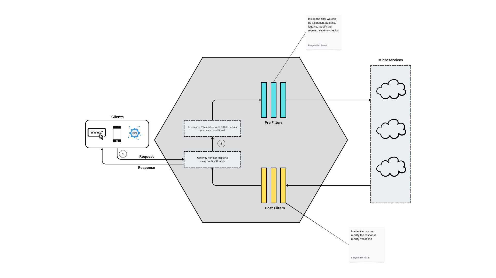

# Developing microservices using Spring Boot Ecosystem
<!-- TOC -->
* [Developing microservices using Spring Boot Ecosystem](#developing-microservices-using-spring-boot-ecosystem)
* [Identify domain context and service boundaries](#identify-domain-context-and-service-boundaries)
* [Deployment, Portability, and Scalability](#deployment-portability-and-scalability)
* [Docker](#docker-)
  * [Build Image](#build-image)
  * [Running docker](#running-docker)
  * [Docker Dashboard](#docker-dashboard)
* [Cloud Native Application](#cloud-native-application)
  * [Beyond 12-factor apps](#beyond-12-factor-apps)
* [Configuration](#configuration)
  * [Spring Cloud Config Server](#spring-cloud-config-server)
    * [Check properties](#check-properties)
    * [Profiles](#profiles)
    * [Encryption](#encryption)
  * [Change config at runtime](#change-config-at-runtime)
    * [Spring cloud bus](#spring-cloud-bus)
      * [Demo](#demo)
    * [Using webhook to avoid manual work](#using-webhook-to-avoid-manual-work)
* [Docker Compose](#docker-compose)
* [Database](#database)
* [Service Discovery](#service-discovery)
* [Routing, Cross cutting concern in microservices](#routing-cross-cutting-concern-in-microservices)
  * [Spring Cloud Gateway](#spring-cloud-gateway)
* [Resiliency in microservices](#resiliency-in-microservices)
  * [Resiliency in Spring Cloud Gateway](#resiliency-in-spring-cloud-gateway)
    * [Fallback for circuit breaker](#fallback-for-circuit-breaker)
  * [Circuit breaker using Feign Client in Account microservices](#circuit-breaker-using-feign-client-in-account-microservices)
  * [Http timeout config:](#http-timeout-config-)
  * [Retry Pattern with Backoff Strategy](#retry-pattern-with-backoff-strategy)
  * [Rate Limiter Pattern](#rate-limiter-pattern)
    * [Rate Limiter in spring gateway](#rate-limiter-in-spring-gateway)
      * [Redis implementation (Stripe)](#redis-implementation-stripe)
        * [Demo](#demo-1)
    * [Ratelimiter inside individual microservice](#ratelimiter-inside-individual-microservice)
  * [Bulkhead patterns](#bulkhead-patterns)
  * [Aspect Order](#aspect-order)
* [Observability and Monitoring](#observability-and-monitoring)
  * [Log, metrics, traces](#log-metrics-traces)
  * [Prometheus and micrometer Demo](#prometheus-and-micrometer-demo)
    * [Alerting in Grafana](#alerting-in-grafana)
* [Distributed Tracing](#distributed-tracing)
* [Securing microservices:](#securing-microservices)
  * [Why OAuth2 (Open Authorization)](#why-oauth2-open-authorization)
  * [OpenID Connect](#openid-connect)
    * [Implementations](#implementations)
  * [Flow](#flow)
    * [Grant Type Flow](#grant-type-flow)
  * [Demo](#demo-2)
  * [Making Gateway server as Resource server](#making-gateway-server-as-resource-server)
    * [Authentication](#authentication)
    * [Authorization using Roles](#authorization-using-roles)
  * [Authorization code grant type flow](#authorization-code-grant-type-flow)
* [Event driven microservices](#event-driven-microservices)
  * [Pub/Sub using RabbitMQ](#pubsub-using-rabbitmq)
    * [Spring Cloud Functions features:](#spring-cloud-functions-features)
    * [Spring cloud streams](#spring-cloud-streams)
    * [Spring cloud function for messaging microservice](#spring-cloud-function-for-messaging-microservice)
  * [Using Kafka](#using-kafka)
    * [Kafka vs RabbitMQ](#kafka-vs-rabbitmq)
    * [Key concepts](#key-concepts)
    * [Key knowledge points:](#key-knowledge-points)
    * [Setup](#setup)
      * [Setup Kafka cluster locally](#setup-kafka-cluster-locally)
      * [Configure microservices to connect](#configure-microservices-to-connect)
      * [Kafka setup in docker compose](#kafka-setup-in-docker-compose)
* [Orchestration - Kubernetes](#orchestration---kubernetes)
  * [Key concepts](#key-concepts-1)
  * [Setup](#setup-1)
  * [Kubernetes Yaml Config](#kubernetes-yaml-config)
    * [Scaling up and down](#scaling-up-and-down)
  * [Kubernetes Service Types](#kubernetes-service-types)
  * [Why helm](#why-helm)
    * [Installing Helm](#installing-helm)
    * [Additional helm commands](#additional-helm-commands)
    * [Helm Structure](#helm-structure)
    * [Helm chart for our Microservices](#helm-chart-for-our-microservices)
    * [Upgrade chart - Roll in and Roll out](#upgrade-chart---roll-in-and-roll-out)
* [Server side load balancing](#server-side-load-balancing)
  * [Demo](#demo-3)
* [Deploying on public cloud](#deploying-on-public-cloud)
* [Kubernetes Ingress, Service mesh (Istio) and mTLS](#kubernetes-ingress-service-mesh-istio-and-mtls)
  * [Ingress](#ingress)
  * [Types of traffic:](#types-of-traffic)
* [Traffic within a cluster between services](#traffic-within-a-cluster-between-services)
  * [Service mesh:](#service-mesh-)
  * [Capabilities:](#capabilities)
  * [Service mesh components](#service-mesh-components)
    * [TLS](#tls)
    * [mTLS](#mtls)
      * [Advantages of mTLS](#advantages-of-mtls)
  * [Popular service meshes:](#popular-service-meshes)
* [Microservice code architecture](#microservice-code-architecture)
  * [Port Adapter and Onion Architecture](#port-adapter-and-onion-architecture)
* [Spring Framework](#spring-framework)
  * [Spring Data (JPA)](#spring-data-jpa-)
  * [Spring Testing Ecosystem](#spring-testing-ecosystem)
  * [](#)
<!-- TOC -->
# Identify domain context and service boundaries
- Domain-driven sizing - requires a lot of time
- Event-storming sizing - faster
  - --> https://www.lucidchart.com/blog/ddd-event-storming

# Deployment, Portability, and Scalability
- Containerization help achieve these like docker
- Container is easy to create and destroy
- Each container has own namespaces, control groups


# Docker 
## Build Image
1. Build images using Dockerfile

``
docker build . -t dockerxya/bank-accounts
``

``
docker inspect image <image-id>
``
2. Build images using Buildpacks. This is heavy but supports many advanced features.

By default it uses By default, Spring Boot uses the CNB builders provided by the [Paketo Buildpacks](https://paketo.io/) project.

[Image build tools comparison](https://buildpacks.io/features/)

[Spring Boot container-images.buildpacks](https://docs.spring.io/spring-boot/docs/current/reference/htmlsingle/#container-images.buildpacks)
```
<plugin>
	<groupId>org.springframework.boot</groupId>
		<artifactId>spring-boot-maven-plugin</artifactId>
	<configuration>
		<image>
			<name>dockerxya/${project.artifactId}</name>
			<env>
				<BP_NATIVE_IMAGE>true</BP_NATIVE_IMAGE>
			</env>
			<builder>paketobuildpacks/builder-jammy-base:latest</builder>					
		</image>
	</configuration>
</plugin>
```
See [this](https://spring.io/blog/2023/09/22/paketo-buildpacks-bionic-end-of-support) for later spring boot upgrade to 3.2.xx 
3. Build images using Google Jib. It can build docker image even if we don't have docker engine installed in dev pc.
It offers consistency, security, performance and governance with the need for Dockerfile

[Google Jib Docu](https://github.com/GoogleContainerTools/jib/tree/master/jib-maven-plugin)

- Note: `jib:build` will build and push the image to dockerhub whereas `jib:dockerBuild` will just build the image locally

## Running docker

``
docker run -p 8081:8080 dockerxya/bank-accounts
``


```
docker ps -a
```

```
docker container kill [container-id]
```

```
docker container logs [container-id]
```

## Docker Dashboard
The dashboard can be used to explore containers, logs as well option to run commands inside the container


# Cloud Native Application
- 12-factor apps
- Microservices, containers, scalability & elasticity, DevOps, resilient and fault tolerance, cloud native services for messaging, caching, identity
- Cloud native vs traditional apps: predictable behavior, OS abstraction, right-size & independent, CD, rapid recovery & scalability

## Beyond 12-factor apps
- 15 factor apps extended by Kevin Hoffman
  - one codebase, on application
  - API first: API driven development
  - dependency management: one central script i.e maven or gradle
  - design, build immutable artifacts, release immutable unique through semantic versioning i.e 1.4.1, run using specific release
  - configuration (change without redeployment) and per deployment evn, credentials and code
  - logs
  - disposability
  - backing services i.e plug & play DB, kafka etc
  - environment parity: try to keep disparity between envs minimal
  - admin process: keep separate code and microservices for admin processes
  - port binding: self-contained in its own port using port binding
  - stateless processes: so that instances could be easily scaled up and down
  - concurrency: large user base is server concurrently by different instances (horizontal scalability)
  - telemetry: observability of microservices and log aggregation
  - Authentication & Authorization

# Configuration
```
@Value

env.getProperty("property.name");

env.getProperty("JAVA_HOME");

@ConfigurationProperties("prefix")
```
- Separate environment specific properties to its own files

- Passing properties to the app using 
```
java .... --build.version="1.1" // command line args or program argument (first precedence)

java -Dbuild.version="1.1".... // JVM system property (second precedence)

BUILD_VERSION="1.1"java -jar .... // Env variables Capital letters and (.) --> (_)

test precedence by setting all the three in intellij
```

## Spring Cloud Config Server


### Check properties
prod + default: http://localhost:8071/bank-accounts/prod

### Profiles
- git
- native

### Encryption
```
encrypt:
  key: bankkey
```
POST http://localhost:8071/encrypt in body the text which needs to be encrypted.
In git stored the encrypted value like "{cipher}fhg4539ghf659"

POST http://localhost:8071/decrypt

## Change config at runtime
Actuator dependency is needed and then exposed using management in yaml.
On account service one could call `POST /actuator/refresh` endpoint to get config changes for the service.
By default, this endpoint is not exposed.

### Spring cloud bus
Broadcast changes for all instances. It will take care of refreshing all instance.
1. Run RabbitMQ as [here](https://www.rabbitmq.com/) --> Getting Started --> Download + Installation. Run the docker command
```
docker run -it --rm --name rabbitmq -p 5672:5672 -p 15672:15672 rabbitmq:3.12-management
```
2. Add RabbitMQ dependency to all applications
```
<dependency>
	<groupId>org.springframework.cloud</groupId>
	<artifactId>spring-cloud-starter-bus-amqp</artifactId>
</dependency>
```
3. Add related configurations to the YAML if different from the default.

#### Demo
1. Change the values in the repo and config server picks it up
2. Invoke the bus endpoint on the microservices
   - POST /actuator/busrefresh 
   - once invoke, bus will detect the changes and communicate them with other microservices too without doing anything.

### Using webhook to avoid manual work
1. Add the dependency to config server
```
<dependency>
    <groupId>org.springframework.cloud</groupId>
    <artifactId>spring-cloud-config-monitor</artifactId>
</dependency>
```
2. Add webhook
Since we run spring config locally, we can use https://hookdeck.com/ to test webhook. It basically received the request
and forward it to the local host in our machine. Just follow the steps shown at https://console.hookdeck.com/

Summary: Changes pushed to github --> hookdeck endpoint is triggered --> using sandbox, config server (localhost:8071/monitor) is triggered -->
/monitor publishes config change event to rabbit-mg (spring-cloud-bus) and initiate refresh on all subscribed nodes (dependency added to the nodes) .

# Docker Compose
- Liveness --> Readiness. Both are available under /actuator/health.
- Individually `/actuator/health/liveness`, `/actuator/health/readiness`
- Network concept: `docker networks ls` and `docker inspect <container-id>`

# Database
In microservices architecture, each service should have its own database.
```
docker run -p 3306:3306 --name bank-accounts-db -e MYSQL_ROOT_PASSWORD=root -e MYSQL_DATABASE=bank-accounts-db -d mysql
```
In order to connect with db, use [SQLECTRON](https://sqlectron.github.io/) and `localhost:3306`.
Create database for microservice and expose in different port in local machine.

# Service Discovery
- - IPs of new instance is short-lived and changes often
- How do microservices locate each other inside a network?
- How do new service instances enter into the network?
- How load balancing is done and info between microservices exchanged?
- --> Service Discovery: A service will discover another service using the registry. 
  - client-side service discovery
  - server-side service discovery
- --> Service Registration (All service registers themselves in a central location by giving its IP address and port)
  - The registry then expects regular heart beats from the services to check if they are healthy and available. It removed an entry if heart beats are not received.
  - As shutting down service deregisters itself
- --> Load Balancing: If multiple instances of a service is discovered, a load balancing strategy is used to distribute load among them


- Based on Gossip protocol all nodes of service discovery will share updated information between themselves.

To access details of registered services [/eureka/apps](http://localhost:8070/eureka/apps)

Kubernetes have server-side service discovery.

Spring cloud Eureka for service discovery

Spring cloud load balancer for client side load balancing

Feign Client for microservice look up

Eureka self preservation mode to avoid traps in the network: 
```
eureka.instance.lease-interval-in-seconds: 30s # heart beat interval
eureka.instance.lease-expiration-duration-in-seconds: 90s # wait if no heart beat sent and then evict
eureka.instance.eviction-interval-in-ms: 60 * 1000 # scheduler which checks
eureka.instance.renewal-percent-threshold: 0.85 #
eureka.instance.renewal-threshold-update-interval-ms: 15 * 60 * 1000
eureka.instance.enable-self-preservation: true

```
# Routing, Cross cutting concern in microservices

- single point of entry for easiness
- cross-cutting concerns: logging, auditing, tracing, security
- A/B testing 
- routing based on headers sometimes
- Edge server = API gateway
[canva drawing](https://www.canva.com/design/DAF0CyI_9jA/O_GelgTVVvw4WX7UFRTDZA/edit?utm_content=DAF0CyI_9jA&utm_campaign=designshare&utm_medium=link2&utm_source=sharebutton)


## Spring Cloud Gateway
Spring cloud compared to Zuul is better
- It is non-blocking
- It is reactive
- Hast many features integrated out of the box
- Refer to [this](https://docs.spring.io/spring-cloud-gateway/docs/current/reference/html/) for further infos



Refer to spring cloud gateway docs for different predicates, filters, global filter, TLS and SSL.

- Gateway service will also connect to the Eureka server to get connection information of different microservices
- Route configuration: routePredicate.[path, filters, uri]
- Even with no route configuration, spring cloud gateway can forward request instances of microservices it retrieves from Eureka server
- Java lambda configuration vs yaml configuration: java based configuration gives more flexibility to customize (Fluent Java Routes API)
- Path route using [yaml](https://docs.spring.io/spring-cloud-gateway/docs/current/reference/html/#the-path-route-predicate-factory)
- For tracing purpose we added a custom header `bank-correlation-id` using `RequestTraceFilter`. 
- This correlation-id is added to all microservices down the call as coded in `bank-accounts` call chain.

Final Demo: config server starts and other util services start, then eureka which depends on config server starts as well as other services.
Finally GW service starts.

- Gateway [routes](http://localhost:8072/actuator/gateway/routes)

# Resiliency in microservices
- To avoid problem cascading if one service is failing
## Resiliency in Spring Cloud Gateway
- [Resilience4J](https://resilience4j.readme.io/docs)
  - We implement circuit breaker in spring gateway server using this.
  - It has different patterns implemented in core modules
- Problematic scenario: in calling gerCustomerDetails bank-accounts microservice (internally calls cards and loans microservices),
if cards service has problem and not responding, a thread is blocked. Further requests will block additional threads, leading to resource exhaustion
in accounts and gateway servers.
- Circuit breaker [pattern](https://martinfowler.com/bliki/CircuitBreaker.html): 
  - Fails fast by opening wire to cards service
  - Fails gracefully
  - Recovers seamlessly


Example: in gateway server, try to check circuit break activities using 
  - http://localhost:8072/actuator/circuitbreakers and 
  - http://localhost:8072/actuator/circuitbreakerevents?name=accounts-circuit-breaker
- Test it using a breaker endpoint in GET contact-info endpoint of accounts microservice

### Fallback for circuit breaker
Refer to FallbackController inside GW codebase and fallback URI in RouteLocator

## Circuit breaker using Feign Client in Account microservices
- If cards service is not responding, it impacts accounts service causing thread exhaustion.
- Fallback implements the feign client interface as in `CardsFallback`
- Check using these urls
  - http://localhost:8080/actuator/circuitbreakers and
  - http://localhost:8080/actuator/circuitbreakerevents?name=accounts-circuit-breaker
## Http timeout config: 
- At gateway server we can configure a global timeout for connect and response.
```
  cloud:
    gateway:
      # Please connect to discovery server (Eureka) and locate all microservices for request forwarding purpose
      discovery:
        locator:
          enabled: true
      # Wait time for each microservice connection. This is global for all microservices
      httpclient:
        connect-timeout: 1000
        response-timeout: 10s

```
- Accounts route will override this, as it has circuit breaker configured.
- One can configure timeout [per route](https://docs.spring.io/spring-cloud-gateway/reference/spring-cloud-gateway/http-timeouts-configuration.html)

## Retry Pattern with Backoff Strategy
- Using together with circuit breaker
- For Idempotent operations only

- At gateway for a microservice
```
.route(p -> p
        .path("/bank/cards/**")
        .filters(f -> f
                .rewritePath("/bank/cards/(?<segment>.*)", "/${segment}")
                .removeRequestHeader("Cookie")
                // GET is Idempotent
                .retry(retryConfig -> retryConfig.setRetries(3)
                        .setMethods(HttpMethod.GET)
                         // gateway initially waits for 100ms, it will then increment backoff duration capping it at max 1000ms
                         .setBackoff(Duration.ofMillis(100), Duration.ofMillis(1000), 2, true))
```
- Inside individual microservice:
```
    @Retry(name = "getBuildInfo",fallbackMethod = "getBuildInfoFallback")
    @GetMapping("/build-info")
    public ResponseEntity<String> getBuildInfo() throws Exception {
```
- in application.yml
```
resilience4j.retry:
  configs:
    default:
      maxRetryAttempts: 3
      waitDuration: 500
      enableExponentialBackoff: true
      exponentialBackoffMultiplier: 2
      retryExceptions:
        - java.util.concurrent.TimeoutException
```

## Rate Limiter Pattern
- 429 status code: too many requests
- enforced based on:
  - session
  - ip address
  - logged in user
  - tenant
  - server
- Business model for SAAS: request quotas i.e basic user, premium user, platinum user
### Rate Limiter in spring gateway
- Rate control for [API](https://spring.io/blog/2021/04/05/api-rate-limiting-with-spring-cloud-gateway) 


- We need a key resolver to decide i.e user, ip address etc using [keyResolver](https://docs.spring.io/spring-cloud-gateway/docs/4.0.7/reference/html/#the-requestratelimiter-gatewayfilter-factory)
- The default implementation of `KeyResolver` is the `PrincipalNameKeyResolver` (current logged-in username)

#### Redis implementation (Stripe)
- [Implementation](https://docs.spring.io/spring-cloud-gateway/docs/4.0.7/reference/html/#the-redis-ratelimiter) using Redis (Stripe team implementation): [link](https://stripe.com/blog/rate-limiters)
- Different scenarios listed in Stripe blog
- The algorithm used is the [Token Bucket Algorithm](https://en.wikipedia.org/wiki/Token_bucket).
- The redis-rate-limiter.replenishRate property defines how many requests per second to allow (without any dropped requests). This is the rate at which the token bucket is filled. 
- The redis-rate-limiter.burstCapacity property is the maximum number of requests a user is allowed in a single second (without any dropped requests). This is the number of tokens the token bucket can hold. Setting this value to zero blocks all requests. 
- The redis-rate-limiter.requestedTokens property is how many tokens a request costs. This is the number of tokens taken from the bucket for each request and defaults to 1. 
- For example, setting replenishRate=1, requestedTokens=60, and burstCapacity=60 results in a limit of 1 request/min. .application.yml

```
<!-- START: Spring data redis config for redis based ratelimiter (Stripe) -->
<dependency>
	<groupId>org.springframework.boot</groupId>
	<artifactId>spring-boot-starter-data-redis-reactive</artifactId>
</dependency>
<!-- END: Spring data redis config for redis based ratelimiter (Stripe) -->
```
```
spring:
  cloud:
    gateway:
      routes:
      - id: requestratelimiter_route
        uri: https://example.org
        filters:
        - name: RequestRateLimiter
          args:
            redis-rate-limiter.replenishRate: 10
            redis-rate-limiter.burstCapacity: 20
            redis-rate-limiter.requestedTokens: 1
```
Or using Java code:
```
    @Bean
    public RedisRateLimiter redisRateLimiter() {
        return new RedisRateLimiter(1, 1, 1);
    }

    @Bean
    public KeyResolver userKeyResolver() {
        return exchange -> Mono.justOrEmpty(exchange.getRequest().getHeaders().getFirst("user"))
                .defaultIfEmpty("anonymous");
    }
```
- We finally configure rate limiter for a route i.e loans route
- changes in yaml
```
spring:
  data:
    redis:
      connect-timeout: 2s
      host: localhost
      port: 6379
      timeout: 1s
```

##### Demo
1. Start redis locally
```
docker run -p 6379:6379 --name bank-redis -d redis
```
2. bench mark test using apache bench mark i.e below sends 10 request with concurrently 2 requests
```
ab -n 10 -c 2 -v 3 http://localhost:8072/bank/loans/api/contact-info
```

### Ratelimiter inside individual microservice
```
    @RateLimiter(name= "getJavaVersion", fallbackMethod = "getJavaVersionFallback")
    @GetMapping("/java-version")
    public ResponseEntity<String> getJavaVersion() {
```
yaml config:
```
resilience4j.ratelimiter:
  configs:
    default:
      timeoutDuration: 1000 # Time for the thread to wait
      # Every 5 seconds, one request is served
      limitRefreshPeriod: 5000 # For every 5 seconds renew the quota
      limitForPeriod: 1 # Quota
```

## Bulkhead patterns
- From ship design concept

- Using [Resilience4j](https://resilience4j.readme.io/docs/getting-started-3)

## Aspect Order
- Refer to [this](https://resilience4j.readme.io/docs/getting-started-3#aspect-order):
- `Retry ( CircuitBreaker ( RateLimiter ( TimeLimiter ( Bulkhead ( Function ) ) ) ) )`, so Retry is applied at the very end
- We can change the order inside application yaml


# Observability and Monitoring
- Trace the request flow
- Log aggregation
- Notification and alarms
- Observability: 
  - Logs
  - Metrics
  - Trace
- Monitoring
  - Dashboard
  - Alarms


## Log, metrics, traces
- We manage logs by using logger in microservices
- Log aggregation
  - dev config
  - product which takes cares of this
- Grafana
  - Log aggregation: Grafana loki
  - Metrics: grafana int with prometheus
  - Traces: Grafana tempo
- Grafana, Loki, Promtail [Setup](https://grafana.com/docs/loki/latest/get-started/)
  - Loki: log aggregation
  - Promtail: log aggregator agent
  - Check getting started for setup using docker compose


- Metrics: one can use /actuator endpoint to checkup on metrics.
- We need a tool to check and extract these metrics - Prometheus
- Prometheus however can't understand json format from /actuator endpoint
- To make such json metrics available for prometheus, we can use micrometer
- [Micrometer](https://micrometer.io/) exposes /actuator/metrics data in a format that a particular monitoring system (i.e Prometheus) can understand 
- Loki is to logs while [prometheus](https://prometheus.io/) is to metrics
- Grafana can be used to visualize Prometheus data

- `/actuator/metrics` and `/actuator/metrics/{metrics_name}`
- From micrometer+prometheus dependency, we get `/actuator/prometheus`
- Prometheus will invoke this path on regular basis

## Prometheus and micrometer Demo
- start docker compose 
- check `/actuator/prometheus` for microservices
- check `localhost:9090/targets` on prometheus server. It should show all services (6 services) monitored by prometheus.
- On graph page query metrics i.e system_cpu_usage and see the graph as well
- For more sophisticated graphs, we need integration of proemetheus with Grafana
- Go to Grafana: `localhost:3000` and check datasources under connections

- Setup [links](https://prometheus.io/docs/visualization/grafana/)
- Pre-build [graphs](https://grafana.com/grafana/dashboards/)
- Login to Grafana using admin:admin --> Dashboards --> Import dashboard --> paste URL of prebuilt [dashboard](https://grafana.com/grafana/dashboards/4701-jvm-micrometer/)
- Spring boot [dashboard](https://grafana.com/grafana/dashboards/11378-justai-system-monitor/)
- Create your own dashboard as well. Select new --> Add row --> Add Visualization by query a metric i.e uptime --> Add more visualizations and rows

### Alerting in Grafana
- We can add a webhook for [demo](https://scribehow.com/shared/Creating_and_Configuring_an_Alert_Rule_with_Contact_Point__2Ipb7e5WTFqdg3nG4agL-Q)
- We can add alerts at the [dashboard too](https://scribehow.com/shared/How_to_Create_a_Dashboard_and_Set_Up_an_Alert_in_Grafana__P-_FWbceSh6ShMHToFo70g).


# Distributed Tracing
- Spring Sleuth which is now moved to micrometer
- Open telemetry an alternative to micrometer (with Sleuth). It supports many languages.
```
<!-- START: Distributed tracing using open telemetry -->
pendency>
	<groupId>io.opentelemetry.javaagent</groupId>
	<artifactId>opentelemetry-javaagent</artifactId>
	<version>${otelVersion}</version>
	<scope>runtime</scope>
</dependency>
<!-- END: Distributed tracing using open telemetry -->
```
- We use Tempo from Grafana which indexes all tracing information. Loki to logs, prometheus to metrics, Tempo to tracing info
- Grafana will then display tracing from Tempo (We need to add tempo as another datasource in grafana datasource.yml)
- After adding Tempo to docker compose and adding related configurations i.e loading opentelemetry javaagent jar into containers start the docker compose
- Check logs of Loki for tracing format
- [Query](https://scribehow.com/shared/Step-by-Step_Guide_Navigating_and_Clicking_on_Web_Page_Elements__f4Edl1aFTfe321BHmEEOSQ) Tempo using a trace-id


- Zipkin is another tool for visualizing tracing information. However tempo is better because of loki logs (side by side)
- Jaeger from Redhat is also used for this purpose


- We can connect Loki and Tempo using Derived fields in Loki connection. As in configured in datasource
```
jsonData:
  httpHeaderName1: "X-Scope-OrgID"
  derivedFields:
    - datasourceUid: tempo # This is the exact same id we assigned to tempo in this file: uid: tempo
      matcherRegex: "\\[.+,(.+),.+\\]"
      name: TraceID
      url: '$${__value.raw}'
```
# Securing microservices:
- Authentication (Auth): is the process of identifying the person or application which is trying to access our microservices
- Authorization (AuthZ): is the process where we enforce privileged access
- Central identity and access management (IAM) especially when we have hundreds of microservices.
- To achieve this we use a tool setup consisting of OAuth2/OpenID connect, KeyCloak (IAM) and Spring Security

## Why OAuth2 (Open Authorization)
- Basic Authentication (username and password)
- Basic not separated from business logic
- Can't grant temporary access to clients
- The strength of OAuth2 is the separation of Auth and AuthZ into separate service
- i.e OAuth2 in play: Login to stackoverflow with github. The reditect url to log into github in decoded form looks like:
```
https://github.com/login?client_id=01b478c0264a1fbd7183&return_to=/login/oauth/authorize?client_id=01b478c0264a1fbd7183&redirect_uri=https://stackauth.com/auth/oauth2/github&response_type=code&scope=user:email&state={"sid":1,"st":"59:3:1b8,16:f7a45ee1c7770212,10:1701413399,16:ef70cfe3621a5996,5564bca86b9d4a7a4b12bd5aef0479ffabc767543758e8d38883dea06cf7869c","cid":"01b478c0264a1fbd7183","k":"GitHub","ses":"b5103c6595c1484587403e487faa97b7"}
```
- Github (OAuth2 server) gives a temporary access token to stackoverflow with limited access rights
- The token is similar to hotel access cards
- Delegated authorization using OAuth2 protocol
- Different grant flows:
  - server to server (two backend applications) communication
  - UI/mobile to backend 
  - IoT devices
  - Consols, TVs etc

- Terminology
  - Resource owner: user
  - Client: i.e stackoverflow acts on user's behalf to get details of user from Github. Stackoverflow is the client which wants to connect to Authorization server of Github
  - Authorization server: it knows the owner. As user/owner should have an account in this server
  - Resource Server: Github in above scenario. It holds resources like user details, email
  - Scope: Granular permissions that client wants. In above scenario github issues scope that stackoverflow can use to read email and user details
    - scope is read:user
## OpenID Connect
- Role based access mechanism
- Initially people used OAuth2 for both Authentication and Authorization, although it was only meant for Authorization.
- OpenID connect brings standards to authentication (identity details) among the applications.
- OAuth2 provides authorization via access token containing scopes, OpenID provides authentication via new ID token containing set of information and claims specifically for identity
- In addition to OAuth2 token, we get IdToken from OpenID

- with both we get IAM


### Implementations
- KeyCLOAK based on OAuth 2.0 and OIDC
- It supports OpenID Connect, OAuth 2.0, SAML 2.0 protocols
- Also SSO
- Social login
- Open Source
- Okta, AWS Cognito, FusionAuth are alternatives commercial products.

## Flow
### Grant Type Flow
- For communication between two backend services

- 


- Client invokes gateway-server
- Gateway-server redirects the client to Auth server
- If client has not account, it has to register. It will be issued client credentials
- With client credentials, it will get an access token from server and openID id token (if supported)
- Using this access token, it returns to gateway-server again.
- Gateway-server verifies the token with auth server himself
- Finally gateway server allows the call through

## Demo
- Keycloak Setup
```
docker run -d -p 7080:8080 -e KEYCLOAK_ADMIN=admin -e KEYCLOAK_ADMIN_PASSWORD=admin quay.io/keycloak/keycloak:23.0.1 start-dev
```
- clarify keycloak concepts: realm, clients, client scopes, realm roles, users, groups, session, events
  - Realm is an environment i.e dev, preprod, prod
- create client, find url in realm setting to get token using client credentials and get the token by following [this](https://scribehow.com/shared/Creating_an_OpenID_Connect_Client_in_Keycloak__jK9wX27IRPyVzi4nbLpKSQ).
- Check contect of access token and id token (OIDC)
- 

## Making Gateway server as Resource server
### Authentication
- Add related dependencies as marked in pom.xml
- Add related access data of Auth server to gateway server
- cert endpoint is for checking if the token was issued exactly by this Auth server. Auth server issues tokens using private certs.
```
  security:
    oauth2:
      resourceserver:
        jwt:
          jwk-set-uri: "http://localhost:7080/realms/master/protocol/openid-connect/certs"
```
- Configure `ServerHttpSecurity` for webflux
- `ServerHttpSecurity` is to webflux as `HttpSecurity` is to webmvc.
### Authorization using Roles
- We use `hasRole` instead of `authenticated` in `ServerHttpSecurity` configuration
- We create the Role in Auth server (i.e KeyCloak)
- Go to Realm Roles --> Create role --> create ACCOUNTS, CARDS and LOANS roles
- Go to the client --> Service accounts roles tab --> Assign roles. In access-token:

```
  "realm_access": {
    "roles": [
      "default-roles-master",
      "ACCOUNTS",
      "offline_access",
      "uma_authorization"
    ]
  }
```
- To extract role from JWT into spring security framework:
```
public class KeycloakRoleConverter implements Converter<Jwt, Collection<GrantedAuthority>> {
```
- `GrantedAuthority` carries role or privilege information.

## Authorization code grant type flow
- When a user is also involved.
- 
- In stackoverflow scenario: I am an user, stackoverflow is client, in between an OAuth server, and Github is a resource server

- Demo using Okta [playground](https://www.oauth.com/playground/authorization-code.html)
-You need to first verify that the state parameter matches the value stored in this user's session so that you protect against CSRF attacks.
- Using KeyCload for bank service:
  - Create client with standard flow (authZ code)
  - Set `Valid redirect URIs` the same as passed by client. Here *
  - Set Web origin to `*` to avoid CORS
  - Create user and set password
  - Using postman, set grant-type to `Authorization Code`. Check [bank-microservices.postman_collection.json](bank-microservices.postman_collection.json) under gateway-server-security
  - Using http://localhost:7080/realms/master/protocol/openid-connect/auth it receives authorization code and using http://localhost:7080/realms/master/protocol/openid-connect/token an access token
  - For state, give a random alpha-numeric value
- Usually a user is created using KeyCloak [REST API](https://www.keycloak.org/docs-api/22.0.1/rest-api/index.html) instead of admin portal


# Event driven microservices
- We need to avoid temporal coupling (Sync request)
- Different models
  - Pub/Sub model: Once consumed, it is done. No future access. Mainly done using RabbitMQ
  - Event streaming model: Consumer can join anytime and start consuming from any part of the stream. Mainly done using Kafka
## Pub/Sub using RabbitMQ

- Read further [here](https://jstobigdata.com/rabbitmq/topic-exchange-in-amqp-rabbitmq/).
- Producer --> Exchange and based on a specific routing rule, RMQ determines queues that should receive a copy of the message.
### Spring Cloud Functions features:
- Choice: Reactive, Imperative and Hybrid
- Data can be streamed out of these functions from/to these functions.
- We can make a composite of functions for complex business logic
- REST API support
- Packaging and deployment to different environments. i.e AWS
- Good for event driven
- Can run as webpoit, stream processor or as task
- Adapters
- Read [here](https://spring.io/projects/spring-cloud-function)
- Look at bank-messaging-service
- To pipe functions into chain ones, see the service's `application.yml` using `email|sms
```
<dependency>
	<groupId>org.springframework.cloud</groupId>
	<artifactId>spring-cloud-function-context</artifactId>
</dependency>

<!-- START: expose functions as REST endpoint -->
<dependency>
	<groupId>org.springframework.cloud</groupId>
	<artifactId>spring-cloud-starter-function-web</artifactId>
</dependency>
<!-- END: expose functions as REST endpoint -->
```

### Spring cloud streams
- scalable, event driven microservices, [streaming](https://spring.io/projects/spring-cloud-stream#overview)
- Just add any dependency for streaming i.e RMQ or Kafka or Kinesis etc. Just plug and play like making function above REST api
- Components:
  - Destination Binders
  - Destination Binding
  - Message


- Integration functions with RMQ: We remove dependencies: fn-context, fn-web, spring-boot-starter. We add just:
```
<dependency>
 <groupId>org.springframework.cloud</groupId>
	<artifactId>spring-cloud-stream</artifactId>
</dependency>
<dependency>
	<groupId>org.springframework.cloud</groupId>
	<artifactId>spring-cloud-stream-binder-rabbit</artifactId>
</dependenc
```
- Internally it adds spring cloud function dependencies
- We add binding and rabbitmq configuration to `application.yml` of bank-messaging-service
- Add configuration to bank-accounts service to send messages into rabbitmq

### Spring cloud function for messaging microservice
- Standard interfaces from java 8: Suppliers, Functions, Consumers
- Used for developing business logics. It offer many things out of the box. i.e The logic of the function is exposed as REST API by default.

## Using Kafka
### Kafka vs RabbitMQ
- Kafka is a distributed event streaming platform where rabbitMQ is a message broker
- Kafka handles large volume of data where RabbitMQ handles complex routing with smaller volume of data
- Data retention: Kafka stores inside the desk whereas RMQ stores events in memory (Low latency and fast)
- Performance: Kafka is faster especially for large data volume
- Scalability: Kafka is highly (add any number of kafka brokers horizontally) scalable where RMQ is limited
- Kafka: producer --> broker --> consumer

### Key concepts
- Producer: They write messages to a specific topic, and Kafka appends these messages to the topic's log.
- Topic: Is a particular stream of data that can be divided into partitions. Each message in a topic is identified by a uniques offset (ID)
- Brokers: Servers that manage the storage and replication of topics, receiving messages from producers, assigning offsets to messages, and serving messages to consumers.
- Partition: Topics can be divided into multiple partitions allowing for parallel processing and load balancing. Each partition is ordered, immutable sequence of messages and each message within a partition has a unique offset.
- Offset: Uniques identifiers assigned to each message within a partition. They are used to track the progress of consumers. Consumers can control their offsets, enabling them to rewind or skip messages based on their needs.
- Replication: Kafka allows topics to be replicated across multiple brokers to ensure fault tolerance. Replication provides data redundancy, allowing for failover and high availability.
- Consumer: Consumers read messages from Kafka topics. They subscribe to one or more topics and consume messages by reading from specific partitions within those topics. Each consumer maintains its offset to track its progress in the topic.
- Consumer group: Consumers can be organized into consumer groups. Each messagepublished to atopic si delivered to only one consumer within each group. This enables parallel processing of messages across multiple consumers.
- Streams: Kafka Streams si aclient library that enables stream processing within Kafka. It allows you to build applications that consume, transform, and produce data in real-time

### Key knowledge points:
- Why partition: distributed content of a topic in different brokers for resiliency purposes
- At least 3 brokers in prod
- Why consumer group: c1 --> p1, c2 --> p2. To achieve parallelism
- How to partition: i.e specific state, zipcode, region goes to one partition

### Setup
#### Setup Kafka cluster locally
- go to apache kafka [web](https://kafka.apache.org/quickstart) 
- Download first
- Setup Kafka with KRaft
- Follow the steps to setup local kafka cluster
#### Configure microservices to connect
- Added Kafka binders as shown in pom.xml of accounts and message service
- Add kafka binder in application.yml
- *NOTE:* To see two binders (kafka and rabbitmq) at play, we use two binders for two communication channels

#### Kafka setup in docker compose
- Use this as [reference](https://github.com/bitnami/containers/tree/main/bitnami/kafka)

# Orchestration - Kubernetes
- Automating deployments, rollouts and rollbacks
- From Google
- Features:
  - Service discovery and load balancing (server side load balancing)
  - container and storage orchestration
  - self-healing
  - secret and config management
- K8s architecture


## Key concepts
- API server: The API server is the primary interface for interacting with the Kubernetes cluster. It exposes the Kubernetes API, which allows users and other components to communicate with the cluster. All administrative operations and control commands are sent to the API server, which then processes and validates them
- Scheduler: The scheduler is responsible for placing Pods onto available nodes in the cluster. It takes into
  account factors like resource requirements, affinity, anti-affinity, and other constraints to make intelligent decisions about which node to assign a Pod to. The scheduler continuously monitors the cluster and ensures that Pods are distributed optimally.
- Controller manager: The controller manager maintains the cluster. It handles node failures, replicates components, maintains the correct number of pods, etc. It constantly tries to keep the system in the desired state by comparing it with the current state of the system.
- etcd: eted is a distributed key-value store that serves as the cluster's primary data store. It stores the configuration data and the desired state ofthe system, including information about Pods, Services, ReplicationControllers, and more. The API server interacts with eted to read and write cluster data.
- Kubelets: is an agent that runs on each worker node and communicates with the control plane components. It receives instructions from the control plane, such as Pod creation and deletion requests, and ensures that the desired state of Pods is maintained on the node. The kubelet is responsible for starting, stopping, and monitoring containers based on Pod specifications.
- Kube-proxy: is a network proxy that runs on each node in your cluster, implementing part of the Kubernetes Service concept. kube-proxy maintains network rules on nodes. These network rules allow network communication to your Pods from network sessions inside or outside of your cluster.
- Container runtime: is responsible for running and managing containers on aworker node. Kubernetes supports multiple container
  runtimes, with Docker being the most commonly used. Other runtimes like containerd and rkt are also supported. The container runtime pulls container images, creates and manages container instances, and handles container lifecycle operations.

## Setup
- To install using [docker](https://docs.docker.com/desktop/kubernetes/)
- `kubeclt config get-contexts`
- `kubectl config get-clusters`
- `kubectl config use-context docker-desktop`. We use this command to switch active contexts.
- Finally, setup k8s dashboard [using](https://kubernetes.io/docs/tasks/access-application-cluster/web-ui-dashboard/)
  - `kubectl apply -f https://raw.githubusercontent.com/kubernetes/dashboard/v2.7.0/aio/deploy/recommended.yaml`
  - `kubectl proxy`
  - http://localhost:8001/api/v1/namespaces/kubernetes-dashboard/services/https:kubernetes-dashboard:/proxy/
  - create sample user [using](https://github.com/kubernetes/dashboard/blob/master/docs/user/access-control/creating-sample-user.md) 
  - create role binding by following the instruction
  - create token and login using token
  - select the namespaces needed i.e kubernetes-dashboard
  - follow the instruction for long-lived token as in k8s folder
    - `kubectl get secret admin-user -n kubernetes-dashboard -o jsonpath={".data.token"} | base64 -d`
## Kubernetes Yaml Config
- Use latest yaml template for deployment, service etc
- label is service name, having label and match label the same value
- To expose the pod, either to external or for local communication, the deployment is paired with a service
- Note: containerPort of deployment and targetPort of service refer to internal port of the pod and are the same value
- After creating all k8s manifests, deploy them to local cluster
  - `kubectl get deployments` `kubectl get services` `kubectl get replicasets` in default
- Cluster-IP (natural) vs External-IP (for exposure to outside)
- `kubectl get events --sort-by=.metadata.creationTimestamp`
### Scaling up and down
- `kubectl scale deployment bank-accounts-deployment --replicas=1`
- `kubectl set image deployment gateway-server-deployment gateway-server=eroidxya/gateway-server:v14 --record=true`
- `kubectl rollout history deployment gateway-server-deployment`
- `kubectl rollout undo deployment gateway-server-deployment --to-revision=1`

## Kubernetes Service Types
1. ClusterIP: ClusterIP service creates an internal IP address for use within the K8s cluster. Good for internal-only applications that support other workloads within the cluster. eazy bytes

2. NodePort: Services of type NodePort build on top of ClusterIP type services by exposing the ClusterIP service outside of the cluster on high ports (default 30000-32767). If no port number is specified then Kubernetes automatically selects afree port. The local kube-proxy is responsible for listening to the port on the node and forwarding client traffic on the NodePort to the ClusterIP.

   - IP address of the cluster worker node is needed. If the worker node goes down, it won't work
3. LoadBalancer: The LoadBalancer service type is built on top of NodePort service types by provisioning and configuring external load balancers from public and private cloud providers. It exposes services that are running in the cluster by forwarding layer 4 traffic to worker nodes. This is a dynamic way of implementing a case that involves external load balancers and NodePort type services.

   - Load balancer will have a public IP address that won't change
   - Independent of worker nodes and its number
   - To avoid exposing services, change LoadBalancer to ClusterIP

## Why helm
- If 100 services, 100 time apply command. And if we want to delete, then 100 times delete command.
- Helm is package manager of k8s where chart is a package. packs into a single chart and put in central repo
- With single command entire deployment and rollback
- Can have hierarchy i.e child - parent relationship between charts
### Installing Helm
- Refer [to](https://helm.sh/docs/intro/quickstart/)
- `helm ls` 
- `helm search hub wordpress`
- To install one:
  - `helm repo add bitnami https://charts.bitnami.com/bitnami`
  - `helm install happy-pands bitnami/wordpress`
  - check the dashboard
- To remove it:
  - `helm ls`
  - `helm uninstall happy-panda`
### Additional helm commands
- `helm env`

### Helm Structure


### Helm chart for our Microservices
- `helm create bank-common`
- After creating all charts, we compile them
  - `helm depedencies build` for each Chart
- `helm template .` to check if everything is ok, like compile
- Install services like Kafka, RabbitMq as a service using bitnami charts
  - From bitnami [charts](https://github.com/bitnami/charts/tree/main/bitnami)
  - Download the folder using [this](https://download-directory.github.io/) and build the chart's dependency
  - i.e `helm install keycloak<release name> keycloak<folder>` and access it locally
  - Note: the console also give the DNS name within the cluster, of the installed service i.e ` keycloak.default.svc.cluster.local`
  - Follow CLI output for futher instructions

### Upgrade chart - Roll in and Roll out
- i.e increase and decrease number of pods, image of container
- `helm upgrade grafana grafana`
- `helm history bank`
- taking version from above command -> `helm rollback bank 1`
- `helm uninstall bank`

# Server side load balancing
- No need of maintaining a separate service for service discovery
- Implementation using [spring cloud kubernetes](https://spring.io/projects/spring-cloud-kubernetes/)

- To setup this [server](https://docs.spring.io/spring-cloud-kubernetes/reference/spring-cloud-kubernetes-discoveryserver.html)

## Demo
- To demo k8s service discovery, we comment out all Eureka related configurations and redploy the services.

# Deploying on public cloud
- We can deploy our kubernetes microservices onto GCP of google using the free tier.
- Steps:
  - Activate free trial
  - Install google cloud SDK to connect to k8s cluster from local system. [Link](https://cloud.google.com/sdk/docs/install-sdk)
  - After installing use `gcloud init` to initiate logging into the created account
  - create k8s cluster after enabling k8s engine API. Switch to standard cluster while creating the cluster
  - After cluster created, click on three dots menu and click on `connect`. Copy the command and execute in the local terminal
  - Install k8s discovery server, followed by all the charts created under `helm`
  - `kubectl describe pod pod-name` and find node name. Find node in k8s dashboard and check logs
  - Access keycloak using the external IP (deployed as loadbalancer)
  - Update postman Authorization Access token URL using the keycload IP
  - Access grafana using port-forwarding (ClusterIP)
- Shut down
  - Uninstall all charts
  - Go to k8s discovery server location and run `kubectl delete -f kubernetes-discoveryserver.yml`
  - Delete the cluster to avoid any costs

# Kubernetes Ingress, Service mesh (Istio) and mTLS
- ExternalName is another service type like LB and ClusterIP. Check docs
- Ingress: Similar to service, we can use ingress to expose our services

## Ingress
- Single entry point similar to spring cloud gateway.
- One can choose either spring cloud gateway or k8s Ingress to implement cross-cutting concerns
- Capabilities
  - Path based routing
  - Single Entry Point
  - Load balancing the traffic i.e route to one of the pods
  - Allow securing application with SSL/TLS certificates. It terminates SSL/TLS to avoid excess load inside the cluster. 
  - Host-based routing i.e app1.example.com instead of path
  - Annotation to rewriting rules, custom headers, adding authentication/authorization
  - All these are also possible in spring cloud gateway but with additional development efforts
  - Ingress offer more advanced routing and traffic management capabilities.

- Example:
```
apiVersion: networking.k8s.io/v1
kind: Ingress
metadata:
  name: ingress-wildcard-host
spec:
  rules:
  - host: "foo.bar.com"
    http:
      paths:
      - pathType: Prefix
        path: "/bar"
        backend:
          service:
            name: service1
            port:
              number: 80
  - host: "*.foo.com"
    http:
      paths:
      - pathType: Prefix
        path: "/foo"
        backend:
          service:
            name: service2
            port:
              number: 80

```

- Using ingress we define rule. There should be an implementation of ingress using different **ingress-controller** i.e **NGINX**, Traefik, HAProxy


## Types of traffic:
- Ingress traffic: traffic entering kubernetes cluster
- Egress traffic: traffic exiting a k8s cluster
- North-south traffic: traffic entering and exiting a cluster

# Traffic within a cluster between services
- It is called east-west traffic 
## Service mesh: 
- It is a dedicated infrastructure layer for managing communication between microservices in a containerized environment
- It provides a set of networking capabilities that facilitate secure, reliable and observable communication between services within a distributed system.
- Internal traffic (east-west) is guarenteed security by:
  - Being closed to outside world
  - Service mesh
## Capabilities:
  - Service discovery
  - Load balancing
  - Circuit breaker
  - Fault tolerance
  - Metrics and tracing
  - Security (mTLS)
- Therefore, service mesh will take care of most of the non-functional requirements (such as security, metrics, tracing, resilience) inside a sidecar proxy container


## Service mesh components
1. Data plane: Responsible for routing traffic between services using sidecar proxies
2. Control plane: Responsible for configuring, managing, and monitoring proxies. It includes components like control plane API, service discovery and configuration management


### TLS
- TLS: transport layer security. Secured transmission of data. Used in browser based exchanges
- TLS is an encryption protocol
- Third party issue the certificate which has a validity
- Previous solution was using SSL and TLS is the more advanced one.


### mTLS
- When the TLS steps followed by both the parties (service-to-service, within cluster communication). Both should prove their identities.
- No need of external CA. 
- Service mesh will act as a certificate authority (CA)
- mTLS: Mutual TLS is used for service-to-service communication between microservices as no browser is involved.
- 
- mTLS follows `zero trust` and make sure security is enforced in internal communications as well.


#### Advantages of mTLS
- Mutual Authentication
- Protection against impersonation
- Granular access control
- Resistance to credential compromise
- Simplified key management as CA is local resource
- No scalability issue of keys
- Compliance to GDPR, HIPAA, PCI DSS etc
- Zero Trust Security framework

## Popular service meshes:
1. Istio
2. Linkerd
3. Consul
4. Kong
5. AWS App Mesh
6. Azure Service Mesh


# Microservice code architecture
## Port Adapter and Onion Architecture

# Spring Framework

## Spring Data (JPA)  
- Lazy loading vs eager
- access these fields
- @Transactional mechanism
- i.e from work

## Spring Testing Ecosystem

## 