# Developing microservices using Spring Boot Ecosystem
<!-- TOC -->
* [Developing microservices using Spring Boot Ecosystem](#developing-microservices-using-spring-boot-ecosystem)
* [Design Pattern](#design-pattern)
* [Java](#java)
  * [Object Oriented](#object-oriented)
  * [Exception Handling](#exception-handling)
  * [String](#string)
  * [Regular expression (Regex) engine (java.util.regex)](#regular-expression-regex-engine-javautilregex)
  * [IO Stream - InputStream and OutputStream](#io-stream---inputstream-and-outputstream)
  * [Serialization/Deserialization](#serializationdeserialization)
  * [Java socket programming:](#java-socket-programming)
  * [Reflection:](#reflection)
  * [Internationalization](#internationalization)
  * [Data Structure and Algorithm using Java](#data-structure-and-algorithm-using-java)
  * [Multithreading and Concurrency in Java](#multithreading-and-concurrency-in-java)
  * [Java Collection:](#java-collection)
* [Java and Imperative vs Declarative Programming](#java-and-imperative-vs-declarative-programming)
  * [Imperative](#imperative)
  * [Declarative:](#declarative)
  * [Modern Java Features](#modern-java-features)
    * [Functional Interface](#functional-interface)
    * [Constructor and Method References](#constructor-and-method-references)
    * [Lambdas](#lambdas)
    * [Streaming API](#streaming-api)
    * [Optionals](#optionals)
    * [Concurrency and Immutability](#concurrency-and-immutability)
    * [Default and Static methods:](#default-and-static-methods)
    * [New Date and Time API (java.time)](#new-date-and-time-api-javatime)
* [Domain Driven Design (DDD)](#domain-driven-design-ddd)
  * [Identify domain context and service boundaries](#identify-domain-context-and-service-boundaries)
* [Cloud Native Application](#cloud-native-application)
  * [Beyond 12-factor apps](#beyond-12-factor-apps)
* [Clean API Documentation - OpenAPI / Swagger](#clean-api-documentation---openapi--swagger)
  * [Decoration of API using annotations](#decoration-of-api-using-annotations)
* [Deployment, Portability, and Scalability](#deployment-portability-and-scalability)
  * [Docker](#docker)
    * [Build Image](#build-image)
    * [Running docker](#running-docker)
  * [Docker Dashboard](#docker-dashboard)
* [Docker Compose](#docker-compose)
* [Configuration](#configuration)
  * [Spring Cloud Config Server](#spring-cloud-config-server)
    * [Check properties](#check-properties)
    * [Profiles](#profiles)
    * [Encryption](#encryption)
  * [Change config at runtime](#change-config-at-runtime)
    * [Spring cloud bus](#spring-cloud-bus)
    * [Using webhook to avoid manual work](#using-webhook-to-avoid-manual-work)
* [Database](#database)
  * [AWS RDS](#aws-rds)
    * [Read Replicas (DB Performance)](#read-replicas-db-performance)
    * [Multi-AZ in RDS (Disaster Recovery & availability)](#multi-az-in-rds-disaster-recovery--availability)
    * [Why Still Use a **Standby (Multi-AZ)** if Read Replicas Can Be Used for DR?](#why-still-use-a-standby-multi-az-if-read-replicas-can-be-used-for-dr)
    * [🧠 Key Points:](#-key-points)
    * [🚦 Real-World Analogy:](#-real-world-analogy)
    * [RDS and IAM Authentication](#rds-and-iam-authentication)
    * [RDS Parameter Groups](#rds-parameter-groups)
    * [Option group](#option-group)
    * [RDS Resource creation](#rds-resource-creation)
    * [RDS Demos](#rds-demos)
    * [RDS Backups](#rds-backups)
    * [RDS vs RDS custom](#rds-vs-rds-custom)
    * [RDS Security](#rds-security)
  * [RDS Proxy](#rds-proxy)
  * [Aurora DB](#aurora-db)
    * [Aurora Storage:](#aurora-storage)
    * [Aurora Instance Class:](#aurora-instance-class)
    * [Aurora DB creation](#aurora-db-creation)
    * [Aurora Endpoints:](#aurora-endpoints)
    * [Global Aurora](#global-aurora)
    * [Aurora vs RDS](#aurora-vs-rds)
    * [Aurora ML Integration](#aurora-ml-integration)
  * [AWS ElastiCache](#aws-elasticache)
  * [AWS No SQL](#aws-no-sql-)
    * [DynamoDB - NoSQL](#dynamodb---nosql)
* [Service Discovery](#service-discovery)
* [Routing, Cross cutting concern in microservices](#routing-cross-cutting-concern-in-microservices)
  * [Spring Cloud Gateway](#spring-cloud-gateway)
  * [Apigee - API management](#apigee---api-management)
  * [AWS API Management](#aws-api-management-)
* [Resiliency in microservices](#resiliency-in-microservices)
  * [Resiliency in Spring Cloud Gateway](#resiliency-in-spring-cloud-gateway)
    * [Fallback for circuit breaker](#fallback-for-circuit-breaker)
  * [Circuit breaker using Feign Client in Account microservices](#circuit-breaker-using-feign-client-in-account-microservices)
  * [Http timeout config:](#http-timeout-config-)
  * [Retry Pattern with Backoff Strategy](#retry-pattern-with-backoff-strategy)
  * [Rate Limiter Pattern](#rate-limiter-pattern)
    * [Rate Limiter in spring gateway](#rate-limiter-in-spring-gateway)
    * [Ratelimiter inside individual microservice](#ratelimiter-inside-individual-microservice)
  * [Bulkhead patterns](#bulkhead-patterns)
  * [Aspect Order](#aspect-order)
* [Observability and Monitoring](#observability-and-monitoring)
  * [Log, metrics, traces](#log-metrics-traces)
  * [Prometheus and micrometer Demo](#prometheus-and-micrometer-demo)
    * [Alerting in Grafana](#alerting-in-grafana)
* [Distributed Tracing](#distributed-tracing)
* [Securing microservices:](#securing-microservices)
  * [Why OAuth2 (Open Authorization)](#why-oauth2-open-authorization)
  * [OpenID Connect](#openid-connect)
    * [Implementations](#implementations)
  * [Flow](#flow)
    * [Grant Type Flow](#grant-type-flow)
  * [Demo](#demo)
  * [Making Gateway server as Resource server](#making-gateway-server-as-resource-server)
    * [Authentication](#authentication)
    * [Authorization using Roles](#authorization-using-roles)
  * [Authorization code grant type flow](#authorization-code-grant-type-flow)
* [Event driven microservices](#event-driven-microservices)
  * [Pub/Sub using RabbitMQ](#pubsub-using-rabbitmq)
    * [Spring Cloud Functions features:](#spring-cloud-functions-features)
    * [Spring cloud streams](#spring-cloud-streams)
    * [Spring cloud function for messaging microservice](#spring-cloud-function-for-messaging-microservice)
  * [Using Kafka](#using-kafka)
    * [Kafka vs RabbitMQ](#kafka-vs-rabbitmq)
    * [Key concepts](#key-concepts)
    * [Key knowledge points:](#key-knowledge-points)
    * [Setup](#setup)
* [Orchestration - Kubernetes](#orchestration---kubernetes)
  * [Key concepts](#key-concepts-1)
  * [Setup](#setup-1)
  * [Kubernetes Yaml Config](#kubernetes-yaml-config)
    * [Scaling up and down](#scaling-up-and-down)
  * [Kubernetes Service Types](#kubernetes-service-types)
  * [Why helm](#why-helm)
    * [Installing Helm](#installing-helm)
    * [Additional helm commands](#additional-helm-commands)
    * [Helm Structure](#helm-structure)
    * [Helm chart for our Microservices](#helm-chart-for-our-microservices)
    * [Upgrade chart - Roll in and Roll out](#upgrade-chart---roll-in-and-roll-out)
* [Server side load balancing](#server-side-load-balancing)
  * [Demo](#demo-1)
  * [A comparison of load balancers:](#a-comparison-of-load-balancers)
* [Kubernetes Ingress, Service mesh (Istio) and mTLS](#kubernetes-ingress-service-mesh-istio-and-mtls)
  * [Ingress](#ingress)
  * [Types of traffic:](#types-of-traffic)
  * [Traffic within a cluster between services](#traffic-within-a-cluster-between-services)
    * [Service mesh:](#service-mesh-)
* [Microservice code architecture](#microservice-code-architecture)
  * [Port Adapter and Onion Architecture](#port-adapter-and-onion-architecture)
* [Deploying on public cloud](#deploying-on-public-cloud)
* [JAVA - Security](#java---security)
  * [Security Libraries:](#security-libraries)
  * [Code Injection Prevention:](#code-injection-prevention)
    * [SQL injection](#sql-injection)
    * [Encoding Reserved Control Sequences](#encoding-reserved-control-sequences)
    * [XML Parser Defense](#xml-parser-defense)
    * [JAAS](#jaas)
  * [Cryptography](#cryptography)
  * [Secure Communication](#secure-communication)
  * [Public key Infrastructure (PKI)](#public-key-infrastructure-pki)
  * [Web Security](#web-security)
* [Spring Framework](#spring-framework)
  * [Spring Web](#spring-web)
    * [Spring Web Security](#spring-web-security)
  * [Spring Testing Ecosystem](#spring-testing-ecosystem)
  * [Spring Data (JPA)](#spring-data-jpa-)
* [SQL Codebook](#sql-codebook)
  * [Local setup for MacOS](#local-setup-for-macos)
  * [Cheat sheet](#cheat-sheet)
  * [GROUP BY and Aggregate functions](#group-by-and-aggregate-functions)
  * [JOINS](#joins)
    * [INNER JOIN will result with the set of records that match in both tables - Intersection of both](#inner-join-will-result-with-the-set-of-records-that-match-in-both-tables---intersection-of-both)
    * [Outer Joins](#outer-joins)
    * [UNION](#union)
  * [Advanced SQL commands](#advanced-sql-commands)
    * [Mathematical Functions and Operators](#mathematical-functions-and-operators)
    * [String functions and operators](#string-functions-and-operators)
    * [Subquery](#subquery)
    * [Self-Join](#self-join)
    * [PgAdmin](#pgadmin)
  * [Additional Examples](#additional-examples)
  * [Creating databases and tables](#creating-databases-and-tables)
    * [Data types:](#data-types-)
    * [Constraints:](#constraints)
  * [Conditional expression and procedures](#conditional-expression-and-procedures)
  * [VIEWS](#views)
  * [Import and Export in pgAdmin](#import-and-export-in-pgadmin)
  * [EXTRA: Postgres with Python](#extra-postgres-with-python)
    * [Python Basics](#python-basics)
    * [Python Setup](#python-setup)
* [BPMN with Camunda](#bpmn-with-camunda)
* [Generative AI:](#generative-ai)
  * [OpenAI](#openai)
  * [Main Topic in GenAI](#main-topic-in-genai)
  * [ChatGPT as developer assistance](#chatgpt-as-developer-assistance-)
  * [](#)
<!-- TOC -->

# Design Pattern
- All design patterns in a single picture


# Java
- Platform independent --> JVM preinstalled


- Secured: No pointer used. Bytecode and exception handling.
- Robust: gc and strong memory management
- Architectural neutral: 32 bit vs 64 bit
- JVM vs Docker: Isolation, Abstraction HW, and OS, portability, resource management, security
  - Jvm --> runtime engine which calls main method
  - Jvm is a specification which computer system should implement.

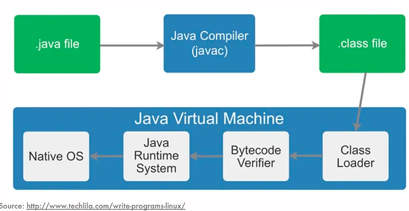
- JRE: It's the implementation of JVM.
- JDK: Dev kit for developing applications.
- Java vs C++: 
  - App programming -> System programming
  - Platform independent -> Platform dependent
  - Pointer internally -> Pointer explicitly
  - call by value only (primitive types) / a copy -> both: by value and by reference
  - thread support built-in -> needs external libraries
  - Not so interactive with hardware -> nearer to hardware
- JVM memory allocation:
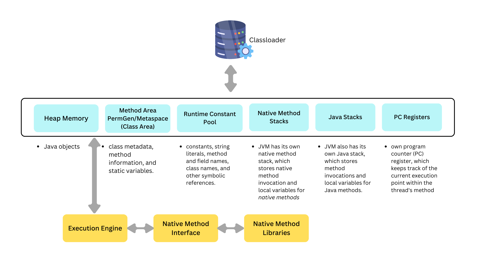


- Garbage collection: reclaiming the unused runtime objects.
  - Memory management
  - in C it is `free()` in C++ it is `delete()
  - gc is controlled by JVM, when a memory cleanup is needed
  - `finalize(): Invoked just before object is garbage collected
  - If an object is created without new, you can use the finalize method to perform cleanup processing (destroying remaining objects). The cleanup processing is the process to free up all the resources, network
  - finalize method is present in the object class hence it is available in every class
```
public class TestGarbage1{  
 public void finalize(){System.out.println("object is garbage collected");}  
 public static void main(String args[]) {  
  TestGarbage1 s1=new TestGarbage1();  
  s1=null;  
  System.gc();  
 }  
}  
=> object is garbage collected
```
- Unreferencing an Object:
  1. By setting reference to null
  2. By assigning a reference to another 
  ```
     Employee e1=new Employee();  
     Employee e2=new Employee();  
     e1=e2;//now the first object referred by e1 is available for garbage collection  
  ```
  3. By anonymous object: `new Employee();`

- JIT: Selectively compiling frequently executed portions of code, the JIT compiler improves the overall performance of Java applications
- Classloader: Responsible for loading classes into the JVM at runtime.
  1. Bootstrap classloader: loads core java classes i.e java.lang etc
  2. Extension classloader: loads `xx/jre/lib/ext`
  3. Sys/App classloader: Responsible for loading application-specific classes and resources. In spring boot apps, all components and main application class
  4. Custom Class Loaders: subclass the `java.lang.ClassLoader` to load from non-standard locations i.e db, network
- Default value for local variables: No value
- Access specifiers: public, protected (same package or subclasses), default (within package - by default), private
- `static` methods and variables: When something is common to all objects. Stored in class area
- Packages: avoids name conflicts, eases access control, locate classes easier.
  - java.lang is loaded internally and doesn't need import
- `sout(2 + 3 + "java")` vs `sout("java" + 2 + 3)` vs `sout("java" + 2 * 3)`
- `Runtime Class`: 
  - Java Runtime class is used to interact with a java runtime environment
  - Java Runtime class provides methods to execute a process, invoke GC, get total and free memory, etc. 
  - There is only one instance of `java.lang.Runtime` class is available for one java application. 
  - The `Runtime.getRuntime() method returns the singleton instance of Runtime class.
  - To invoke external process in java: `Runtime.getRuntime().exec("notepad");//will open a new notepad

## Object Oriented
- Modularity and re-usability
- Based on objects having data and methods
- Bottom-up approach: i.e accounts,cards,transactions--> BankApp
- Encapsulation (contain all required data and operations): Makes code testable, readable, provide control over data, makes it read-only or write-only 
- Abstraction: hide internal complexity, and showing only functionality to users
  - achieved by
    - abstract class
    - interface
- Java, python, c++ uses this concept
- In contrast to object-based language like JavaScript( having inbuilt objects i.e window in JavaScript)
- Object references as instance variables are initialized to null

- Constructor: special method, no explicit return, not inherited, can't be final, default one there to assign default values
  - When a parameterized constructor is there, no default constructor implicitly 
- `new`: 1. Memory allocation, 2. init (init default values: null -> instance references, 0 -> numeric types, false -> boolean), 3. constructor invocation 4. Return references (or a memory address)
- Default constructors: if not there, compiler creates one initializing the default values
- Static method: this and super() can't be used here. Main methods is static so that jvm doesn't need to create an object to call it.
- Static block: `static{xxx}` is used to initialize static data members. It is executed before main method at class loading time.
- `this` is a reference variable referring to the current object. `this()` invokes current class constructor i.e `this(2)`. It is final. 
- `super`: When an instance of subclass is created, the instance of super class created implicitly and is referenced by variable super.
  - `super()` is called implicitly by compiler as first statement when no super or this present
- `this()` and `super()` can't be used together in a constructor: Each has to be the first statement
```
class Person   
{  
    public Person(){  System.out.println("Person class constructor called"); }  
}  
public class Employee extends Person   
{  
    public Employee() { System.out.println("Employee class constructor called"); }  
    public static void main (String args[]) { Employee e = new Employee(); }  
} 
==> Person class xxxx
    Employee class xxx
```
- Inheritance: 
  - code re-usability and method overriding. IS-A vs HAS-A
  - Runtime polymorphism - Liskov Substitution
```
Base b = new Derived(); 
b.baseMethod(); // compile: the presence of baseMethod() in Base class is checked. Runtime: b references instance of Derived class
``` 
- Aggregation: HAS-A
- Composition: Stronger relationship than aggregation in which one can't exist without the other. i.e Student - Class
- Inner class can access all members of outer class
- Anonymous inner classes
```
  Person p=new Person(){ void eat(){System.out.println("nice fruits");} }; // Person being an Abstract class
```
- 
- Object: It is the superclass of all classes. It has `equal()`, `hashCode()`, `toString()`, `clone()` etc methods which classes can override
  - How two objects are defined as equal --> override `equal()`.
  - Advantages vs Disadvantages of cloning
  - How to store objects uniquely in Set --> override `hashCode()` and then `HashSet<Account> accountHashSet = new HashSet<>();`
  - The hashCode() method returns the same integer number if two keys (by calling equals() method) are identical.
  - hash-collision in Hashtable
    - Two different keys with the same hash value are known as hash-collision
    - ways to avoid hash-collision. 
      - Separate Chaining 
      - Open Addressing
  ```
  @Override
  public int hashCode() {
  final int prime = 31; // Choose a prime number for better distribution
  int result = 1;
  result = prime * result + id; // Calculate hash code based on account id
  return result;
  }
  
  // vs
  // better performance, but it might lead to more collisions if the id values are not well distributed or if there are patterns in the id values
  @Override
  public int hashCode() { 
    return id;
  }
  ```
  - `toString()`:
  ```
  @Override
  public String toString() {
    return "Account{id=" + id + ", name='" + name + "'}";
  }
  ```
  - `toString()` if a class hasn't overridden Object's toString method --> default toString from Object class --> class name followed by the hexadecimal representation of the object's hash code (memory address)
  - For a class object to be cloneable, it has to implement `java.lang.Cloneable`
- Method Overloading:
  - 1. By changing number of arguments
  - 2. By changing data type of arguments
  - `main()` can be overloaded, and we can have as many as we want
  - If same type found, it is called otherwise it is promoted to the corresponding method is called.
  - type promotion:


- Modify the throws clause of the superclass:
  - No exception in superclass method -> subclass can declare only unchecked (not checked at compile time) exception.
  - Exception in superclass, subclass overridden method can declare same, subclass exception.

- Method overriding: We can change scope of overridden methods, but only increasing accessibility is allowed
- Abstract class:
  - `extends`one level
  - abstract similar to normal class and can have
    - abstract methods
    - concrete methods with partial implementations
    - final methods
    - constructor
    - interface implementation
    - instance variables
    - static variables
  - abstract class can have anything 
- Interface
  - Full abstraction, multiple inheritance -> `implements`
  - Interface can have:
    - Constants: implicitly public, static
    - Marker Interfaces: empty interfaces i.e Serializable, Cloneable
    - Abstract methods - implicitly public
    - `default` methods: default implementations but can be overridden by implementing classes
    - `static` methods: utility methods
    - can extend another java interface only
    - No instance variable in interface
  
- *final*:
  - Stops value change. Initialized only at declaration or in constructor
  - Stop method overriding
  - Stop inheritance
  - blank final instance variable: if not static -> initialize it in the constructor. If static, initialize only in the static block.
- Compile-time vs run-time polymorphism
  - static binding | early binding | overloading vs late binding | late binding | overriding
  - less flexibility vs more flexibility
- `instanceof` operator: true or false

## Exception Handling
- Types
  - Checked: checked at compile i.e SQlException etc
  - Unchecked: caught at runtime i.e NullPointerException, ArithmeticException, IndexOutOfBound
  - Error: OutOfMemoryError, AssertionError


```
// checked
try {
    FileReader reader = new FileReader(file); // May throw IOException
} catch (IOException e) {
    System.out.println("An error occurred while reading the file: " + e.getMessage());
}

vs
// unchecked - it's not strictly necessary to handle this type of exception explicitly. Compiler allows you wihtout try-catch
try {
    result = 10 / 0; // May throw ArithmeticException
} catch (ArithmeticException e) {
    System.out.println("An arithmetic error occurred: " + e.getMessage());
}
```
- Check: Error
```
.....
catch(Exception e){System.out.println(e);}  
catch(ArithmeticException ex){System.out.println(ex);}    
```
- Finally:
  - The `finally` block is executed regardless of whether an exception occurs in the try block, and regardless of whether an exception is caught by a catch block.
  - Used to clean up such as closing files/database
  - Can be used without a catch block
  - No executed only when: System.exit()
- `throw` vs `throws`
  - `throw new Throwable(...)` only
- overriding method declare an exception if parent class method doesn't throw on?
  - only unchecked exceptions
- Exception propagation: m()//having code that throws exception --> n() calling m() --> p() which has try/catch calling n() --> main() calls p()
  - m() at the top of stack and main() at the bottom
- Output?
```
public class Main {  
    void a() {  
        try {  
        System.out.println("a(): Main called");  
        b();  
        } catch(Exception e) { System.out.println("Exception is caught");}  
    }  
    void b() throws Exception {  
     try {  
         System.out.println("b(): Main called");  
         c();  
     } catch(Exception e){ throw new Exception();}  
     finally { System.out.println("finally block is called"); }  
    }  
    void c() throws Exception { throw new Exception(); }  
  
    public static void main (String args[]) {  
        Main m = new Main();  
        m.a();  
    }  
}  
```
- Output?
```
public class Calculation {  
    int a;   
    public Calculation(int a) { this.a = a; }  
    public int add() {  
        a = a+10;   
        try {  
            a = a+10;   
            try {  
                a = a*10;   
                throw new Exception();   
            }catch(Exception e){ a = a - 10; }  
        }catch(Exception e)  {  a = a - 10; }  
        return a;  
    }  
    public static void main (String args[]) {  
        Calculation c = new Calculation(10);  
        int result = c.add();  
        System.out.println("result = "+result);  
    }  
}  
```

## String
- String poo: Reserved Heap Memory area for Strings
  - Jvm check if a String is already in pool. If it exists, it returns a reference to that, if not, it creates a new string instance
  - Saves memory by avoiding duplicacy.

```
String s1 = "Welcome";
String s2 = "Welcome"; // JVM doesn't create a new instance. It returns the reference to s1
System.out.println(s == s2); // returns true as both point to the same memory location (20adf3f
System.out.println(Integer.toHexString(System.identityHashCode(s))); // memory address in hexadecimal
System.out.println(Integer.toHexString(System.identityHashCode(s2))); // memory address in hexadecimal
```


- Strings are immutable:
```
public class StringImmutabilityExample {
    public static void main(String[] args) {
        String str1 = "Hello"; // Create a String object or String literal "Hello". JVM checks string pool first
        System.out.println("Original String: " + str1);

        // Concatenate " World" to str1 and assign the result to a new String object
        String str2 = str1 + " World";
        
        // Print the original and modified strings
        System.out.println("Original String: " + str1);
        System.out.println("Concatenated String: " + str2);
    }
}
==> str1 remains the same. str2 is a new string
```


- Ways to create String
  - Using literals: using double quotes
  - Using new: `String s = new String("Hi");` It will create an object in heap and a String instance placed in string constant pool. s will refer to object in heap
  - `s.intern()` returns String object reference from string pool
- String VS StringBuffer:
  - immutable VS mutable
  - slow and more memory consumed when we concat too many Strings (each creating new literal) VS Fast and consume less memory
  - String overrides `equals()` of Object clas --> `s1.equal(s2) VS StringBuffer doesn't override equals()
- StringBuffer vs StringBuilder
  - Thread safe (synchronized) VS Not thread-safe (non-synchronized)
  - less efficient VS more efficient
- Why CharArray() is preferred over String to store the password?
  - String stays in the string pool until the garbage is collected. It stays in the memory for a longer period, and anyone having the memory-dump can extract the password as clear text.
  - Using CharArray allows us to set it to blank whenever we are done with the password.

## Regular expression (Regex) engine (java.util.regex)
- Some classes and interfaces:
  - MatchResult Interface
  - Matcher class
  - Pattern class
  - PatternSyntaxException class
- metacharacters (^, $, ., *, +, etc) vs ordinary characters:
  - Metacharacters special meaning to the regular expression engine. Regex engine does not consider them as the regular characters. 
  - To enable the regular expression engine treating the metacharacters as ordinary characters, we need to escape them with the backslash.
- A password must start with an alphabet and followed by alphanumeric characters; Its length must be in between 8 to 20:
  - `^[a-zA-Z][a-zA-Z0-9]{8,19}`
    - `^`: start of regex
    - `[a-zA-Z]`: alphabet
    - `[a-zA-Z0-9]`: Alphanumeric
    - `{8,19}`: Size between 8 and 20
- `Pattern.matches(".s", "as")`=> string of size 2 => true similarly `7s`, `rs`, `!s` but not `abs
  - `.`: matches any single character except `\n`
- Get part-one and part-two from part-one.agentNumber=part-two
```
Pattern pattern = Pattern.compile("^(.*?)\\.agentNumber=(.*)$");
// Match the pattern against the input string
Matcher matcher = pattern.matcher(input);

if (matcher.find()) {
    // Extract part-one and part-two
    String partOne = matcher.group(1);
    String partTwo = matcher.group(2);
    ..
```
- Explanation:
  1. `^`: Start of the string.
  2. `(.*?)`: First capturing group denoted by parentheses ( ). The . matches any character except a newline. The *? is a quantifier that matches the preceding element (. in this case) zero or more times, but as few times as possible. This is because of the ? which makes the * non-greedy, meaning it will match as few characters as possible to satisfy the overall pattern. This captures part-one.
  3. `\\.`: This part matches the dot character . literally. In Java, the backslash \ is an escape character, so to match a literal dot, we need to escape it with another backslash, hence `\\.`.
  4. agentNumber=: This matches the literal string "agentNumber=".
  5. (.*): This is the second capturing group, capturing part-two. The .* matches any character (except newline) zero or more times. This captures part-two. 
  6. $: Signifies the end of the string. In a regular expression, it asserts that the preceding pattern must appear at the end of the input string.

## IO Stream - InputStream and OutputStream
- IO Stream: a sequence of data that flows from source to destination. It is composed of bytes. 
- In Java, three streams are created for us automatically.
  - System.out: standard output stream
  - System.in: standard input stream
  - System.err: standard error stream
- Reader/Writer vs InputStream/OutputStream
  - Character-oriented vs Class-oriented
  - CharacterStream: perform the input/output for the 16-bit Unicode system vs ByteStream: perform input-output of 8-bit bytes
  - `FileInputStream and FileOutputStream` vs `FileInputStream and FileOutputStream`
  - FileOutputStream: is an output stream used for writing data to a file.
  - FileInputStream: obtains input bytes from a file.


```
public static void main(String args[]) {
	try {
		FileInputStream fin = new FileInputStream("D:\\testout.txt");
		int i = fin.read();
		System.out.print((char) i);
		fin.close();
	} catch (Exception e) {
		System.out.println(e);
	}
}

public static void main(String args[]) {
	try {
		FileOutputStream fout = new FileOutputStream("D:\\testout.txt");
		fout.write(65);
		fout.close();
		System.out.println("success...");
	} catch (Exception e) {
		System.out.println(e);
	}
}   
```
- Purpose of BufferedInputStream and BufferedOutputStream
  - BufferedOutputStream internally uses a buffer to store data. It adds more efficiency than to write data directly into a stream.
  - BufferedInputStream class is used to read information from the stream. It internally uses the buffer mechanism to make the performance fast.
- I/O filter is an object that reads from one stream and writes to another, usually altering the data in some way as it is passed from one stream to another.
- Ways you can take input from the console
  - Using BufferedReader class
  - Using Scanner class
  - Using Console class:

## Serialization/Deserialization
- Serialization is a mechanism of writing the state of an object into a byte stream. 
- It is used primarily in Hibernate, RMI, JPA, EJB and JMS technologies or to transmit it over the network
- Serializable: by implementing the Serializable interface

- Avoid serialization of subclass if baseclass is serializable: writeObject() or readObject() methods in the subclass and throw NotSerializableException
- `transient`: it will not be serialized.
- Serializable and Externalizable
  - marker vs not marker
  - easier but less performant vs better performance
  - no control vs more control using `readExternal()` and `writeExternal()

## Java socket programming:
- Used for communication between the applications running on different JRE
- connection-oriented or connectionless
- Socket and ServerSocket classes => connection-oriented socket programming and 
- DatagramSocket, and DatagramPacket classes => connectionless socket programming. 
- The client in socket programming must know two information:
  - IP address of the server 
  - port number
- A socket is simply an endpoint for communications between the machines. 
  - Provides connection mechanism to connect the two computers using TCP. The Socket class can be used to create a socket.
- Steps followed when two computers connect through TCP:
  - The ServerSocket object is instantiated by the server which denotes the port number to which, the connection will be made. 
  - After instantiating the ServerSocket object, the server invokes accept() method of ServerSocket class which makes server wait until the client attempts to connect to the server on the given port. 
  - Meanwhile, the server is waiting, a socket is created by the client by instantiating Socket class. The socket class constructor accepts the server port number and server name.
  - The Socket class constructor attempts to connect with the server on the specified name. If the connection is established, the client will have a socket object that can communicate with the server. 
  - The accept() method invoked by the server returns a reference to the new socket on the server that is connected with the server.
- A program in Java to establish a connection between client and server:
- Convert numeric IP address 192.18.97.39 into a hostname like java.sun.com:

## Reflection:
- Process of examining or modifying the runtime behavior of a class at runtime. 
- The java.lang.Class class provides various methods that can be used to get metadata, examine and change the runtime behavior of a class. 
- `java.lang` and `java.lang.reflect` classes for java reflection. 
- It is used in:
  - IDE (Integrated Development Environment), e.g., Eclipse, MyEclipse, NetBeans. 
  - Debugger 
  - Test Tools, etc.
- Instantiate the Class class
  - forName() method of Class class
  - getClass() method of Object class
  - the .class syntax:
  ```
  Class c=Class.forName("Simple");    
  Simple s=(Simple)c.newInstance(); //of the Class class is used to invoke the constructor at runtime 
  s.message();  
  ```
- Wrapper classes and Boxing/Unboxing: i.e boolean => Boolean
- Native methods:
  - Methods implemented in other languages and called in java
- Purpose of System class:
  - Access to resources like i/o, err
- RMI allows an object to invoke methods on an object running in another JVM
  - Stub and skeleton
  - Step in writing RMI based programs
## Internationalization
- Locale: A Locale object represents a specific geographical, political, or cultural region. 
  - Get the locale-specific information such as country name, language, variant, etc.

## Data Structure and Algorithm using Java
- Bubble Sort
- Selection Sort
- Merge Sort
- Quick Sort
- Linear Search
- Binary Search
- Double linked list with n nodes
- Get Maximum and minimum value node from a circular linked list
- Calculate the difference between the sum of the odd level and even level nodes of a Binary Tree

## Multithreading and Concurrency in Java
- Multithreading: Executing multiple threads simultaneously.
- A thread is a lightweight subprocess.
- process vs thread
  - A Program in the execution is called the process whereas; A thread is a subset of the process
  - Process have different address space in memory, while threads contain a shared address space.
  - Context switching is faster between the threads as compared to processes
- Inter-thread communication:
  - wait(): Pause current thread
  - notify()
  - notifyAll()
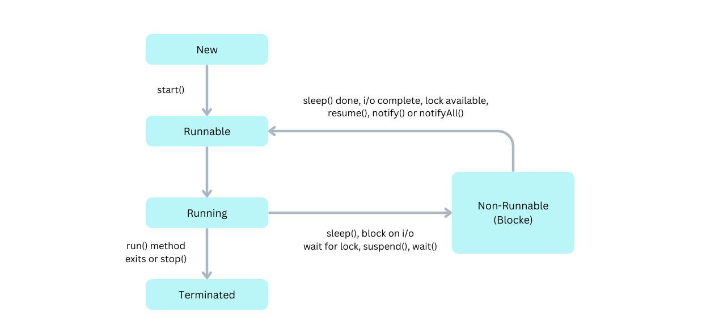

## Java Collection:
- Classes: ArrayList, Vector, Stack, HashSet
- Interfaces: List, Queue, Set
- Arrays vs Collection:
  - fixed size vs collection size can be changed dynamically
  - homogenous vs heterogeneous
- Interfaces:
  - Collection: Primary interface which every collection must implement `public interface Collection<E>extends Iterable`
  - List: Ordered collection of objects, contains duplicate, allow random access `public interface List<E> extends Collection<E>`
  - Queue: queue data structure in FIFO form
  - Dequeue: double-ended queue. Allows the insertion and removal of elements from both ends. Stack + Queue => LIFO and FIFO
    - `public interface Dequeue<E> extends Queue<E>`
  - Map: key-value pair storage of elements
- ArrayList vs LinkedList:
  - ArrayList uses a dynamic array.	LinkedList uses a doubly linked list. 
    - not efficient for manipulation because too much is required vs efficient for manipulation.
    - Better to store and fetch data vs better to manipulate data. 
    - random access vs provide no random access. 
    - less memory overhead as it stores only object	vs takes more memory overhead as it stores the object and the address of that object.
- Iterator vs ListIterator:
  - Traverses the elements in the forward direction vs traverses the elements in backward and forward directions both. 
  - Used in List, Set, and Queues vs can be used in List only. 
  - can only perform remove operation while traversing the collection vs can perform add, remove, and set operation while traversing the collection.
- List vs Set
  - duplicate vs unique
  - ordered vs unordered (insertion order is not preserved)
- Hashset vs TreeSet
  - No order vs ascending order. 
  - impended by hash table vs implemented by a Tree structure. 
  - HashSet performs faster than TreeSet. 
  - HashSet is backed by HashMap whereas TreeSet is backed by TreeMap.
- HashMap vs TreeMap
- Collection vs Collections (class)
- Comparable vs Comparator
- BlockingQueue:
  - Thread-safe
  - Concurrency in the operations like retrieval, insertion, deletion


# Java and Imperative vs Declarative Programming
## Imperative
- Focuses on describing how to achieve a specific result step by step
- Relies on statements like for, while, if, else
- Key Features: Mutable state, explicit control flow, and often more verbose.
```
int sumOfSquaresOfEvens = 0; 
for (int number : numbers) {
    if (number % 2 == 0) {
        sumOfSquaresOfEvens += number * number;
    }
}
```
## Declarative:
- Focuses on describing what needs to be achieved without specifying how to achieve it
- Use higher-level constructs like streams, lambdas, and functional operations
- Key Features: Emphasis on immutability, higher-order functions, and concise expressions 
- Java still remains primarily an imperative object-oriented language
```
int sumOfSquaresOfEvens = numbers.stream()
                                         .filter(number -> number % 2 == 0)
                                         .mapToInt(number -> number * number)
                                         .sum();
```
## Modern Java Features
### Functional Interface
- Functional Interface: Interface that has only one abstract method
- Types:
  - Consumer - BiConsumer: consumes one value : consumes two values
  ```
  List<String> names = new ArrayList<>();
  names.add("Alice");
  names.add("Bob");
  names.add("Charlie");

  // Using a Consumer to print each name in the list
  Consumer<String> printName = name -> System.out.println("Hello, " + name);
  names.forEach(printName);
  
  Map<String, Integer> ages = new HashMap<>();
  ages.put("Alice", 30);
  ages.put("Bob", 25);
  ages.put("Charlie", 35);

  Using a BiConsumer to print each name and age in the map
  BiConsumer<String, Integer> printNameAndAge = (name, age) -> System.out.println(name + " is " + age + " years old");
  ages.forEach(printNameAndAge);
  ```
  - Predicate - BiPredicate: `test()`, `and()`, `or()` for chaining
  ```
  BiPredicate<Integer, Integer> isSumGreaterThanTen = (num1, num2) -> (num1 + num2) > 10;
  // Test pairs of numbers and print if their sum is greater than 10
  System.out.println("Is sum of 5 and 6 greater than 10? " + isSumGreaterThanTen.test(5, 6));
  ```
  - Function - BiFunction
  ```
  Function<String, Integer> stringLength = str -> str.length();

  // Apply the function to get the length of a string
  int length = stringLength.apply("Hello");
  
  BiFunction<Integer, Integer, Integer> sum = (num1, num2) -> num1 + num2;
  // Apply the function to get the sum of two integers
  int result = sum.apply(5, 3);
  ```
- `accept()` performs operation and `andThen()` used for chaining different functions
  - UnaryOperator, BinaryOperator
  ```
  UnaryOperator<Integer> doubleInteger = num -> num * 2;
  // Apply the UnaryOperator to double an integer
  int result = doubleInteger.apply(5);
  
  BinaryOperator<Integer> max = (num1, num2) -> Math.max(num1, num2);
  // Apply the BinaryOperator to find the maximum of two integers
  int result = max.apply(5, 8);
  ```
  - Supplier Function
  ```
  Supplier<Integer> randomIntegerSupplier = () -> (int) (Math.random() * 100) + 1;
  // Get a random integer using the Supplier
  int randomNumber = randomIntegerSupplier.get();
  ```
### Constructor and Method References
- Method reference `String::toUpperCase` for consumer function
- Constructor reference `Student::new` for empty constructor
### Lambdas
- Anonymous functions
```
Runnable r = () -> System.out.println("hi");
r.run();
or 
new Thread(() -> System.out.println("hi")).start();

Comparator<Integer> comp = Integer::compareTo;
```
- Local variable outside lambda is not modifiable.
- Effectively final: lambda not allowed to modify local variable even if not final -->
### Streaming API
- Can be performed sequentially or in parallel
- Intermediate operation and 
- terminal operation: it is the one which starts the stream operation
- Debugging streaming operations: `peak()`
- `map() flatMap(), distinct(), count(), sorted(), reduce(), min(), limi(), allMatch(), anyMatch(), noneMatch()`
- `findAny(), findFirst()`
- Short-circuiting: limit(), findFirst(), findAny(), anyMatch(), allMatch(), noneMatch()
- Factory methods: `Stream.of(1,2,3), Stream.iterate(1, x->x*2), Stream.generate(Supplier<>)`
- Numeric Streams: `range(), rangeClose(), count(), foreach(),`
  - Aggregate functions: `sum(), max(), min(), average(), mapToInt()`
- Boxing and Unboxing
- Terminal operations: 
  - `collect()`: Inputs to collect() --> from Collectors --> 
    - `joining(...), counting(...), mapping(...), minBy(...), `
    - `minBy(...), maxBy(...), summingInt(), averagingInt()`
    - `grouptingBy(classifier), groupingBy(classifier, downstream), groupingBy(classifier,supplier, downstream`
    - `groupingBy() - maxBy(), groupingBy() - minBy(), collectingAndThen()`
    - `partitionBy(predicate), partitioningBy(predicate,downstream`
- Parallel Streams: `IntStream.rangeClose(1,1000).sum();` vs `IntStream.rangeClosed(1,1000).parallel().sum())`
- How parallel streams works taking into account the number of processors `(Runtime.getRuntime().availableProcessors()))`
- When not to use parallel streams. Example: boxing unboxing scenario. Local variable scenario
### Optionals
- Avoid too many nulls
- `Optional.ofNullable(...), Optional.of()`
- `Optional.orElse(), orElseGet(), orElseThrow()`
- `ifPresent(), isPresent()`
- `map(), flatMap(), filter()`
### Concurrency and Immutability
### Default and Static methods:
- Default method, can be overriden
### New Date and Time API (java.time)
- LocalDate, LocalTime, LocalDateTime in java.time
- Immutable with functional programming
- Supporting classes: Instant, Duration, Period
- Handy methods: `now(), of(xxx), getYear(), localDate.getDayOfWeek()`
- Modifying local date. `localDate.plusMonths(xx), .plusDays(xx)` localtime etc
- Same with localtime
- LocalDateTime: `getHour(), getMinute(), plus(), plusDays()`
- `withYear(), with(TemporalAdjusters.firstDayOfNextMonth())`
- Conversion support b/w LocalTime, LocalDate and LocalDateTime. `localDate.atTime(hour, minute), localTime.atDate(localDate)`
- *Period*: Period representation. used with LocalDate.
  - Use case: `Period p = Period.between(localDate1, localDate2)`, `p.getMonths(), p.getDays()`, `Period.ofYears(10)`
- *Duration*: time-based representation of hours, minutes, seconds
- Used with LocalTime and LocalDateTime 
- `Duration.ofHours(3)`
- `Duration d = Duration.between(localtime, localtime);`
- *Instance*: Represents time in machine readable format
  - `Instant.now()`: time in seconds from January 01, 1970 (EPOCH)
  - `Duration.between(instant, instant)`
- *Time Zones*
  - ZonedDateTime, ZoneID, ZoneOffset
  - zonedDateTime.getOffset() - Time difference from UTC
  - zonedDateTime.getZone - to get zone id
  - ZoneId.getAvailableZoneIds()
  - Get current datetime in Seattle - `ZonedDateTime.now(ZoneId.of("America/Los_Angeles"))`
  - Conversions: localDateTime.atZone(ZoneId.of("America/Los_Angeles")), Instant.now().atZone(xx), 
- java.util.Date and java.sql.date to LocalDate: 
  - `date.toInstant.atZone(ZoneId.systemDefault()).toLocalDate()`
  - vise versa: `new Date().from(Instant)`
  - Similarly for Sql Date
- DateTimeFormatter: 
  - Parse: String to LocalDate etc `LocalDate.parse("2022-03-23")`
  ```
  String date = "2018/04/24";
  DateTimeFormatter d = DateTimeFormatter.ofPattern("yyyy/MM/dd");
  System.out.println(LocalDate.parse(date, d));
  ```
  - Similarly for LocalTime
  - Format: LocalDate etc to String
# Domain Driven Design (DDD)
## Identify domain context and service boundaries
- Domain-driven sizing - requires a lot of time
- Event-storming sizing - faster
  - --> https://www.lucidchart.com/blog/ddd-event-storming

# Cloud Native Application
- 12-factor apps
- Microservices, containers, scalability & elasticity, DevOps, resilient and fault tolerance, cloud native services for messaging, caching, identity
- Cloud native vs traditional apps: predictable behavior, OS abstraction, right-size & independent, CD, rapid recovery & scalability

## Beyond 12-factor apps
- 15 factor apps extended by Kevin Hoffman
  - one codebase, on application
  - API first: API driven development
  - dependency management: one central script i.e maven or gradle
  - design, build immutable artifacts, release immutable unique through semantic versioning i.e 1.4.1, run using specific release
  - configuration (change without redeployment) and per deployment evn, credentials and code
  - logs
  - disposability
  - backing services i.e plug & play DB, kafka etc
  - environment parity: try to keep disparity between envs minimal
  - admin process: keep separate code and microservices for admin processes
  - port binding: self-contained in its own port using port binding
  - stateless processes: so that instances could be easily scaled up and down
  - concurrency: large user base is server concurrently by different instances (horizontal scalability)
  - telemetry: observability of microservices and log aggregation
  - Authentication & Authorization

# Clean API Documentation - OpenAPI / Swagger
- Swagger will be available under this path: http://{server-url}/swagger-ui/index.html 
- openapi json under /v3/api-docs 
- These endpoints are whitelisted in Websecurity config
```
<!-- If spring boot is based on Webmvc instead of Webflux -->
<dependency>
    <groupId>org.springdoc</groupId>
	<artifactId>springdoc-openapi-starter-webmvc-ui</artifactId>
	<version>2.3.0</version>
</dependency>
```
## Decoration of API using annotations
- Use @OpenAPIDefinition on the main application for top-level decorations
- Use @Tag, @Operation, @ApiResponses in RestController

# Deployment, Portability, and Scalability
- Containerization help achieve these like docker
- Container is easy to create and destroy
- Each container has own namespaces, control groups


## Docker
- docker images stored in repositories
- Dockerhub is the public repository
- Amazon ECR (Elastic Container Registry)
  - private repo
  - public repo  (https://gallery.ecr.aws)

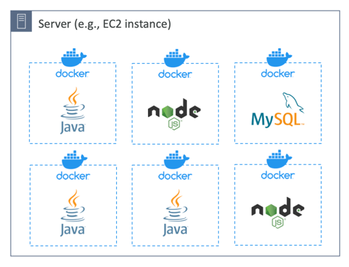
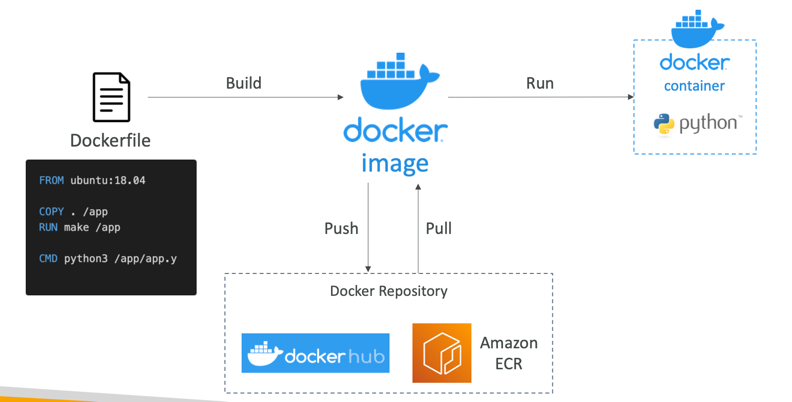
- for additional container concepts on AWS, see `aws-architect` docs
### Build Image
1. Build images using Dockerfile

``
docker build . -t dockerxya/bank-account
``
``
docker inspect image <image-id>
``
2. Build images using Buildpacks. This is heavy but supports many advanced features.

By default, Spring Boot uses the CNB builders provided by the [Paketo Buildpacks](https://paketo.io/) project.

[Image build tools comparison](https://buildpacks.io/features/)

[Spring Boot container-images.buildpacks](https://docs.spring.io/spring-boot/docs/current/reference/htmlsingle/#container-images.buildpacks)
```
<plugin>
	<groupId>org.springframework.boot</groupId>
		<artifactId>spring-boot-maven-plugin</artifactId>
	<configuration>
		<image>
			<name>dockerxya/${project.artifactId}</name>
			<env>
				<BP_NATIVE_IMAGE>true</BP_NATIVE_IMAGE>
			</env>
			<builder>paketobuildpacks/builder-jammy-base:latest</builder>					
		</image>
	</configuration>
</plugin>
```
See [this](https://spring.io/blog/2023/09/22/paketo-buildpacks-bionic-end-of-support) for later spring boot upgrade to 3.2.xx 
3. Build images using Google Jib. It can build docker image even if we don't have docker engine installed in dev pc.
It offers consistency, security, performance and governance with the need for Dockerfile

[Google Jib Docu](https://github.com/GoogleContainerTools/jib/tree/master/jib-maven-plugin)

- Note: `jib:build` will build and push the image to dockerhub whereas `jib:dockerBuild` will just build the image locally

### Running docker

``
docker run -p 8081:8080 dockerxya/bank-account
``


```
docker ps -a
```

```
docker container kill [container-id]
```

```
docker container logs [container-id]
```

## Docker Dashboard
The dashboard can be used to explore containers, logs as well option to run commands inside the container


# Docker Compose
- Liveness --> Readiness. Both are available under /actuator/health.
- Individually `/actuator/health/liveness`, `/actuator/health/readiness`
- Network concept: `docker networks ls` and `docker inspect <container-id>`


# Configuration
```
@Value

env.getProperty("property.name");

env.getProperty("JAVA_HOME");

@ConfigurationProperties("prefix")
```
- Separate environment specific properties to its own files

- Passing properties to the app using 
```
java .... --build.version="1.1" // command line args or program argument (first precedence)

java -Dbuild.version="1.1".... // JVM system property (second precedence)

BUILD_VERSION="1.1"java -jar .... // Env variables Capital letters and (.) --> (_)

test precedence by setting all the three in intellij
```

## Spring Cloud Config Server


### Check properties
prod + default: http://localhost:8071/bank-account/prod

### Profiles
- git
- native

### Encryption
```
encrypt:
  key: bankkey
```
POST http://localhost:8071/encrypt in body the text which needs to be encrypted.
In git stored the encrypted value like "{cipher}fhg4539ghf659"

POST http://localhost:8071/decrypt

## Change config at runtime
Actuator dependency is needed and then exposed using management in yaml.
On account service one could call `POST /actuator/refresh` endpoint to get config changes for the service.
By default, this endpoint is not exposed.

### Spring cloud bus
Broadcast changes for all instances. It will take care of refreshing all instance.
1. Run RabbitMQ as [here](https://www.rabbitmq.com/) --> Getting Started --> Download + Installation. Run the docker command
```
docker run -it --rm --name rabbitmq -p 5672:5672 -p 15672:15672 rabbitmq:3.12-management
```
2. Add RabbitMQ dependency to all applications
```
<dependency>
	<groupId>org.springframework.cloud</groupId>
	<artifactId>spring-cloud-starter-bus-amqp</artifactId>
</dependency>
```
3. Add related configurations to the YAML if different from the default.

**Demo**
1. Change the values in the repo and config server picks it up
2. Invoke the bus endpoint on the microservices
   - POST /actuator/busrefresh 
   - once invoke, bus will detect the changes and communicate them with other microservices too without doing anything.

### Using webhook to avoid manual work
1. Add the dependency to config server
```
<dependency>
    <groupId>org.springframework.cloud</groupId>
    <artifactId>spring-cloud-config-monitor</artifactId>
</dependency>
```
2. Add webhook
Since we run spring config locally, we can use https://hookdeck.com/ to test webhook. It basically received the request
and forward it to the local host in our machine. Just follow the steps shown at https://console.hookdeck.com/

Summary: Changes pushed to github --> hookdeck endpoint is triggered --> using sandbox, config server (localhost:8071/monitor) is triggered -->
/monitor publishes config change event to rabbit-mg (spring-cloud-bus) and initiate refresh on all subscribed nodes (dependency added to the nodes) .

---

# Database
In microservices architecture, each service should have its own database.
```
docker run -p 3306:3306 --name bank-account-db -e MYSQL_ROOT_PASSWORD=root -e MYSQL_DATABASE=bank-account-db -d mysql
```
In order to connect with db, use [SQLECTRON](https://sqlectron.github.io/) and `localhost:3306`.
Create database for microservice and expose in different port in local machine.

## AWS RDS
- **Fully managed** relational database service (continuous backup & restore, monitoring).
- Supports **MySQL, PostgreSQL, MariaDB, Oracle, SQL Server, and Aurora**.
- No **SSH access** to DB instances.
- Billing based on:
  - Storage capacity used
  - I/O requests
  - Backup storage
  - Data transfer
- Instance types: **On-Demand** (pay-as-you-go)
- Part of **VPC** for security and network configuration

- EBS volume used - auto-scaling 
  - when RDS detects you are running out of free DB storage, it scales automatically
  - you set a max storage threshold too
  - i.e modify storage if free storage is less than 10% of allocated storage, and low storage lasts less than 4 minutes and 6 hours passed since last modification
  - available for all types of db engines in RDS
- VPC concept

### Read Replicas (DB Performance)
- Improves **read performance**.
- **Async replication**, eventually consistent.
- Up to **15 replicas** across:
  - Same AZ
  - Cross-AZ
  - Cross-region
- Read replica can be **promoted** to master.
- To leverage read replicas, `applicaiton` must be updated
- Read client in a different region can use that region's read replica
- Use case: **analytics, reporting** without impacting production DB.
- Replication is **one-way**, used for **read scalability**.


- Complete Multi-AZ Setup


**Network Cost and Read Replicas**
- Usually traffic between AZs incur additional costs
- However, for RDS read replicas within the same region, you don't pay that fee.
- i.e `Master (M)` in `us-east-1a` replicates the data to `read replica (R)` in `us-east-1b` without cross AZ costs.
- Cross-region will incur costs (replication fee)

### Multi-AZ in RDS (Disaster Recovery & availability)

- **Synchronous replication** for HA.
- Automatic **failover** in case of:
  - AZ failure
  - Network issues
  - Storage or DB instance issues
- **No performance boost**, purely for **availability**.
- No manual intervention in app (automatic)
  - AWS RDS simply flips the CNAME for the DB to point to the standby, which in turm promoted to become primary
- Note: A read replica can be setup as multi-AZ for DR
- Going from Single-AZ to Multi-AZ
  - zero downtime, just modify
  - an standby will be brought up
    - a snapshot is taken
    - a new DB is restored from snapshot in the new AZ
    - synchronization is established between the two DBs

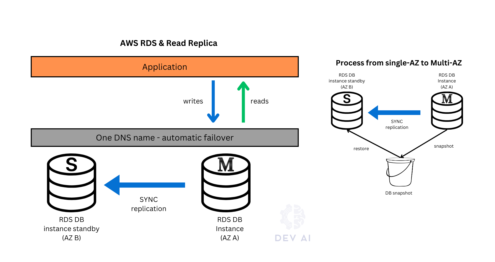

- Data sync between master and standby each 5 minutes
- Failover in 1 to 2 minutes
- Upgrade: first on standby, reroute traffic to standby and so on
- Backups can be taken from standby to avoid impacts


Let’s break it down in terms of **disaster recovery (DR)** vs **high availability (HA)** — these are similar but serve different goals:

---

### Why Still Use a **Standby (Multi-AZ)** if Read Replicas Can Be Used for DR?

| Aspect | Multi-AZ Standby | Read Replica |
|--------|------------------|--------------|
| **Failover time** | 🚀 Fast (~60 seconds, automatic) | 🐌 Slow (manual promotion required) |
| **Consistency** | 🔒 Synchronous (no data loss) | 🕒 Asynchronous (may lose last writes) |
| **Automatic recovery** | ✅ Yes (handled by RDS) | ❌ No (you must manually promote) |
| **Role** | Transparent HA/Failover | Read scaling + Optional DR |
| **Read access** | ❌ No (standby is hidden) | ✅ Yes |
| **Use for scaling?** | ❌ No | ✅ Yes |
| **Cost** | 💸 Included in Multi-AZ pricing | 💸 Extra per replica |

---

### 🧠 Key Points:
1. **Multi-AZ is about availability**, not scaling or geo-redundancy.
  - You want your app to **keep running during failures**, automatically, with **zero ops effort**.
  - RDS handles **instant failover**, **DNS updates**, **no manual intervention**.

2. **Read Replicas are about scalability and optional DR.**
  - If your **primary fails**, you must **promote manually**.
  - Data might be lost due to **replication lag**.
  - Better for **low RTO/RPO requirements** in non-critical situations, or **cross-region DR** where Multi-AZ isn’t enough.

---

### 🚦 Real-World Analogy:

- **Standby (Multi-AZ):** Like a **hot spare tire** in your car — already mounted, ready to take over instantly if one fails.
- **Read Replica:** Like a **second car** parked nearby — can take over if needed, but someone has to **go get it, start it, and maybe adjust the seat.**


### RDS and IAM Authentication

1. **Security & Deployment**
   - **Deploy RDS in a private subnet** (no public internet access).
   - Use multiple layers for security:
     - **Security Groups** (stateful firewall)
     - **Network ACLs** (optional, stateless)
     - **IAM** for authentication
     - **AWS Secrets Manager** for credential management

---

2. **Authentication Options**
  - A. **IAM Authentication (Passwordless)**
    - Secure, temporary access via IAM roles and STS.
    - Flow:
      1. Create an **IAM role** with RDS access.
      2. **Attach the role to an EC2** (or other compute service).
      3. RDS user is mapped to the IAM identity.
      4. The app connects using an **IAM auth token** (via STS).

> No stored credentials; uses short-lived tokens.

---

B. **Secrets Manager (With Password)**
  - Stores and rotates RDS credentials securely.
  - Flow:
    1. Store DB credentials in **Secrets Manager**.
    2. App or EC2 **assumes a role** to access the secret.
    3. App retrieves credentials and connects to RDS.

> Supports automatic password rotation via Lambda.

---

3. **AWS STS (Security Token Service)**
   - Provides **temporary credentials** for assuming IAM roles.
   - Powers:
     - IAM authentication to RDS
     - Access to Secrets Manager
     - Federated access via CLI/SDK

---

### RDS Parameter Groups
- To configure DB, we use parameter group (PG)
- A PG can be applied to more instance of RDS
- Under DB instance --> Configuration --> find the Parameter Group used
  - One can edit the PG and add new values for any parameters listed.
### Option group

### RDS Resource creation
- VPC creation:
  - Go to AWS, search VPC and create one
- RDS creation:
  1. Go to AWS RDS resource
  2. Create new `Subnet Group`
    1. Use created VPC
    2. Use created `Subnets`
  3. Go to `Create Database` and select the right DB instance to create
    1. Storage setup:
      1. gp3:
      2. Allocated storage size
      3. `Enable storage autoscaling`
      4. Max storage and scaling at rate of `10%`
  4. Connectivity Setup
    1. Don't connect to an EC2 vs Setup connection to a EC2 instance
  5. Choose subnet group created in `2.`
  6. Create security group. It a place with port to access RDS instances. It is created under VPC

### RDS Demos
- Configuration

[rds-postgres-config.gif](media/rds-postgres-config.gif)

- Connection to the DB

[rds-postgres-connection.gif](media/rds-postgres-connection.gif)

- Additional features

[rds-additional-features.gif](media/rds-additional-features.gif)

### RDS Backups
- **Automated backups (snapshots)**:
  - Daily full backup during backup window
  - Transaction logs every 5 mins
    - so you can restore to any point in time (till 5 minutes ago)
    - point-in-time recovery needs native RDS backup (automated)
  - Retention: 0 – 35 days
- RDS snapshots (manual or on demand backup):
  - manually triggered by the user
  - Long-term storage
  - Cheaper than running instance
  - Can be copied/shared across regions/accounts
  - retention for as long as you want
  - Hint: stopped RDS database will still incur costs for storage. Better make snapshot, then delete it and later if needed restore again.
    - snapshots costs way less than the actual storage
  - restore:
    - MySQL RDS: create backup of the on-premise DB, store in S3, then restore onto a new RDS (MySQL)
    - Aurora MySQL: create backup using Percona XtraBackup, store the backup file onto S3, restore onto a new Aurora instance 
- Under `Maintenance and Backups` one can find restore option and manual snapshot
- Snapshots can be copied and shared: in `Actions`. However, an automated backup can't be shared. It can only be copied
  - can be copied to another region.
  - with this method, a DB can be moved to another region (from frankfurt to london). In london, go to RDS->snapshots
  - Can be shared with another aws account (using account id). Go to that account: RDS->snapshots->shared with me
    - The snapshot is encrypted. The other account should have access to ecryption in order to restore the DB
- To **encrypt unencrypted DB**:
  - Take snapshot → copy with encryption → restore

### RDS vs RDS custom
- RDS automates setup, operation, and scaling of database in AWS
- RDS custom gives access to the underlying database and OS (configure, install patches etc) as well as access to underlying EC2 instance using SSH
  - available only for Oracle & SQL server database
  - deactivate `automation mode` when customizing and better to take snapshots

| Feature          | RDS                         | RDS Custom                         |
|------------------|------------------------------|-------------------------------------|
| OS-level access | ❌ No                         | ✅ Yes (SSH, root access)           |
| Use Cases       | General apps                 | Custom configurations, legacy apps |
| Supported Engines | All major engines incl. Aurora | Only Oracle & SQL Server           |

### RDS Security
- At-rest encryption:
  - master and replicas encryption using AWS KMS - defined as launch time
- RDS shouldn't be accessible to the internet (should reside in private subnet)
- Security group (stateful firewall)
  - block specific IPs, ports, or SGs
- encryption:
  - if master not encrypted, replica can't be encrypted
  - to encrypt un-encrypted DB, create snapshot, copy it with ticked "enable encryption", and restore the RDS instance from encrypted snapshot
  - in-flight encryption:
    - RDS creates an SSL cert and install the cert on the DB instance when the DB is provisioned
    - these certs are signed by CA
    - The SSL cert includes the DB instance endpoint as the CN for the SSL certificate to guard against spoofing attacks
    - download the root cert from the aws that works for all regions or a region-specific intermediate cert and use it to connect to the DB
- In addition to security group, one can configure network ACL (not stateful firewall)
- IAM role to connection and authenticate like user/pass
- Audit logs can be enabled and sent to CloudWatch for longer retention

## RDS Proxy
- It manages incoming connections to prevent the db from being overwhelmed (stressed on CPU, RAM)
- Fully managed, **multi-AZ**, **autoscaling**
- It minimizes open connections (timeouts) and pools connections to the RDS
  - it allows apps to pool and share connections
- It reduces RDS & Aurora failover time by upto 66%
- supports MySQL, Postgres, MariaDB, MS SQL, and Aurora (MySQL, Postgres)
- It is never publicly accessible (must be accessed from VPC)
- Improves db scalability when many users
- Caching for common queries - improved performance by
- So it is basically a loadbalancer thing
- Can be integrated with IAM and AWS secret manager
- Use case: a crucial use case is when 1000s of lambda functions coming up & going down want to access the DB

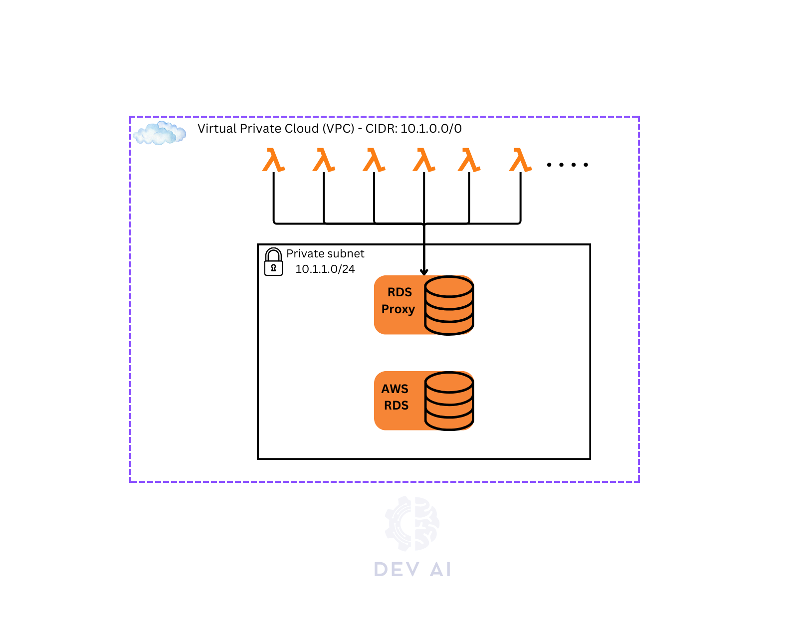

## Aurora DB

Aurora separates **compute** (DB instances) from **storage** (cluster volume):

- **Storage:** Shared, auto-replicated **six-way across 3 AZs** (super durable).
- **Compute nodes:** Writer + multiple Readers.

- Similar to RDS Read replica.
- Failover:
  - It is instantaneous
  - read replicas are assigned priority (0-15)
  - in the event of failure, aws promotes the highest priority replica (smaller number), if two of the same priority, it will pick up the largest one.
  - Any read replica can be become the master in case the master fails

- Aurora High Availability:
  - 6 copies of your data across 3 AZ
    - 4 copies out of 6 needed for writes (so if one AZ is down, that is fine)
    - 3 copies out of 6 needed for replicas ()
    - self-healing with peer-to-peer replication (if some data is corrupted, it will be healed)
    - storage is stripped across 100s of volumes
  - Automated failover for master in less than 30 seconds
  - Only one Aurora instance takes writes (master)


  - Read replicas can have auto-scaling. How the apps can keep track of the read replicas then? Using read endpoint (DNS name)


### Aurora Storage:
- Storage scaling in increment of 10GB, upto 128 TB
- Aurora I/O-Optimized:
  - For i/o intensive use cases
  - But more expensive per GB
  - Not paying for read and writes
- Aurora Standard
  - Cheaper per GB
- Aurora Backup:
  - DB can be restored to any point in time (back and fort)
  - Automated Backup:
    - 1 to 35 days (can't be disabled)
  - Manual snapshots:
    - same as RDS manual backup
- Aurora Cloning:
  - Create a new one from existing one which faster than snapshot & restore. It is cost-effective.
  - uses `copy-on-write` protocol: read: uses same data volume as original DB, when write: additional storage allocated and copy made
  - use case: prod --> staging (cloned)
- Cache Scenario
  - Write through cache (see DB Cache in ElastiCache)
  - A complex query is coming again, is already stored

### Aurora Instance Class:
  - Provisioned
    - db.r7g.large: graviton
    - r is memory optimized
  - Serverless
    - Instance class types
      - Intel, graviton
      - Memory optimized
  - prices are determined based on those classes
  - decide based on use cases in hand
- Aurora costs:
  - 20 % more costs, but more efficient
### Aurora DB creation
- Enable global database flag
- One can configure EC2 instance to connect to the DB
- Security group selection
- RDS proxy
- Database port choice
- encryption choice
- Failover priority: assign priority (1 - 16)
- Reader and writer are two different endpoints
  - Add additional reader instance
- Add a serverless reader:
  - Add reader --> Serverless v2 --> ACU (Aurora Capacity Unity)
  - No matter how many readers, the endpoint is one and the same
  - Any reader with high fail over priority will overtake a failing primary writer
- Create a serverless Aurora cluster
  - Create RDS and choose serverless v2 class
- Create an Aurora global database:
  - Add a new region to the cluster which renders it as global

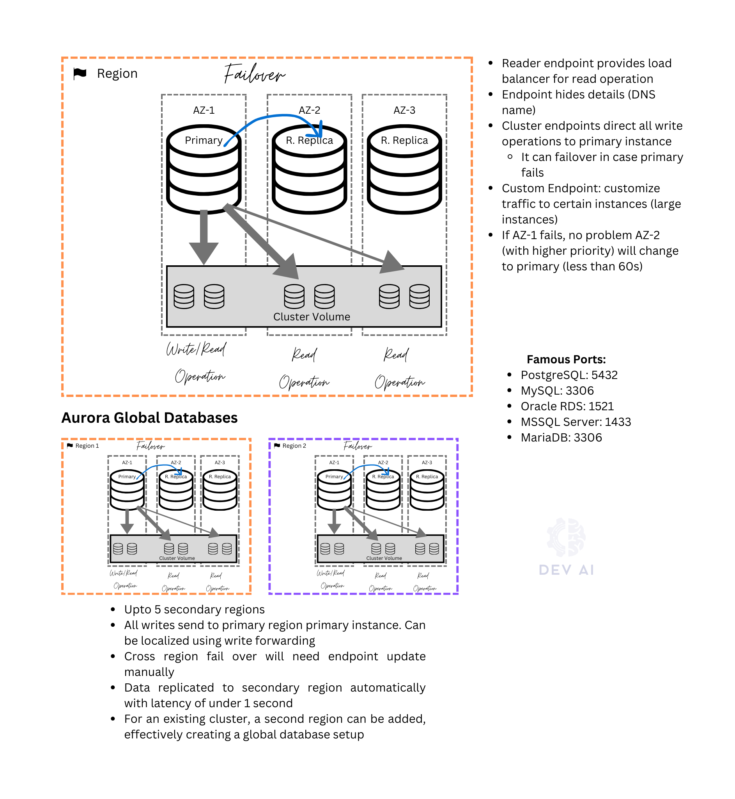

**Aurora DB Demo**
- Aurora Setup Demo

[aurora-db-setup.gif](media/aurora-db-setup.gif)

- Aurora DB Interaction Demo

[aurora-db-interaction.gif](media/aurora-db-interaction.gif)

**Aurora Advanced Concepts**
- Auto-scaling automatic


### Aurora Endpoints:
- **Aurora Reader Endpoint**:
  - Automatically **distributes read traffic** across all available **read replicas** in the Aurora cluster.
  - Ideal for **read scaling**—you just use one endpoint and Aurora balances the load.
  - Automatically **updates when replicas are added or removed**.

✅ Best for: **Read-heavy applications** needing high availability and load balancing.

---

- **Aurora Custom Endpoint**:
  - Lets you **create your own endpoint** that points to a **specific subset of DB instances** (e.g., only certain replicas).
  - Gives **fine-grained control** over which instances receive traffic.
  - You define which instances the endpoint includes.

✅ Best for: Workloads that need **custom routing**, like reporting queries to specific replicas.


- Aurora Serverless
  - Autoscaling based on the usage only 
  - good for infrequent, intermittent, unpredictable workloads
  - No capacity planning and pay per second and can be more cost-effective


### Global Aurora
- Across multiple regions
- Upto 5 secondary regions
- If one region fails it fail over to another region
- Aurora Serverless:
  - Scaling provisioned cluster can be challenging
  - Aurora serverless scales automatically (By automatically adjusting DB CPU, memory, network capacity)
    - Elastic scaling (they all come up and go down when not used)
  - One can add a serverless cluster on top of provisioned cluster. i.e Writer is provisioned while readers are serverless and vise versa
- Aurora cross-region read replicas
- Aurora Global DB (recommended)
  - 1 primary region (read/write)
  - upto 5 secondary (read-only) regions, replication lag is less than 1 second
  - upto 16 read replicas per secondary region
  - if a DB in a region fails, another region can be promoted in less than 1 minute
  - cross-region replication takes less than `1 second

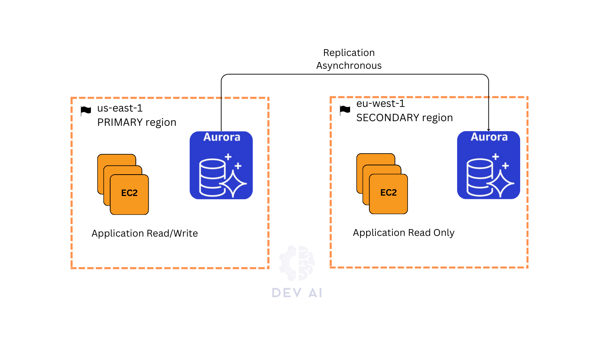

### Aurora vs RDS
1. ✅ **Aurora Standby Equivalent (High Availability)**

- Aurora doesn’t use a traditional **standby instance** like RDS does.
- Instead, it has a **clustered setup** where:
  - The **writer instance** handles writes.
  - **Reader instances** can be promoted to writer on failure.
- **Failover is automatic** and fast (~30 seconds or less).
- Since all nodes share the same distributed storage, there's **no replication lag** during failover.

> 🧠 So in Aurora, **standby = auto-failover to a reader instance**.

---

2. ✅ **Aurora Read Replicas (Scaling)**

- You can add **up to 15 read replicas** (Aurora Replicas) per cluster.
- These:
  - Share the same storage (no async replication like RDS).
  - Can serve **low-latency reads**.
  - Can be **promoted to writer** during failover (i.e., HA + DR).
- Reader nodes can be **in the same region or cross-region**.

---

**Failover Logic in Aurora**

If the writer fails:
- Aurora **promotes a reader** to be the new writer.
- This is **automated**, and faster than traditional RDS Multi-AZ failover.

---

**Summary: Aurora vs RDS**

| Feature | Aurora | Traditional RDS |
|--------|--------|-----------------|
| **Standby instance?** | ❌ Not needed (shared storage) | ✅ Synchronous replica |
| **Read replicas?** | ✅ Up to 15, low latency | ✅ Async replication |
| **Failover time** | ⚡ Fast (<30s) | ~60–120s |
| **Storage replication** | ✅ Built-in 6-way | ❌ Tied to instance |
| **Cross-region replicas** | ✅ Yes | ✅ Yes (for supported engines) |

---

For clear distinction between Aurora and RDS see this [readme](database.md)

### Aurora ML Integration
- Add ML based prediction to the application
- SageMaker
- Amazon Comprehend
- Use cases:
  - fraud detection, ads targeting, sentiment analysis, product recommendation


## AWS ElastiCache
- like RDS, it is a managed Redis, Memcached
- HIPAA (health) compliant
- they are in-memory DBs with high performance, low latency
- reduces load off of DBs for read intensive workloads (common queries results are cached)
- the cache makes the applications stateless
- for integration, it involves heavy application code change
- Redis (Remote dictionary server):
  - fast, open-source, in-memory key-value data store for use as a database, cache, message broker and queue
  - sub-milliseconds response time enabling millions of of requests per second for real time applications in gaming, ad-tech, financial services, health care and IoT
  - All redis data reside in memory
  - multi-AZ with auto-failover, high availability
  - read replicas and replication
  - It is a popular choice for:
    - caching
    - session mgmt
    - gaming
    - leaderboards
    - real-time analytics
    - geospatial
    - ride-hailing
    - chat/messaging
    - media streaming
    - pub/sub apps
  - more sophisticated use cases compared to `memcached`
  - IAM authentication
  - Redis AUTH (password/token)
  - AOF for data durability, backup, restore, supports sets and sorted sets
  - Use case: an important use case is leaderboards in games (computationally complex) for ranking gamers in real time using 
    - sorted sets which guarantees uniqueness and ordering
- Memcached:
  - multi-node and partitioning of data (sharding)
  - no high-availability (replication)
  - supports SASL based authentication
  - non-persistent
  - back & restore only in serverless one
  - multi-threaded architecture
  - simplest model possible
- Patterns for loading data into ElastiCache
  - lazy loading: all data cached, stale
  - write through: add or update the data in the cache when written to the DB, no stale data
  - session store: store temporary session data in a cache (using TTL feature)
  - 
- DB cache hit/miss:

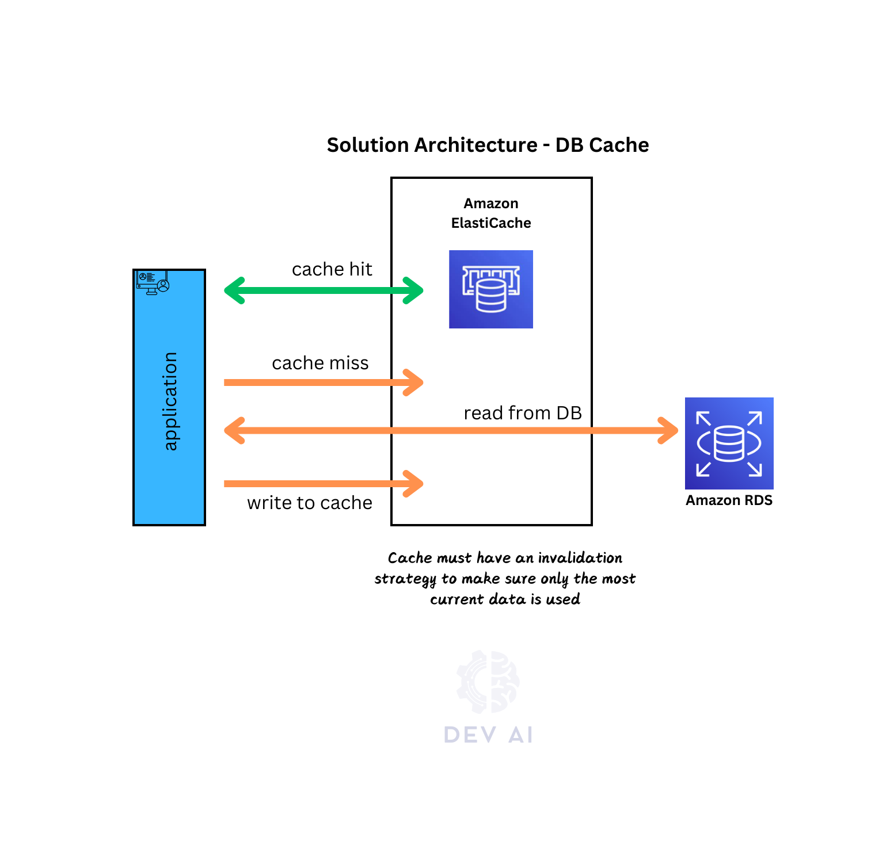

- User Session Store - Stateless application

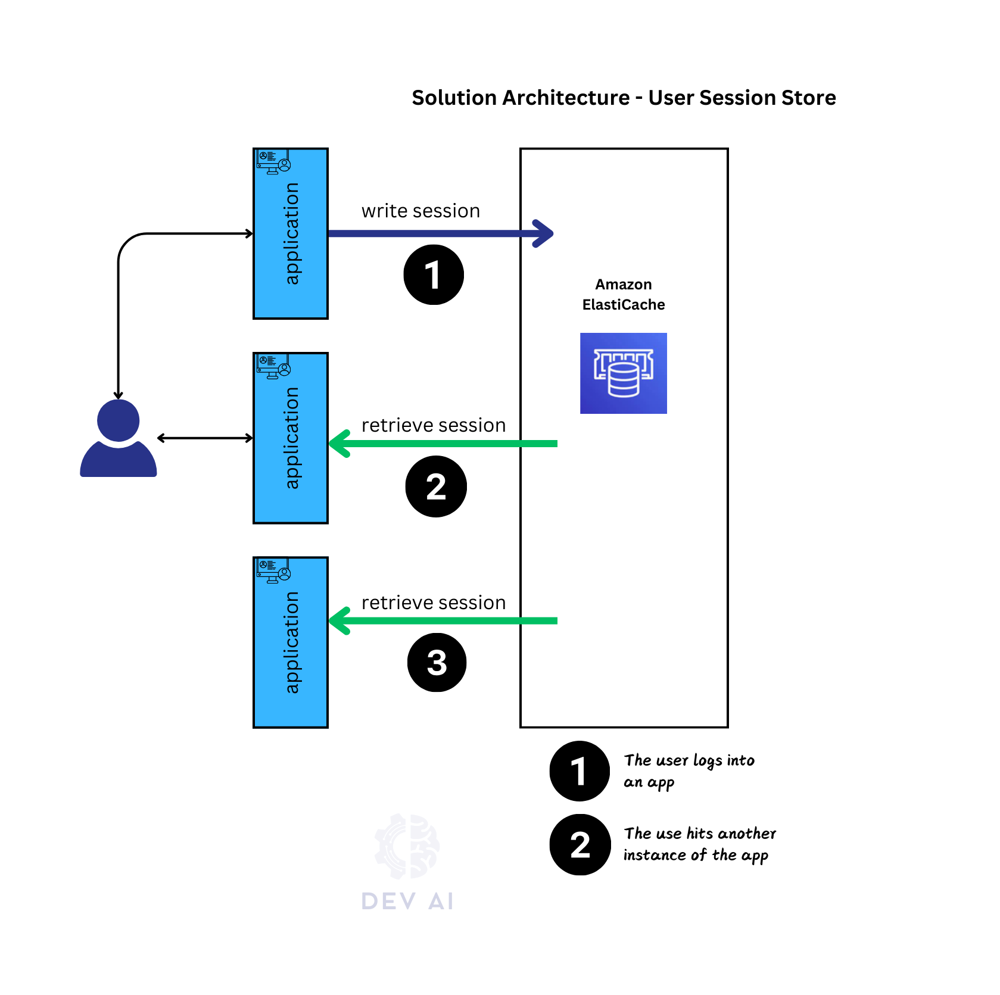

- Demos


## AWS No SQL 
### DynamoDB - NoSQL
- **Fully managed & available:** 
  - NoSQL database with multi-AZ replication and integrated IAM security.
- **High scalability & performance:** 
  - Supports millions of requests/sec, trillions of rows, hundreds of TB storage, and single-digit millisecond latencies.
- **Flexible schema:** 
  - Uses tables with primary keys, supports evolving attributes and various data types (scalar, document, set) with a 400KB item limit.
  - items has attributes (& new ones can be added anytime unlike RDS)
- **Cost-efficient & maintenance-free:** 
  - Offers auto-scaling and requires no patching (DB is already there).
- **Capacity options:** 
  - Provisioned (pre-planned RCUs/WCUs with auto-scaling) and On-Demand (automatic scaling for variable workloads).
- Standard & Infrequent Access (IA) Table Class
- If schema changes rapidly, then DynamoDB is the choice


- Demos:


- **DAX caching:**
  - Provides an in-memory cache for reduced read latency (microseconds) with a default 5-minute TTL.
  - helps solve read congestion
  - fully compatible with DynamoDB API (not app code change).


  - Why not ElastiCache
    - both can be complementary
    - in ElastiCache one can store huge aggregated result

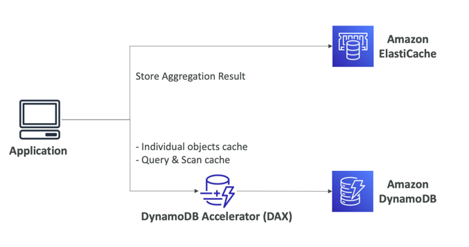
- DynamoDB - Stream Processing
  - ordered stream of item-level modification(create, update, delete)
  - use cases:
    - react in real time (welcome emails to users)
    - real-time usage analytics
    - insert into derivative tables
    - implement cross-region replication
    - invoke lambda on changes
  - Two stream processing types on DynamoDB:
    - DynamoDB streams
      - 24 hours retention
      - limited # consumers
      - process using lambda triggers or dynamodb stream kinesis adapters
    - Kinesis Data Stream (new): send all streams to it
      - 1 year retention
      - high # consumers
      - process using lambda, kinesis data analytics, Kinesis Data Firehose, Glue, Streaming ETL

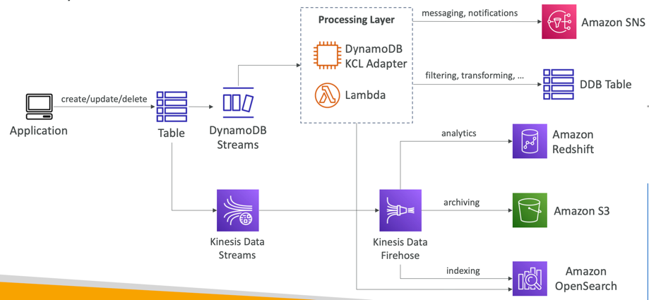

- DynamoDB Global Tables
  - Make a DynamoDB table accessible with low latency in multiple-regions
  - Active-Active replication (2-ways)
  - Applications can READ and WRITE to the table in any region
  - Must enable DynamoDB Streams as a pre-requisite

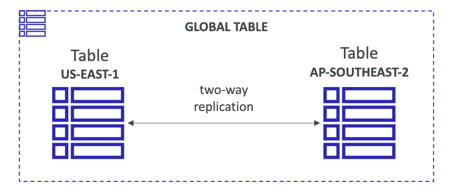

- DynamoDB TTL
  - automatically delete an item after an expiry timestamp 
  - Use cases: reduce stored data by keeping only current items, adhere to regulatory obligations, web session handling...


- DynamoDB - backups for DR
  - **Continuous Backups using point-in-time recovery (PITR)**
    - Can be enabled for up to 35 days
    - Allows recovery to any point within the backup window
    - Restores data by creating a new table
  - **On-Demand Backups**
    - Full backups retained until explicitly deleted
    - No impact on performance or latency
    - Can be managed in AWS Backup (supports cross-region copies & life cycle options)
    - Restores data by creating a new table

- DynamoDB - Integration with S3
  - Export table to S3 (Requires PITR) & query using retina on S3
    - Supports export for any point in the last 35 days
    - No impact on table read capacity
    - Enables data analysis and auditing
    - Supports ETL before re-importing to DynamoDB
    - Exports in DynamoDB JSON or ION format
  - Import from S3
    - Supports CSV, DynamoDB JSON, or ION formats
    - Doesn’t consume write capacity
    - Creates a new table
    - Logs import errors in CloudWatch Logs

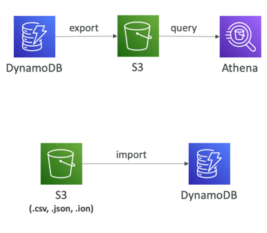
# Service Discovery
- IPs of new instance is short-lived and changes often
- How do microservices locate each other inside a network?
- How do new service instances enter into the network?
- How load balancing is done and info between microservices exchanged?
- --> Service Discovery: A service will discover another service using the registry. 
  - client-side service discovery
  - server-side service discovery
- --> Service Registration (All service registers themselves in a central location by giving its IP address and port)
  - The registry then expects regular heart beats from the services to check if they are healthy and available. It removed an entry if heart beats are not received.
  - As shutting down service deregisters itself
- --> Load Balancing: If multiple instances of a service is discovered, a load balancing strategy is used to distribute load among them


- Based on Gossip protocol all nodes of service discovery will share updated information between themselves.

To access details of registered services [/eureka/apps](http://localhost:8070/eureka/apps)

Kubernetes have server-side service discovery.

Spring cloud Eureka for service discovery

Spring cloud load balancer for client side load balancing

Feign Client for microservice look up

Eureka self-preservation mode to avoid traps in the network: 
```
eureka.instance.lease-interval-in-seconds: 30s # heart beat interval
eureka.instance.lease-expiration-duration-in-seconds: 90s # wait if no heart beat sent and then evict
eureka.instance.eviction-interval-in-ms: 60 * 1000 # scheduler which checks
eureka.instance.renewal-percent-threshold: 0.85 #
eureka.instance.renewal-threshold-update-interval-ms: 15 * 60 * 1000
eureka.instance.enable-self-preservation: true

```
# Routing, Cross cutting concern in microservices

- single point of entry for easiness
- cross-cutting concerns: logging, auditing, tracing, security
- A/B testing 
- routing based on headers sometimes
- Edge server = API gateway
[canva drawing](https://www.canva.com/design/DAF0CyI_9jA/O_GelgTVVvw4WX7UFRTDZA/edit?utm_content=DAF0CyI_9jA&utm_campaign=designshare&utm_medium=link2&utm_source=sharebutton)


## Spring Cloud Gateway
Spring cloud compared to Zuul is better
- It is non-blocking
- It is reactive
- Hast many features integrated out of the box
- Refer to [this](https://docs.spring.io/spring-cloud-gateway/docs/current/reference/html/) for further infos


Refer to spring cloud gateway docs for different predicates, filters, global filter, TLS and SSL.

- Gateway service will also connect to the Eureka server to get connection information of different microservices
- Route configuration: routePredicate.[path, filters, uri]
- Even with no route configuration, spring cloud gateway can forward request instances of microservices it retrieves from Eureka server
- Java lambda configuration vs yaml configuration: java based configuration gives more flexibility to customize (Fluent Java Routes API)
- Path route using [yaml](https://docs.spring.io/spring-cloud-gateway/docs/current/reference/html/#the-path-route-predicate-factory)
- For tracing purpose we added a custom header `bank-correlation-id` using `RequestTraceFilter`. 
- This correlation-id is added to all microservices down the call as coded in `bank-account` call chain.

Final Demo: config server starts and other util services start, then eureka which depends on config server starts as well as other services.
Finally GW service starts.

- Gateway [routes](http://localhost:8072/actuator/gateway/routes)


## Apigee - API management
- Securely expose bare APIs API key, OAuth or JWT
- API analytics for usage visibility
- API proxy - is a wrapper for your service i.e client calls proxy and proxy calls your server
  - why? enforce app independent mechanism for api management with respect to security, url design, data model, token verification, rate limit, hashing and analytics etc
- API policy: 
  - create product which wraps api proxy
  - create app which holds api key
  - add developer which owns the app
  - use that api key to call the proxy
- apigee has over 30 policies (traffic, security, message manipulation) and add custom code
- You have full control over request and response
- Apigee tracing:
  - you can trace a request and check steps followed for the request
- API portal in Apigee
  - publish api products with clear docs
  - consumer can learn and consume the API
  - web, text, asset (images, videos)
- API analytics:
  - Exposing API, enable other to consume your API, and visibility (API analytics)
  - API analytics: usage, error rates, geographic distribution etc

## AWS API Management 
- see `aws solution architect` repo

# Resiliency in microservices
- To avoid problem cascading if one service is failing
## Resiliency in Spring Cloud Gateway
- [Resilience4J](https://resilience4j.readme.io/docs)
  - We implement circuit breaker in spring gateway server using this.
  - It has different patterns implemented in core modules
- Problematic scenario: in calling gerCustomerDetails bank-account microservice (internally calls cards and loans microservices),
if cards service has problem and not responding, a thread is blocked. Further requests will block additional threads, leading to resource exhaustion
in account and gateway servers.
- Circuit breaker [pattern](https://martinfowler.com/bliki/CircuitBreaker.html): 
  - Fails fast by opening wire to cards service
  - Fails gracefully
  - Recovers seamlessly


Example: in gateway server, try to check circuit break activities using 
  - http://localhost:8072/actuator/circuitbreakers and 
  - http://localhost:8072/actuator/circuitbreakerevents?name=account-circuit-breaker
- Test it using a breaker endpoint in GET contact-info endpoint of account microservice

### Fallback for circuit breaker
Refer to FallbackController inside GW codebase and fallback URI in RouteLocator

## Circuit breaker using Feign Client in Account microservices
- If cards service is not responding, it impacts account service causing thread exhaustion.
- Fallback implements the feign client interface as in `CardsFallback`
- Check using these urls
  - http://localhost:8080/actuator/circuitbreakers and
  - http://localhost:8080/actuator/circuitbreakerevents?name=account-circuit-breaker
## Http timeout config: 
- At gateway server we can configure a global timeout for connect and response.
```
  cloud:
    gateway:
      # Please connect to discovery server (Eureka) and locate all microservices for request forwarding purpose
      discovery:
        locator:
          enabled: true
      # Wait time for each microservice connection. This is global for all microservices
      httpclient:
        connect-timeout: 1000
        response-timeout: 10s

```
- Accounts route will override this, as it has circuit breaker configured.
- One can configure timeout [per route](https://docs.spring.io/spring-cloud-gateway/reference/spring-cloud-gateway/http-timeouts-configuration.html)

## Retry Pattern with Backoff Strategy
- Using together with circuit breaker
- For Idempotent operations only

- At gateway for a microservice
```
.route(p -> p
        .path("/bank/cards/**")
        .filters(f -> f
                .rewritePath("/bank/cards/(?<segment>.*)", "/${segment}")
                .removeRequestHeader("Cookie")
                // GET is Idempotent
                .retry(retryConfig -> retryConfig.setRetries(3)
                        .setMethods(HttpMethod.GET)
                         // gateway initially waits for 100ms, it will then increment backoff duration capping it at max 1000ms
                         .setBackoff(Duration.ofMillis(100), Duration.ofMillis(1000), 2, true))
```
- Inside individual microservice:
```
    @Retry(name = "getBuildInfo",fallbackMethod = "getBuildInfoFallback")
    @GetMapping("/build-info")
    public ResponseEntity<String> getBuildInfo() throws Exception {
```
- in application.yml
```
resilience4j.retry:
  configs:
    default:
      maxRetryAttempts: 3
      waitDuration: 500
      enableExponentialBackoff: true
      exponentialBackoffMultiplier: 2
      retryExceptions:
        - java.util.concurrent.TimeoutException
```

## Rate Limiter Pattern
- 429 status code: too many requests
- enforced based on:
  - session
  - ip address
  - logged in user
  - tenant
  - server
- Business model for SAAS: request quotas i.e basic user, premium user, platinum user
### Rate Limiter in spring gateway
- Rate control for [API](https://spring.io/blog/2021/04/05/api-rate-limiting-with-spring-cloud-gateway) 


- We need a key resolver to decide i.e user, ip address etc using [keyResolver](https://docs.spring.io/spring-cloud-gateway/docs/4.0.7/reference/html/#the-requestratelimiter-gatewayfilter-factory)
- The default implementation of `KeyResolver` is the `PrincipalNameKeyResolver` (current logged-in username)

**Redis implementation (Stripe)**
- [Implementation](https://docs.spring.io/spring-cloud-gateway/docs/4.0.7/reference/html/#the-redis-ratelimiter) using Redis (Stripe team implementation): [link](https://stripe.com/blog/rate-limiters)
- Different scenarios listed in Stripe blog
- The algorithm used is the [Token Bucket Algorithm](https://en.wikipedia.org/wiki/Token_bucket).
- The redis-rate-limiter.replenishRate property defines how many requests per second to allow (without any dropped requests). This is the rate at which the token bucket is filled. 
- The redis-rate-limiter.burstCapacity property is the maximum number of requests a user is allowed in a single second (without any dropped requests). This is the number of tokens the token bucket can hold. Setting this value to zero blocks all requests. 
- The redis-rate-limiter.requestedTokens property is how many tokens a request costs. This is the number of tokens taken from the bucket for each request and defaults to 1. 
- For example, setting replenishRate=1, requestedTokens=60, and burstCapacity=60 results in a limit of 1 request/min. .application.yml

```
<!-- START: Spring data redis config for redis based ratelimiter (Stripe) -->
<dependency>
	<groupId>org.springframework.boot</groupId>
	<artifactId>spring-boot-starter-data-redis-reactive</artifactId>
</dependency>
<!-- END: Spring data redis config for redis based ratelimiter (Stripe) -->
```
```
spring:
  cloud:
    gateway:
      routes:
      - id: requestratelimiter_route
        uri: https://example.org
        filters:
        - name: RequestRateLimiter
          args:
            redis-rate-limiter.replenishRate: 10
            redis-rate-limiter.burstCapacity: 20
            redis-rate-limiter.requestedTokens: 1
```
Or using Java code:
```
    @Bean
    public RedisRateLimiter redisRateLimiter() {
        return new RedisRateLimiter(1, 1, 1);
    }

    @Bean
    public KeyResolver userKeyResolver() {
        return exchange -> Mono.justOrEmpty(exchange.getRequest().getHeaders().getFirst("user"))
                .defaultIfEmpty("anonymous");
    }
```
- We finally configure rate limiter for a route i.e loans route
- changes in yaml
```
spring:
  data:
    redis:
      connect-timeout: 2s
      host: localhost
      port: 6379
      timeout: 1s
```

**Demo**
1. Start redis locally
```
docker run -p 6379:6379 --name bank-redis -d redis
```
2. bench mark test using apache bench mark i.e below sends 10 request with concurrently 2 requests
```
ab -n 10 -c 2 -v 3 http://localhost:8072/bank/loans/api/contact-info
```

### Ratelimiter inside individual microservice
```
    @RateLimiter(name= "getJavaVersion", fallbackMethod = "getJavaVersionFallback")
    @GetMapping("/java-version")
    public ResponseEntity<String> getJavaVersion() {
```
yaml config:
```
resilience4j.ratelimiter:
  configs:
    default:
      timeoutDuration: 1000 # Time for the thread to wait
      # Every 5 seconds, one request is served
      limitRefreshPeriod: 5000 # For every 5 seconds renew the quota
      limitForPeriod: 1 # Quota
```

## Bulkhead patterns
- From ship design concept

- Using [Resilience4j](https://resilience4j.readme.io/docs/getting-started-3)

## Aspect Order
- Refer to [this](https://resilience4j.readme.io/docs/getting-started-3#aspect-order):
- `Retry ( CircuitBreaker ( RateLimiter ( TimeLimiter ( Bulkhead ( Function ) ) ) ) )`, so Retry is applied at the very end
- We can change the order inside application yaml


# Observability and Monitoring
- Trace the request flow
- Log aggregation
- Notification and alarms
- Observability: 
  - Logs
  - Metrics
  - Trace
- Monitoring
  - Dashboard
  - Alarms


## Log, metrics, traces
- We manage logs by using logger in microservices
- Log aggregation
  - dev config
  - product which takes cares of this
- Grafana
  - Log aggregation: Grafana loki
  - Metrics: grafana int with prometheus
  - Traces: Grafana tempo
- Grafana, Loki, Promtail [Setup](https://grafana.com/docs/loki/latest/get-started/)
  - Loki: log aggregation
  - Promtail: log aggregator agent
  - Check getting started for setup using docker compose


- Metrics: one can use /actuator endpoint to checkup on metrics.
- We need a tool to check and extract these metrics - Prometheus
- Prometheus however can't understand json format from /actuator endpoint
- To make such json metrics available for prometheus, we can use micrometer
- [Micrometer](https://micrometer.io/) exposes /actuator/metrics data in a format that a particular monitoring system (i.e Prometheus) can understand 
- Loki is to logs while [prometheus](https://prometheus.io/) is to metrics
- Grafana can be used to visualize Prometheus data

- `/actuator/metrics` and `/actuator/metrics/{metrics_name}`
- From micrometer+prometheus dependency, we get `/actuator/prometheus`
- Prometheus will invoke this path on regular basis

## Prometheus and micrometer Demo
- start docker compose 
- check `/actuator/prometheus` for microservices
- check `localhost:9090/targets` on prometheus server. It should show all services (6 services) monitored by prometheus.
- On graph page query metrics i.e system_cpu_usage and see the graph as well
- For more sophisticated graphs, we need integration of proemetheus with Grafana
- Go to Grafana: `localhost:3000` and check datasources under connections

- Setup [links](https://prometheus.io/docs/visualization/grafana/)
- Pre-build [graphs](https://grafana.com/grafana/dashboards/)
- Login to Grafana using admin:admin --> Dashboards --> Import dashboard --> paste URL of prebuilt [dashboard](https://grafana.com/grafana/dashboards/4701-jvm-micrometer/)
- Spring boot [dashboard](https://grafana.com/grafana/dashboards/11378-justai-system-monitor/)
- Create your own dashboard as well. Select new --> Add row --> Add Visualization by query a metric i.e uptime --> Add more visualizations and rows

### Alerting in Grafana
- We can add a webhook for [demo](https://scribehow.com/shared/Creating_and_Configuring_an_Alert_Rule_with_Contact_Point__2Ipb7e5WTFqdg3nG4agL-Q)
- We can add alerts at the [dashboard too](https://scribehow.com/shared/How_to_Create_a_Dashboard_and_Set_Up_an_Alert_in_Grafana__P-_FWbceSh6ShMHToFo70g).


# Distributed Tracing
- Spring Sleuth which is now moved to micrometer
- Open telemetry an alternative to micrometer (with Sleuth). It supports many languages.
```
<!-- START: Distributed tracing using open telemetry -->
pendency>
	<groupId>io.opentelemetry.javaagent</groupId>
	<artifactId>opentelemetry-javaagent</artifactId>
	<version>${otelVersion}</version>
	<scope>runtime</scope>
</dependency>
<!-- END: Distributed tracing using open telemetry -->
```
- We use Tempo from Grafana which indexes all tracing information. Loki to logs, prometheus to metrics, Tempo to tracing info
- Grafana will then display tracing from Tempo (We need to add tempo as another datasource in grafana datasource.yml)
- After adding Tempo to docker compose and adding related configurations i.e loading opentelemetry javaagent jar into containers start the docker compose
- Check logs of Loki for tracing format
- [Query](https://scribehow.com/shared/Step-by-Step_Guide_Navigating_and_Clicking_on_Web_Page_Elements__f4Edl1aFTfe321BHmEEOSQ) Tempo using a trace-id


- Zipkin is another tool for visualizing tracing information. However tempo is better because of loki logs (side by side)
- Jaeger from Redhat is also used for this purpose


- We can connect Loki and Tempo using Derived fields in Loki connection. As in configured in datasource
```
jsonData:
  httpHeaderName1: "X-Scope-OrgID"
  derivedFields:
    - datasourceUid: tempo # This is the exact same id we assigned to tempo in this file: uid: tempo
      matcherRegex: "\\[.+,(.+),.+\\]"
      name: TraceID
      url: '$${__value.raw}'
```
# Securing microservices:
- Authentication (Auth): is the process of identifying the person or application which is trying to access our microservices
- Authorization (AuthZ): is the process where we enforce privileged access
- Central identity and access management (IAM) especially when we have hundreds of microservices.
- To achieve this we use a tool setup consisting of OAuth2/OpenID connect, KeyCloak (IAM) and Spring Security

## Why OAuth2 (Open Authorization)
- Basic Authentication (username and password)
- Basic not separated from business logic
- Can't grant temporary access to clients
- The strength of OAuth2 is the separation of Auth and AuthZ into separate service
- i.e OAuth2 in play: Login to stackoverflow with github. The reditect url to log into github in decoded form looks like:
```
https://github.com/login?client_id=01b478c0264a1fbd7183&return_to=/login/oauth/authorize?client_id=01b478c0264a1fbd7183&redirect_uri=https://stackauth.com/auth/oauth2/github&response_type=code&scope=user:email&state={"sid":1,"st":"59:3:1b8,16:f7a45ee1c7770212,10:1701413399,16:ef70cfe3621a5996,5564bca86b9d4a7a4b12bd5aef0479ffabc767543758e8d38883dea06cf7869c","cid":"01b478c0264a1fbd7183","k":"GitHub","ses":"b5103c6595c1484587403e487faa97b7"}
```
- Github (OAuth2 server) gives a temporary access token to stackoverflow with limited access rights
- The token is similar to hotel access cards
- Delegated authorization using OAuth2 protocol
- Different grant flows:
  - server to server (two backend applications) communication
  - UI/mobile to backend 
  - IoT devices
  - Consols, TVs etc

- Terminology
  - Resource owner: user
  - Client: i.e stackoverflow acts on user's behalf to get details of user from Github. Stackoverflow is the client which wants to connect to Authorization server of Github
  - Authorization server: it knows the owner. As user/owner should have an account in this server
  - Resource Server: Github in above scenario. It holds resources like user details, email
  - Scope: Granular permissions that client wants. In above scenario github issues scope that stackoverflow can use to read email and user details
    - scope is read:user
## OpenID Connect
- Role based access mechanism
- Initially people used OAuth2 for both Authentication and Authorization, although it was only meant for Authorization.
- OpenID connect brings standards to authentication (identity details) among the applications.
- OAuth2 provides authorization via access token containing scopes, OpenID provides authentication via new ID token containing set of information and claims specifically for identity
- In addition to OAuth2 token, we get IdToken from OpenID

- with both we get IAM


### Implementations
- KeyCLOAK based on OAuth 2.0 and OIDC
- It supports OpenID Connect, OAuth 2.0, SAML 2.0 protocols
- Also SSO
- Social login
- Open Source
- Okta, AWS Cognito, FusionAuth are alternatives commercial products.

## Flow
### Grant Type Flow
- For communication between two backend services

- 


- Client invokes gateway-server
- Gateway-server redirects the client to Auth server
- If client has not account, it has to register. It will be issued client credentials
- With client credentials, it will get an access token from server and openID id token (if supported)
- Using this access token, it returns to gateway-server again.
- Gateway-server verifies the token with auth server himself
- Finally gateway server allows the call through

## Demo
- Keycloak Setup
```
docker run -d -p 7080:8080 -e KEYCLOAK_ADMIN=admin -e KEYCLOAK_ADMIN_PASSWORD=admin quay.io/keycloak/keycloak:23.0.1 start-dev
```
- clarify keycloak concepts: realm, clients, client scopes, realm roles, users, groups, session, events
  - Realm is an environment i.e dev, preprod, prod
- create client, find url in realm setting to get token using client credentials and get the token by following [this](https://scribehow.com/shared/Creating_an_OpenID_Connect_Client_in_Keycloak__jK9wX27IRPyVzi4nbLpKSQ).
- Check contect of access token and id token (OIDC)
- 

## Making Gateway server as Resource server
### Authentication
- Add related dependencies as marked in pom.xml
- Add related access data of Auth server to gateway server
- cert endpoint is for checking if the token was issued exactly by this Auth server. Auth server issues tokens using private certs.
```
  security:
    oauth2:
      resourceserver:
        jwt:
          jwk-set-uri: "http://localhost:7080/realms/master/protocol/openid-connect/certs"
```
- Configure `ServerHttpSecurity` for webflux
- `ServerHttpSecurity` is to webflux as `HttpSecurity` is to webmvc.
### Authorization using Roles
- We use `hasRole` instead of `authenticated` in `ServerHttpSecurity` configuration
- We create the Role in Auth server (i.e KeyCloak)
- Go to Realm Roles --> Create role --> create ACCOUNTS, CARDS and LOANS roles
- Go to the client --> Service account roles tab --> Assign roles. In access-token:

```
  "realm_access": {
    "roles": [
      "default-roles-master",
      "ACCOUNTS",
      "offline_access",
      "uma_authorization"
    ]
  }
```
- To extract role from JWT into spring security framework:
```
public class KeycloakRoleConverter implements Converter<Jwt, Collection<GrantedAuthority>> {
```
- `GrantedAuthority` carries role or privilege information.

## Authorization code grant type flow
- When a user is also involved.
- 
- In stackoverflow scenario: I am an user, stackoverflow is client, in between an OAuth server, and Github is a resource server

- Demo using Okta [playground](https://www.oauth.com/playground/authorization-code.html)
-You need to first verify that the state parameter matches the value stored in this user's session so that you protect against CSRF attacks.
- Using KeyCload for bank service:
  - Create client with standard flow (authZ code)
  - Set `Valid redirect URIs` the same as passed by client. Here *
  - Set Web origin to `*` to avoid CORS
  - Create user and set password
  - Using postman, set grant-type to `Authorization Code`. Check [bank-microservices.postman_collection.json](bank-microservices.postman_collection.json) under gateway-server-security
  - Using http://localhost:7080/realms/master/protocol/openid-connect/auth it receives authorization code and using http://localhost:7080/realms/master/protocol/openid-connect/token an access token
  - For state, give a random alpha-numeric value
- Usually a user is created using KeyCloak [REST API](https://www.keycloak.org/docs-api/22.0.1/rest-api/index.html) instead of admin portal


# Event driven microservices
- We need to avoid temporal coupling (Sync request)
- Different models
  - Pub/Sub model: Once consumed, it is done. No future access. Mainly done using RabbitMQ
  - Event streaming model: Consumer can join anytime and start consuming from any part of the stream. Mainly done using Kafka
## Pub/Sub using RabbitMQ

- Read further [here](https://jstobigdata.com/rabbitmq/topic-exchange-in-amqp-rabbitmq/).
- Producer --> Exchange and based on a specific routing rule, RMQ determines queues that should receive a copy of the message.
### Spring Cloud Functions features:
- Choice: Reactive, Imperative and Hybrid
- Data can be streamed out of these functions from/to these functions.
- We can make a composite of functions for complex business logic
- REST API support
- Packaging and deployment to different environments. i.e AWS
- Good for event driven
- Can run as webpoit, stream processor or as task
- Adapters
- Read [here](https://spring.io/projects/spring-cloud-function)
- Look at bank-messaging-service
- To pipe functions into chain ones, see the service's `application.yml` using `email|sms
```
<dependency>
	<groupId>org.springframework.cloud</groupId>
	<artifactId>spring-cloud-function-context</artifactId>
</dependency>

<!-- START: expose functions as REST endpoint -->
<dependency>
	<groupId>org.springframework.cloud</groupId>
	<artifactId>spring-cloud-starter-function-web</artifactId>
</dependency>
<!-- END: expose functions as REST endpoint -->
```

### Spring cloud streams
- scalable, event driven microservices, [streaming](https://spring.io/projects/spring-cloud-stream#overview)
- Just add any dependency for streaming i.e RMQ or Kafka or Kinesis etc. Just plug and play like making function above REST api
- Components:
  - Destination Binders
  - Destination Binding
  - Message


- Integration functions with RMQ: We remove dependencies: fn-context, fn-web, spring-boot-starter. We add just:
```
<dependency>
 <groupId>org.springframework.cloud</groupId>
	<artifactId>spring-cloud-stream</artifactId>
</dependency>
<dependency>
	<groupId>org.springframework.cloud</groupId>
	<artifactId>spring-cloud-stream-binder-rabbit</artifactId>
</dependenc
```
- Internally it adds spring cloud function dependencies
- We add binding and rabbitmq configuration to `application.yml` of bank-messaging-service
- Add configuration to bank-account service to send messages into rabbitmq

### Spring cloud function for messaging microservice
- Standard interfaces from java 8: Suppliers, Functions, Consumers
- Used for developing business logics. It offer many things out of the box. i.e The logic of the function is exposed as REST API by default.

## Using Kafka
### Kafka vs RabbitMQ
- Kafka is a distributed event streaming platform where rabbitMQ is a message broker
- Kafka handles large volume of data where RabbitMQ handles complex routing with smaller volume of data
- Data retention: Kafka stores inside the desk whereas RMQ stores events in memory (Low latency and fast)
- Performance: Kafka is faster especially for large data volume
- Scalability: Kafka is highly (add any number of kafka brokers horizontally) scalable where RMQ is limited
- Kafka: producer --> broker --> consumer

### Key concepts
- Producer: They write messages to a specific topic, and Kafka appends these messages to the topic's log.
- Topic: Is a particular stream of data that can be divided into partitions. Each message in a topic is identified by a uniques offset (ID)
- Brokers: Servers that manage the storage and replication of topics, receiving messages from producers, assigning offsets to messages, and serving messages to consumers.
- Partition: Topics can be divided into multiple partitions allowing for parallel processing and load balancing. Each partition is ordered, immutable sequence of messages and each message within a partition has a unique offset.
- Offset: Uniques identifiers assigned to each message within a partition. They are used to track the progress of consumers. Consumers can control their offsets, enabling them to rewind or skip messages based on their needs.
- Replication: Kafka allows topics to be replicated across multiple brokers to ensure fault tolerance. Replication provides data redundancy, allowing for failover and high availability.
- Consumer: Consumers read messages from Kafka topics. They subscribe to one or more topics and consume messages by reading from specific partitions within those topics. Each consumer maintains its offset to track its progress in the topic.
- Consumer group: Consumers can be organized into consumer groups. Each messagepublished to atopic si delivered to only one consumer within each group. This enables parallel processing of messages across multiple consumers.
- Streams: Kafka Streams si aclient library that enables stream processing within Kafka. It allows you to build applications that consume, transform, and produce data in real-time

### Key knowledge points:
- Why partition: distributed content of a topic in different brokers for resiliency purposes
- At least 3 brokers in prod
- Why consumer group: c1 --> p1, c2 --> p2. To achieve parallelism
- How to partition: i.e specific state, zipcode, region goes to one partition

### Setup
**Setup Kafka cluster locally**
- go to apache kafka [web](https://kafka.apache.org/quickstart) 
- Download first
- Setup Kafka with KRaft
- Follow the steps to setup local kafka cluster

**Configure microservices to connect**
- Added Kafka binders as shown in pom.xml of account and message service
- Add kafka binder in application.yml
- *NOTE:* To see two binders (kafka and rabbitmq) at play, we use two binders for two communication channels

**Kafka setup in docker compose**
- Use this as [reference](https://github.com/bitnami/containers/tree/main/bitnami/kafka)

# Orchestration - Kubernetes
- Automating deployments, rollouts and rollbacks
- From Google
- Features:
  - Service discovery and load balancing (server side load balancing)
  - container and storage orchestration
  - self-healing
  - secret and config management
- K8s architecture


## Key concepts
- API server: The API server is the primary interface for interacting with the Kubernetes cluster. It exposes the Kubernetes API, which allows users and other components to communicate with the cluster. All administrative operations and control commands are sent to the API server, which then processes and validates them
- Scheduler: The scheduler is responsible for placing Pods onto available nodes in the cluster. It takes into
  account factors like resource requirements, affinity, anti-affinity, and other constraints to make intelligent decisions about which node to assign a Pod to. The scheduler continuously monitors the cluster and ensures that Pods are distributed optimally.
- Controller manager: The controller manager maintains the cluster. It handles node failures, replicates components, maintains the correct number of pods, etc. It constantly tries to keep the system in the desired state by comparing it with the current state of the system.
- etcd: eted is a distributed key-value store that serves as the cluster's primary data store. It stores the configuration data and the desired state ofthe system, including information about Pods, Services, ReplicationControllers, and more. The API server interacts with eted to read and write cluster data.
- Kubelets: is an agent that runs on each worker node and communicates with the control plane components. It receives instructions from the control plane, such as Pod creation and deletion requests, and ensures that the desired state of Pods is maintained on the node. The kubelet is responsible for starting, stopping, and monitoring containers based on Pod specifications.
- Kube-proxy: is a network proxy that runs on each node in your cluster, implementing part of the Kubernetes Service concept. kube-proxy maintains network rules on nodes. These network rules allow network communication to your Pods from network sessions inside or outside of your cluster.
- Container runtime: is responsible for running and managing containers on aworker node. Kubernetes supports multiple container
  runtimes, with Docker being the most commonly used. Other runtimes like containerd and rkt are also supported. The container runtime pulls container images, creates and manages container instances, and handles container lifecycle operations.

## Setup
- To install using [docker](https://docs.docker.com/desktop/kubernetes/)
- `kubeclt config get-contexts`
- `kubectl config get-clusters`
- `kubectl config use-context docker-desktop`. We use this command to switch active contexts.
- Finally, setup k8s dashboard [using](https://kubernetes.io/docs/tasks/access-application-cluster/web-ui-dashboard/)
  - `kubectl apply -f https://raw.githubusercontent.com/kubernetes/dashboard/v2.7.0/aio/deploy/recommended.yaml`
  - `kubectl proxy`
  - http://localhost:8001/api/v1/namespaces/kubernetes-dashboard/services/https:kubernetes-dashboard:/proxy/
  - create sample user [using](https://github.com/kubernetes/dashboard/blob/master/docs/user/access-control/creating-sample-user.md) 
  - create role binding by following the instruction
  - create token and login using token
  - select the namespaces needed i.e kubernetes-dashboard
  - follow the instruction for long-lived token as in k8s folder
    - `kubectl get secret admin-user -n kubernetes-dashboard -o jsonpath={".data.token"} | base64 -d`
## Kubernetes Yaml Config
- Use latest yaml template for deployment, service etc
- label is service name, having label and match label the same value
- To expose the pod, either to external or for local communication, the deployment is paired with a service
- Note: containerPort of deployment and targetPort of service refer to internal port of the pod and are the same value
- After creating all k8s manifests, deploy them to local cluster
  - `kubectl get deployments` `kubectl get services` `kubectl get replicasets` in default
- Cluster-IP (natural) vs External-IP (for exposure to outside)
- `kubectl get events --sort-by=.metadata.creationTimestamp`
### Scaling up and down
- `kubectl scale deployment bank-account-deployment --replicas=1`
- `kubectl set image deployment gateway-server-deployment gateway-server=eroidxya/gateway-server:v14 --record=true`
- `kubectl rollout history deployment gateway-server-deployment`
- `kubectl rollout undo deployment gateway-server-deployment --to-revision=1`

## Kubernetes Service Types
1. ClusterIP: ClusterIP service creates an internal IP address for use within the K8s cluster. Good for internal-only applications that support other workloads within the cluster. eazy bytes

2. NodePort: Services of type NodePort build on top of ClusterIP type services by exposing the ClusterIP service outside of the cluster on high ports (default 30000-32767). If no port number is specified then Kubernetes automatically selects a free port. The local kube-proxy is responsible for listening to the port on the node and forwarding client traffic on the NodePort to the ClusterIP.
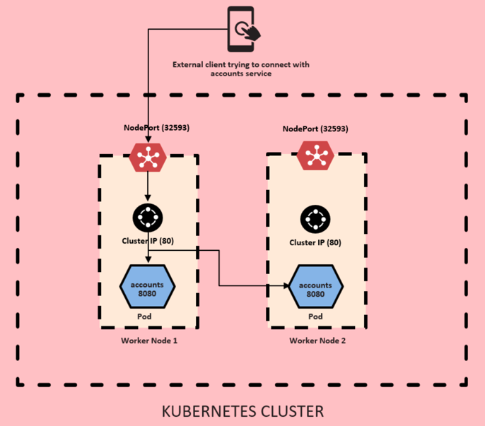
   - IP address of the cluster worker node is needed. If the worker node goes down, it won't work
3. LoadBalancer: The LoadBalancer service type is built on top of NodePort service types by provisioning and configuring external load balancers from public and private cloud providers. It exposes services that are running in the cluster by forwarding layer 4 traffic to worker nodes. This is a dynamic way of implementing a case that involves external load balancers and NodePort type services.

   - Load balancer will have a public IP address that won't change
   - Independent of worker nodes and its number
   - To avoid exposing services, change LoadBalancer to ClusterIP

## Why helm
- If 100 services, 100 time apply command. And if we want to delete, then 100 times delete command.
- Helm is package manager of k8s where chart is a package. packs into a single chart and put in central repo
- With single command entire deployment and rollback
- Can have hierarchy i.e child - parent relationship between charts
### Installing Helm
- Refer [to](https://helm.sh/docs/intro/quickstart/)
- `helm ls` 
- `helm search hub wordpress`
- To install one:
  - `helm repo add bitnami https://charts.bitnami.com/bitnami`
  - `helm install happy-pands bitnami/wordpress`
  - check the dashboard
- To remove it:
  - `helm ls`
  - `helm uninstall happy-panda`
### Additional helm commands
- `helm env`

### Helm Structure


### Helm chart for our Microservices
- `helm create bank-common`
- After creating all charts, we compile them
  - `helm depedencies build` for each Chart
- `helm template .` to check if everything is ok, like compile
- Install services like Kafka, RabbitMq as a service using bitnami charts
  - From bitnami [charts](https://github.com/bitnami/charts/tree/main/bitnami)
  - Download the folder using [this](https://download-directory.github.io/) and build the chart's dependency
  - i.e `helm install keycloak<release name> keycloak<folder>` and access it locally
  - Note: the console also give the DNS name within the cluster, of the installed service i.e ` keycloak.default.svc.cluster.local`
  - Follow CLI output for futher instructions

### Upgrade chart - Roll in and Roll out
- i.e increase and decrease number of pods, image of container
- `helm upgrade grafana grafana`
- `helm history bank`
- taking version from above command -> `helm rollback bank 1`
- `helm uninstall bank`

# Server side load balancing
- No need of maintaining a separate service for service discovery
- Implementation using [spring cloud kubernetes](https://spring.io/projects/spring-cloud-kubernetes/)

- To setup this [server](https://docs.spring.io/spring-cloud-kubernetes/reference/spring-cloud-kubernetes-discoveryserver.html)

## Demo
- To demo k8s service discovery, we comment out all Eureka related configurations and redeploy the services.
## A comparison of load balancers:
1. Spring Cloud Load Balancer:
- Ideal for small-scale, Spring-based microservices applications.
- Provides fine-grained, application-level control over request routing.

2. Kubernetes LoadBalancer Service:
- Best for managing external traffic into Kubernetes clusters.
- Works within Kubernetes environments with Pod scaling and cloud integrations.

3. AWS Elastic Load Balancer:
A robust, scalable, and fully-managed service for balancing external and internal traffic across AWS workloads.
Designed for enterprise-grade applications requiring multi-region, highly available, and secure load balancing.

# Kubernetes Ingress, Service mesh (Istio) and mTLS
- ExternalName is another service type like LB and ClusterIP. Check docs
- Ingress: Similar to service, we can use ingress to expose our services

## Ingress
- Single entry point similar to spring cloud gateway.
- One can choose either spring cloud gateway or k8s Ingress to implement cross-cutting concerns
- Capabilities
  - Path based routing
  - Single Entry Point
  - Load balancing the traffic i.e route to one of the pods
  - Allow securing application with SSL/TLS certificates. It terminates SSL/TLS to avoid excess load inside the cluster. 
  - Host-based routing i.e app1.example.com instead of path
  - Annotation to rewriting rules, custom headers, adding authentication/authorization
  - All these are also possible in spring cloud gateway but with additional development efforts
  - Ingress offer more advanced routing and traffic management capabilities.

- Example:
```
apiVersion: networking.k8s.io/v1
kind: Ingress
metadata:
  name: ingress-wildcard-host
spec:
  rules:
  - host: "foo.bar.com"
    http:
      paths:
      - pathType: Prefix
        path: "/bar"
        backend:
          service:
            name: service1
            port:
              number: 80
  - host: "*.foo.com"
    http:
      paths:
      - pathType: Prefix
        path: "/foo"
        backend:
          service:
            name: service2
            port:
              number: 80

```

- Using ingress we define rule. There should be an implementation of ingress using different **ingress-controller** i.e **NGINX**, Traefik, HAProxy


## Types of traffic:
- Ingress traffic: traffic entering kubernetes cluster
- Egress traffic: traffic exiting a k8s cluster
- North-bound traffic: Refers to traffic flowing in and out of the Kubernetes cluster to external networks, including: Ingress an Egress
- South-bound traffic: Refers to internal traffic within the Kubernetes cluster. This includes communication between the pods, services, and nodes inside the cluster.
- North-south traffic: Traffic entering and exiting a cluster

## Traffic within a cluster between services
- It is called east-west traffic 
### Service mesh: 
- It is an extra layer of software you deploy alongside your cluster (i.e k8s)
- It is a dedicated infrastructure layer for managing communication between microservices in a containerized environment
- It provides a set of networking capabilities that facilitate secure, reliable and observable communication between services within a distributed system.
- Internal traffic (east-west) is guarenteed security by:
  - Being closed to outside world
  - Service mesh
**Capabilities:**
  - Service discovery
  - Load balancing
  - Circuit breaker
  - Fault tolerance
  - Metrics and tracing
  - Security (mTLS)
- Therefore, service mesh will take care of most of the non-functional requirements (such as security, metrics, tracing, resilience) inside a sidecar proxy container
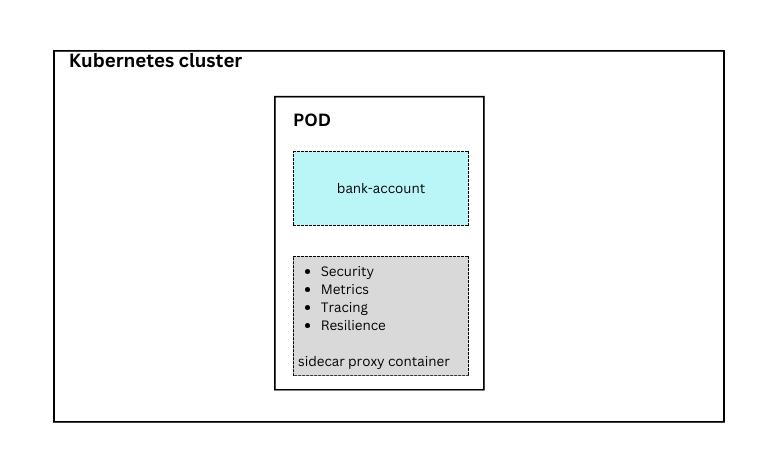


**Service mesh components**
1. Data plane: Responsible for routing traffic between services using sidecar proxies
2. Control plane: Responsible for configuring, managing, and monitoring proxies. It includes components like control plane API, service discovery and configuration management


**TLS**
- TLS: transport layer security. Secured transmission of data. Used in browser based exchanges
- TLS is an encryption protocol
- Third party issue the certificate which has a validity
- Previous solution was using SSL and TLS is the more advanced one.


**mTLS**
- When the TLS steps followed by both the parties (service-to-service, within cluster communication). Both should prove their identities.
- No need of external CA. 
- Service mesh will act as a certificate authority (CA)
- mTLS: Mutual TLS is used for service-to-service communication between microservices as no browser is involved.
- 
- mTLS follows `zero trust` and make sure security is enforced in internal communications as well.


- **Advantages of mTLS**
  - Mutual Authentication
  - Protection against impersonation
  - Granular access control
  - Resistance to credential compromise
  - Simplified key management as CA is local resource
  - No scalability issue of keys
  - Compliance to GDPR, HIPAA, PCI DSS etc
  - Zero Trust Security framework

**Popular service meshes:**
1. Istio
2. Linkerd
3. Consul
4. Kong
5. AWS App Mesh
6. Azure Service Mesh


# Microservice code architecture
## Port Adapter and Onion Architecture

# Deploying on public cloud
- We can deploy our kubernetes microservices onto GCP of google using the free tier.
- Steps:
  - Activate free trial
  - Install google cloud SDK to connect to k8s cluster from local system. [Link](https://cloud.google.com/sdk/docs/install-sdk)
  - After installing use `gcloud init` to initiate logging into the created account
  - create k8s cluster after enabling k8s engine API. Switch to standard cluster while creating the cluster
  - After cluster created, click on three dots menu and click on `connect`. Copy the command and execute in the local terminal
  - Install k8s discovery server, followed by all the charts created under `helm`
  - `kubectl describe pod pod-name` and find node name. Find node in k8s dashboard and check logs
  - Access keycloak using the external IP (deployed as loadbalancer)
  - Update postman Authorization Access token URL using the keycload IP
  - Access grafana using port-forwarding (ClusterIP)
- Shut down
  - Uninstall all charts
  - Go to k8s discovery server location and run `kubectl delete -f kubernetes-discoveryserver.yml`
  - Delete the cluster to avoid any costs


# JAVA - Security
Refer to OWASP project for further details.
Inherent Security Features: 
- Strong Data Type, 
- Byte Code Verification: Bytecode --> platform independence
- Secure Class Loading: Bytecode is loaded from *.class into VM by classloader
- Exception Handling, 
- Automatic Memory Management using JRE garbage collector. Memory used by objects is released and reclaimed by gc.
- POLP: Principle of The Least Privilege

## Security Libraries:
- Authentication and Access Control
  - JAAS (Java Auth and AuthZ service)
- Protecting Data At Rest:
  - Cryptographic controls to protect confidentiality, availability, and integrity of application data
  - Using
    - Digital signature
    - message digests
    - support symmetric and asymmetric and streaming ciphers
- Secure communication Libraries
  - Java Secure Socket Extension (JSSE)
  - Java GSS-API
  - Java SASL API
- Trust management
  - Public Key Infrastructure (PKI) is beneficial when establishing trust relationship
  - Java CertPath API
  - Revocation Services (OCSP/CRL), and PKIX APIs
- Diagnostic, Forensic and Supply Chain Security
  - Java Logging API
  - Java Dependency Analysis Tools (jdeps) that identifies third party components 

## Code Injection Prevention:
### SQL injection
We can defend against sql injection using JDBC prepared statement
```
"SELECT * FROM accounts WHERE account_number = '" + accountNumber + "';"

GIVEN:
accountNumber="TomJerry'; DROP TABLE accounts; --"
```
(--) is considered comment and will be ignored.
Safer Code would be:
```
String query = "SELECT * FROM accounts WHERE account_number = ?;";
PreparedStatement pstmt = dbConnection.preparedStatement(query);
pstmt.setString(1, accountNumber);
ResultSet results = pstmt.executeQuery();
```
PreparedStatement pre-computes the sql query into a binary database proprietary format. Everything passed, will be considered 
accountNumber.

### Encoding Reserved Control Sequences
If in comment section of a website one inserts below, it will be rendered.
```
<script>alert("hello Alerting")</script>
```
< and > should be converted to &lt and &gt

### XML Parser Defense
- XML external entity (XXE) attack is used to:
  - exfiltrate sensitive data, like below for linux password
```
....
<!ENTITY xxe SYSTEM "file:///etc/passwd">]><bar>&xxe;</bar>
```
  - execute server-side port scanning, 
  - denial of service
  - Refer to OWASP for settings for popular xml parsers

### JAAS
- Subject: a user or a software service
- Principal: Unique representation of a subject's identity within a context of an application
- Credential: implements Refreshable and Destroyable interfaces
- Authentication features validate 
  - LoginContext: features to authenicate subjects
  - LoginModule: 
  - Callback handler
  - Callback
- Authorization:
  - Policy: access control policy
    - Security policy
    - Security manager
    - 
  - AuthPermission: Permission associated with Authentication
  - PrivateCredentialPermission:
- App instantiates LoginContext --> LoginModules --> LoginContext login method --> LoginModules associate principals and credentials
--> LoginContext returns authentication status to the application --> if success, app retrieves teh subject from context
- For AuthZ: App retrieves authenticated subject from LoginContext --> execute privileged action --> if success priviledgeExceptionAction.run()

## Cryptography
  - Confidentiality. Java provides:
    - Message Digest
    - Managing password ciphers: encrypt and decrypt using key and initVector
    - Digital signatures: To establish the authenticity of digital messages.
      Only holder of private key can sign a document. Holder of public key can verify that data is signed by the owner
      i.e HTTPS over TLS/SSL (X.509 signed by CA)
    - Secure random number generation: DRBG (Deterministic Random Bit Generator): This refers to a category of algorithms designed for secure random number generation. Java's SecureRandom
    - Integrity

## Secure Communication
- Java Secure Socket Extension (JSSE): Encryption, server authentication, message integrity et 

## Public key Infrastructure (PKI)
- Ecosystem of roles, responsibilities, policies, and procedures for issuing, managing and revoking digital certs.

## Web Security

# Spring Framework
## Spring Web
### Spring Web Security
- If Spring starter-security is on the classpath, then web applications are secured by default.
- To switch off the default security configuration completely or to combine other components such as OAuth2 Client and Resource Server:
  - Add a bean of type `SecurityFilterChain`: This is recommended instead of extending `WebSecurityConfigurerAdapter`. [See](https://spring.io/blog/2022/02/21/spring-security-without-the-websecurityconfigureradapter)
- Add `http.csrf(AbstractHttpConfigurer::disable)` is important if you call endpoint using swagger-ui, otherwise the API throws 403
- For OAuth2, [check](https://docs.spring.io/spring-boot/docs/current/reference/htmlsingle/#web.security.oauth2) and bank-services
- 

## Spring Testing Ecosystem

## Spring Data (JPA)  
- Lazy loading vs eager
- access these fields
- @Transactional mechanism
- i.e from work

# SQL Codebook
- Main frame: Business queries to database language
## Local setup for MacOS
- From [here](https://www.postgresql.org/download/macosx/) go and download [Postgres.app](https://postgresapp.com/) which doesn't need installer
- Follow the instructions
- Download [pgAdmin](https://www.pgadmin.org/download/pgadmin-4-macos/) for macos based on processor you have
- Connect to local instance from pgAdmin
- Create some sample data using `dvdrental.tar` by restoring the data into a new schema

## Cheat sheet
```
SELECT c1,c2 FROM tbl WHERE conditions ORDERED BY c1 ASC, c2 DESC LIMIT 100; // AND, OR, NOT, case-sensitive**
SELECT DISTINCT c1,c2 FROM tbl; // only distinc combination of c1,c2 returned. With or without brackets. Unique value inside the column or combination
SELECT COUNT (DISTINCT release_year) FROM book;
SELECT c1, aggregate(expr) FROM tbl GROUP BY c1;
SELECT c1, aggregate(expr) AS c2 FROM table GRUOP BY c1 HAVING c2>v;

INSERT INTO tbl (c1,c2,...) VALUES (v1,v2,...);
INSERT INTO tbl (c1,c2,...) SELECT c1,c2 FROM tbl2 WHERE condition;
UPDATE t SET c1=v1,c2=v2 WHERE condition;
DELETE FROM t WHERE condition
TRUNCATE TABLE t; // Drop table t and recreate it, losing all data

CREATE TABLE t (
  c1 datatype(length) column_constraints, -- or c1 datatype(length) PRIMARY KEY
  c2 datatype(length column_constraints, -- age SMALLINT NOT NULL
  ...
  PRIMARY KEY (c1), -- i.e serial type, bigserial
  table_constraints
  );
  
DROP TABLE t; // remove table, including 
ALTER TABLE t ADD COLUMN c1 datatype(length);

SELECT * FROM t1 INNER JOIN t2 ON joint-conditions;
SELECT * FROM t1 LEFT JOIN t2 ON join-conditions;
SELECT * FROM t1 RIGHT JOIN t2 ON join-conditions;
```
- Example of nested query:
```
SELECT *
FROM (
    SELECT
        d.name,
        d.id,
        COUNT(e.id) AS employees,
        SUM(
            CASE
                WHEN e.level = 'SENIOR' THEN 1
                WHEN e.level = 'ASSOCIATE' THEN 1
                ELSE 0
            END
        ) AS AboveJunior
    FROM
        department d
    LEFT JOIN
        employee e ON d.id = e.fk_department
    GROUP BY
        d.id
) AS subquery
LIMIT 10;

```
- Ascending the throne, descending the throne

- COUNT(*) vs COUNT(title) vs COUNT(id)
- Meaning of `ORDER BY c1,c2`? If two row have same value in c1?
  - First order by c1, and then c2 if the condition of equality happens in c1 
- Default value of `ORDER BY`?
```
SELECT store_id, first_name, last_name FROM customer
ORDER BY store_id DESC, first_name ASC
```
```
-- Reward 10 paying customers
SELECT customer_id from payment
ORDER BY payment_date ASC
LIMIT 10;

-- How many options do I have for movie less than or equal to 50 mins length
SELECT COUNT(*) FROM film 
WHERE length <= 50;
```

- BETWEEN xx AND yy => >= AND <= (Inclusive)
- For date, it should be in ISO 8601 format (yyyy-mm-dd)
```
-- All movie between 1,5 hours and two hours
SELECT title FROM film 
WHERE length BETWEEN 90 AND 120;

-- Or count them
SELECT COUNT(title) FROM film 
WHERE length BETWEEN 90 AND 120;
```
- IN => for a set of values, NOT IN 
```
SELECT film_id, title, rating FROM film
WHERE rating IN ('R', 'G')
ORDER BY rating, title
```

- LIKE and ILIKE (case-insensitive): Pattern matching with String data
  - (%) match any number of strings
  - (_) single character wild card place to fill in. One could use more of (_) for more characters
- LIKE '_her%': Cheryl, Theresa, Sherri
- NOT LIKE
- Postgres supports full regex capabilities
```
SELECT *
FROM customer
WHERE first_name LIKE 'Ja%';
```

## GROUP BY and Aggregate functions
- Aggregate: take multiple inputs and return one output
  - AVG(), COUNT(), MAX(), MIN(), SUM()
- ROUND --> `ROUND(AVG(replacement_cost),2)`
- GROUP BY syntax: `SELECT category_col, AGG(data_col) FROM t GROUP BY category_col;`
- All columns must appear in GROUP BY claus except those on which AGG is applied
- WHERE should not refer to AGG result. Instead we use HAVING to filter thos result
- GROUP BY is for categorical columns (non-continuous)
- Example
```
-- total number of movies for each group of ratings
SELECT rating,
	COUNT(rating)
FROM film WHERE rating !='G'
GROUP BY rating
ORDER BY COUNT(rating); -- or its alias
```
```
-- Report total payments by each customer in 2007-02-18 onwards
SELECT staff_id, customer_id, -- here order doesn't matter
	SUM(amount)
FROM payment
WHERE payment_date > '2007-02-18' -- [00:01 onwards included]
GROUP BY staff_id, customer_id -- order here matters
ORDER BY SUM(amount);
```

```
-- Unique dates without timestamp
SELECT DATE(payment_date)
FROM payment
GROUP BY DATE(payment_date)
ORDER BY DATE(payment_date);

-- Sales per day
SELECT DATE(payment_date),
	SUM(amount)
FROM payment
GROUP BY DATE(payment_date)
ORDER BY SUM(amount);

-- Sales per Staff
SELECT staff_id,
	COUNT(amount)
FROM payment
GROUP BY staff_id;


SELECT first_name, last_name, address_id
FROM customer
WHERE first_name LIKE 'E%' AND address_id < 500
ORDER BY customer_id DESC
LIMIT 1;

-- Average replacement cost per movie rating category in ascending average
SELECT rating,
	ROUND(AVG(replacement_cost), 2)
FROM film
GROUP BY rating
ORDER BY AVG(replacement_cost)

-- Reward top 5 customers with most total spend
SELECT customer_id,
	SUM(amount)
FROM payment
GROUP BY customer_id
ORDER BY SUM(amount) DESC
LIMIT 5
```
- HAVING: Like WHERE but for aggregated columns
```
SELECT customer_id, staff_id, SUM(amount)
FROM payment
WHERE staff_id = 2
GROUP BY customer_id, staff_id
HAVING SUM(amount) > 100 -- No alias allowed here
ORDER BY SUM(amount);
```

## JOINS
- Alias AS operator gets executed at the very end of a query, so it can't be used inside WHERE or GROUP BY
- Only used inside select
- INNER JOINS, OUTER JOINS, FULL JOINS, UNIONS
- Why different joins: deal with data only present in one of the joined tables
### INNER JOIN will result with the set of records that match in both tables - Intersection of both
- It is symmetrical and can be swapped without change in the result
- Just JOIN in postgres is treated as INNER JOIN
```
SELECT payment_id, amount, email, payment.customer_id
FROM payment 
INNER JOIN customer ON payment.customer_id = customer.customer_id
ORDER BY payment.customer_id
```

### Outer Joins
- FULL OUTER JOIN, LEFT OUTER JOIN, RIGHT OUTER JOIN 
- FULL OUTER JOIN: Union of both, including everything, fill with null for mismatches
  - Additional filter using WHERE to gain non-intersection
```
-- Compliance confirmation: no payment without customer info and no customer without payment
SELECT * FROM customer
FULL OUTER JOIN payment
ON customer.customer_id = payment.customer_id
WHERE customer.customer_id IS NULL
OR payment.payment_id IS NULL;
```
- LEFT OUTER JOIN or LEFT JOIN: All from left table and from right table, and if no match with right table, then null.
- Using where one could further modify the result like exclusively values to the left table t1.id IS NULL
```
SELECT * FROM T1 LEFT OUTER JOIN T2 ON T1.col_match = T2.col_match
```
Result?
```
SELECT * FROM T1 LEFT OUTER JOIN T2 ON T1.col_match = T2.col_match WHERE T2.id IS NULL
```
- RIGHT OUTER JOIN or RIGHT JOIN: Flipped state of LEFT JOIN. All from right table
  - With t1.id IS null, one can retrieve data exclusively found in B.
  - Order of table and order of matching col matters
```
SELECT * FROM T1 RIGHT OUTER JOIN T2 ON T1.col_match = T2.col_match
```
Result?
```
SELECT * FROM T1 RIGHT OUTER JOIN T2 ON T1.col_match = T2.col_match WHERE T1.id IS NULL
```

### UNION
- Combine results of two or more select statements. They should match logically. Like Q1 and Q2 of sales table
```
SELECT * FROM T1
UNION
SELECT * FROM T2
```

- Examples:
```
-- Notify all customers from California
SELECT first_name, last_name, email
FROM customer
INNER JOIN address ON customer.address_id = address.address_id
WHERE district = 'California';
```

```
-- Using two joins
-- 1.
SELECT first_name, last_name, title
FROM film
INNER JOIN (
	SELECT first_name, last_name, film_id
FROM film_actor
INNER JOIN actor ON film_actor.actor_id = actor.actor_id
) AS x
ON film.film_id = x.film_id
WHERE first_name = 'Nick' AND last_name = 'Wahlberg';

-- 2.
SELECT first_name, last_name, title
FROM actor
INNER JOIN film_actor ON actor.actor_id = film_actor.actor_id
INNER JOIN film ON film_actor.film_id = film.film_id
WHERE first_name = 'Nick' AND last_name = 'Wahlberg';
```
- Thinking process: join step by step everything and then filter using WHERE.

## Advanced SQL commands
- TIME, DATE, TIMESTAMP, TIMESTAMPZ (zone info as well)
- [Functions](https://www.postgresql.org/docs/8.1/functions-datetime.html): TIMEZONE, NOW, TIMEOFDAY, CURRENT_TIME, CURRENT_DATE
```
SHOW ALL
SHOW TIMEZONE
SELECT NOW()
SELECT TIMEOFDAY() -- timestamp as string
SELECT CURRENT_DATE
EXTRACT (YEAR FROM date_col) -- i.e in select query
AGE(TIMESTAMP) -- i.e in select query
TO_CHAR(date_col, 'mm-dd-yyyy') -- more option, see docs i.e 'MONTH YYYY', month name will be in uppercase or 'MONTH
```
- Examples:
```
SELECT COUNT(*)
FROM payment
WHERE EXTRACT(DOW FROM payment_date) = 1; -- 0-6, 0 for Sunday
```
### Mathematical Functions and Operators
- Add, subtract, logarithm, rounding of columns. [More](https://www.postgresql.org/docs/current/functions-math.html)
```
SELECT title, ROUND(100 * rental_rate / replacement_cost, 2) AS Rental_Rate_Percentage 
FROM film
```
```
-- 1/50 of monthlymaintenance
SELECT * FROM cd.facilities AS f
WHERE f.membercost > 0 AND (f.membercost < (f.monthlymaintenance * 1/50.0));
-- Remember to put 50.0 to make division floating. (f.membercost < (1/50 * f.monthlymaintenance)) will always return 0 as it is division of integers
```
### String functions and operators
- [More](https://www.postgresql.org/docs/9.1/functions-string.html).
- concatenate, Lowercase uppercase, regex, convert to bytes, length()
- Concatenate
- ```
  SELECT first_name || ' ' || last_name 
  FROM customer
  ```

### Subquery
- Innermost query is run first. Used with 
```
SELECT student,grade
FROM test_scores
WHERE grade > (SELECT AVG(grade) FROM test_scores)

SELECT student,grade
FROM test_scores
WHERE student IN
(SELECT student
FROM honor_roll
)
```
- Example queries
```
SELECT title, rental_rate
FROM film
WHERE rental_rate > (SELECT AVG(rental_rate) FROM film);
```

```
-- Film titles return between dates
SELECT film_id, title FROM film
WHERE film_id IN (
SELECT film_id FROM inventory
INNER JOIN rental ON inventory.inventory_id = rental.inventory_id
WHERE return_date BETWEEN '2005-05-29' AND '2005-05-30'
)
ORDER BY title;
)
```
- WHERE EXISTS, WHERE NOT EXISTS with a subquery returning a list

### Self-Join
- Join of two copies of the same table
```
-- All film pairs having equal duration excluding the film with itself
SELECT f1.title, f2.title, f1.length, f2.length
FROM film AS f1
JOIN film AS f2 ON f1.length = f2.length AND f1.film_id != f2.film_id;
```
### PgAdmin
- Create database
- Right click and restore
- Restore with Pre-date, data, post-data and Tablespace as pg_default

## Additional Examples
```
SELECT m.memid, m.surname, m.firstname, m.joindate 
FROM cd.members AS m
WHERE m.joindate > '2012-09-01' -- where joindate is a timestamp without zone i.e 2012-09-01 08:44:42 (included)


-- Number of slots booked per facility in September 2012
SELECT FACID,
	SUM(SLOTS) AS SLOTS_COUNT
FROM CD.BOOKINGS
-- Alternatively starttime >= '2012-09-01' AND starttime < '2012-10-01' 
WHERE TO_CHAR(STARTTIME,'Month yyyy') = 'September 2012'
GROUP BY FACID
ORDER BY SUM(SLOTS)


-- for the date '2012-09-21'? Return a list of start time and facility name pairings, ordered by the time
SELECT f.name, b.starttime AS start
FROM cd.bookings b
INNER JOIN cd.facilities f ON b.facid = f.facid
-- alternatively: AND cd.bookings.starttime >= '2012-09-21' AND cd.bookings.starttime < '2012-09-22' 
WHERE TO_CHAR(b.starttime, 'yyyy-mm-dd') = '2012-09-21' AND f.name ILIKE '%Tennis Court%'
ORDER BY b.starttime;


-- list of the start times for bookings by members named 'David Farrell'
SELECT  (m.firstname || ' ' || m.surname) AS name, b.starttime AS start
FROM cd.bookings b
INNER JOIN cd.members m ON b.memid = m.memid
WHERE m.firstname = 'David' AND m.surname = 'Farrell'
```

## Creating databases and tables
### Data [types](https://www.postgresql.org/docs/current/datatype.html): 
- boolean, char, numeric, temporal (date, time, timestamp, zone, interval)
- Choose the right data type by thinkin about possible range of values and size i.e smallint vs integer. Year is better set to smallint
- UUID
- Array
- Json
- Hstore key-value pair
- Geometric data

### Constraints:
- Primary Key and Foreign Key: Primary key can be combination of one or more columns
- NOT NULL
- UNIQUE
- CHECK: That values satisfy a given condition
- Table constraints:
```
CREATE TABLE account (
	user_id SERIAL PRIMARY KEY,
	username VARCHAR(50) NOT NULL,
	password VARCHAR(50) NOT NULL,
	email VARCHAR(250) UNIQUE NOT NULL,
	created_on TIMESTAMP NOT NULL,
	last_login TIMESTAMP
) 

CREATE TABLE job (
	job_id SERIAL PRIMARY KEY,
	job_name VARCHAR(200) UNIQUE NOT NULL
)

CREATE TABLE account_job (
	user_id INTEGER REFERENCES account(user_id),
	job_id INTEGER REFERENCES job(job_id),
	hire_date TIMESTAMP 
)

INSERT INTO account (username, password, email, created_on)
VALUES ('rashed', '123', 'rashed@car.com', CURRENT_TIMESTAMP)

UPDATE job 
SET job_name = 'Software Developer'
WHERE job_name = 'Software Engineer';
-- If we want to return the column after update
UPDATE t
SET last_login = created_on
RETURNING account_id, last_login 

-- Update join example
UPDATE account_job
SET hire_date = account.created_on
FROM account
WHERE account_job.user_id = account.user_id

DELETE from job -- DELETE FROM job will delete all
WHERE job_name = 'Software Developer'
RETURNING job_id, job_name
```

**CHECK**
- i.e age SMALLINT CHECK (age > 21), parent_age SMALLINT CHECK (parent_age > age)

**[ALTER](https://www.postgresql.org/docs/current/sql-altertable.html)**
- Add, delete, rename columns
- Change column data type
- Set default values for columns
- Add check constraints
- Rename table
```
ALTER TABLE t ADD COLUMN c1 datatype(length);
ALTER TABLE t DROP COLUMN c1; -- 
ALTER TABLE t SET DEFAULT value
ALTER TABLE t RENAME new_name
ALTER TABLE t RENAME COLUMN current_name TO new_name
ALTER TABLE t ALTER COLUMN col DROP NOT NULL

ALTER TABLE students
ALTER COLUMN homeroom_number TYPE INTEGER
```

**DROP column**
- It will not remove columns used in views, triggers or stored procedures without additional CASCADE claus
- To achieve this as well
```
ALTER TABLE t
DROP COLUMN col1 CASCADE -- or DROP COLUMN IF EXISTS
DROP COLUMN col2 CASCADE
```

## Conditional expression and procedures
- CASE, COALESCE, NULLIF, CAST, Views, Import/Exports
- CASE has good use in combination of enum in code
```
SELECT customer_id,
CASE
	WHEN (customer_id < 100) THEN 'PREMIUM'
	WHEN (customer_id BETWEEN 100 AND 200) THEN 'PLUS'
	ELSE 'NORMAL'
END AS loyalty_class
FROM customer

SELECT customer_id,
CASE customer_id
	WHEN 1 THEN 'FIRST'
	WHEN 2 THEN 'SECOND'
	ELSE 'NORMAL'
END AS loyalty_age
FROM customer

-- discounted (0.99) films count
SELECT
SUM(CASE rental_rate
	WHEN 0.99 THEN 1
	ELSE 0
END) AS discounted_film_count
SUM(CASE rental_rate
	WHEN 2.99 THEN 1
	ELSE 0
END) AS premium_film_count
FROM film
```
- COALESCE: takes n arguments and returns the first non-null
- -SELECT COALESCE (NULL, 2, 3) --> 2
```
SELECT item, (price - COALESCE(discount,0)) AS final -- WHEN discount is null, it defaults to 0
FROM t;
```

- CAST: only reasonable ones
  - SELECT CAST('4' AS INTEGER)
  - SELECT '5'::INTEGER - only in postgres

- NULLIF
  - NULLIF(10,10): returns null if both equal, otherwise return the first one
  - Use case: divide by 0 i.e NULLIF(expression-returning-zero, 0). Returing a null will be result in null instead of error

## VIEWS
- See queries result as if the table exists
- Stored query
- Virtual table
```
CREATE VIEW customer_mailing_address AS
SELECT first_name, last_name, address FROM customer
INNER JOIN address ON customer.address_id = address.address_id

SELECT * FROM customer_mailing_address
```
- Update view or update query
```
CREATE OR REPLACE VIEW customer_mailing_address AS
SELECT first_name, last_name, address, district FROM customer
INNER JOIN address ON customer.address_id = address.address_id

DROP VIEW IF EXISTS customer_mailing_address
ALTER VIEW customer_mailing_address RENAME TO customer_address_view
```

## Import and Export in pgAdmin
- from .csv
- import into an existing table and not possible to create a table from csv
- External tool might be able to create table
- Steps
  - Create a sheet and export or save as csv. Make sure the right format
  - Right click --> Import Export Data ( select the delimiter between columns i.e ; or ,)
  - Remember to have values for all column including serial fields

## EXTRA: Postgres with Python
### Python Basics
- Refer to [this](https://github.com/dev-ai-lab/generative-ai-practice.git)
### Python Setup
- `python3 --version` in macos
- `pip3`
- Install [JupyterLab](https://jupyter.org/install) using pip3 and start it `jupyter lab`
- Install pyscopg `pip3 install pyscopg`
  - `pip3` is a package manager
  - `python3` is the command used to run python code
- When we have Postgres.App instead of an installed Postgres, we need to make sure JupyterLab is able to find libpq
- DYLD_LIBRARY_PATH is an environment variable used on macOS to specify additional directories to search for dynamic libraries. 
In the context of Postgres.App, which is a self-contained application bundle that includes the PostgreSQL database server and related tools, 
setting DYLD_LIBRARY_PATH allows the operating system to locate the PostgreSQL dynamic library (libpq) bundled with Postgres.App.
```
export DYLD_LIBRARY_PATH=/Applications/Postgres.app/Contents/Versions/<version>/lib:$DYLD_LIBRARY_PATH
export DYLD_LIBRARY_PATH=/Applications/Postgres.app/Contents/Versions/16/lib:$DYLD_LIBRARY_PATH
```
- Restart jupyterlab and Proceed with Notebook coding:
```
[1] import psycopg as pg;

[2] try:
    connection = pg.connect(
        user="postgres",
        password="",
        host="localhost",
        port="5432",
        dbname="dvdrental"
    )
    print("Connected to the database.")
except (Exception, pg.Error) as error:
    print("Error while connecting to PostgreSQL:", error)
    
[3] cur = connection.cursor()
[4] cur.execute("SELECT * FROM payment")
[5] data = cur.fetchmany(5)
[6] data[0][4]
[7dCo] connection.close()
```

# BPMN with Camunda
- Integrated in bank-accounts
- Links to env variables and history data variables
- To trigger process start at runtime, one would need `/META-INF/processes.xml` in classpath
- All bpmns found in the classpath will be deployed if auto deployment is true

# Generative AI:
- Generate new text, image, video or audio as we instruct it.
  - use Artificial neural networks to understand patterns in data
  - emerged from a variety of tech. being applied for decades
  - Computationally intensive
- AI --> Neural Networks --> ML --> Generative Models
- Traditional AI ML vs GenAI
  - Prediction using classification and regression vs Generate new data using patterns
  - trained with less data vs needs huge data
- GenAI use cases:
  - Customer experience and retention, revenue growth, cost optimization, business continuity
  - Textual data, coding, educational, marketing and SEO, customer service, human resource, customer service and support, content creation,
  chatbots, language translation, research and analysis
- Usage domains: Text generation (chatGPT, Bedrock, Bard etc), code generation (Github Copilot), image generation (DALL-E), 
 Model dev. and dep. (Azure ML), Base LLMs (GPT-4: dev. a website or a game)
## OpenAI
- ChatGPT, 
- DALL-E, 
- API: integrate OpenAPI to your system

## Main Topic in GenAI
- Iterative Prompt Engineering: idea --> implementation prompt --> experimental result --> error analysis and feedback
  - Good command of language
  - Creativity
  - Critical thinking
  - Subject matter expertise of the specific domain
- Follow some principles to make good results such as using delimiters and examples, going step by step, give AI an persona role i.e userx
- Summarizing, inferring, transforming, expanding
- Roles: System --> Assistant (ChatGPT - LLM) --> User

```
review1: "xxxx ccc"
prompt = "What is the sentiment of the following product review which is delimited with tripple backticks?
          Review text: ```review1```"
response = Generate_Content(prompt)
print(response)
```
```
prompt = "Identify the list of emotions that the writer of the review is expressing. Include no more that five items in the list and format xxxx"
prompt = "Is the user expressing anger" --> yes
```
- moderation api is used for moderating contents like violence, crime etc. It will quantify them as well
  - It is required by laws
```
curl https://api.openai.com/v1/chat/completions \
  -H "Content-Type: application/json" \
  -H "Authorization: Bearer $OPENAI_API_KEY" \
  -d '{
    "model": "gpt-3.5-turbo",
    "messages": [
      {
        "role": "system",
        "content": "You are a helpful assistant."
      },
      {
        "role": "user",
        "content": "Who won the world series in 2020?"
      },
      {
        "role": "assistant",
        "content": "The Los Angeles Dodgers won the World Series in 2020."
      },
      {
        "role": "user",
        "content": "Where was it played?"
      }
    ]
  }'
  
```
```
completion.choices[0].message.content
```
- Prompt chaining: to help AI tool know how to proceed. it breaks down the complex problem into multiple steps
- LangChain: For performing complex tasks. Prompts and chaining are integral to langchain
  - python module is langchain
  - It creates a memory at AI side and the AI remembers context from previous interaction
  - Langchain has 4 memory types: See [here](https://python.langchain.com/docs/modules/memory/types/).
  - LangChain Agents: The core idea of agents is to use a language model to choose a sequence of actions to take. see [here](https://python.langchain.com/docs/modules/agents/)
  - 
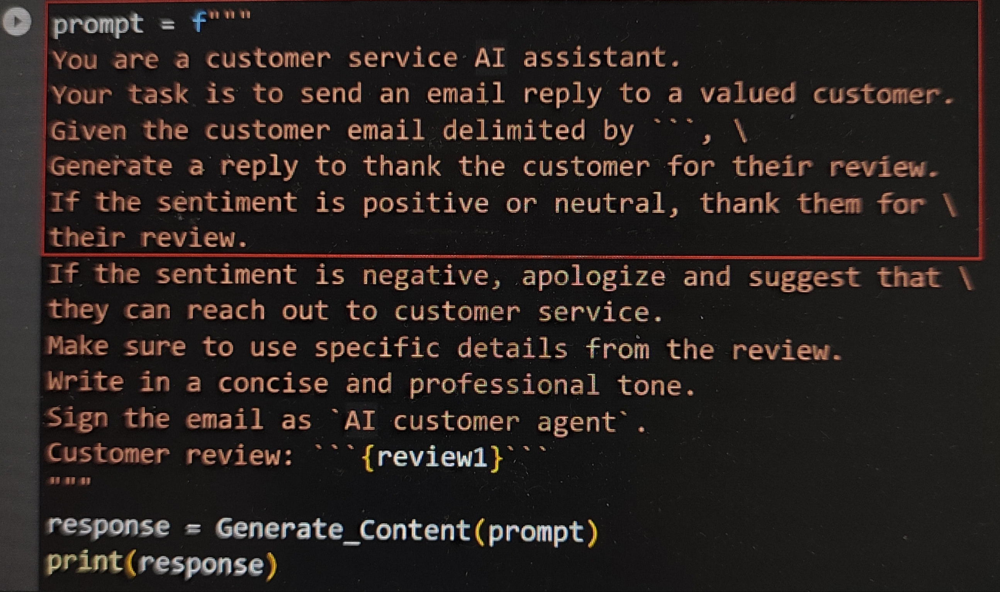
## ChatGPT as developer assistance 
- Very handy in terms of usual code quality checkup, test, knowledge refresh etc
- Prompt Engineering is the emerging term
- Just type: `Nullif use case with example using postgres` and see the wonder
- Github Copilot is an integration of AI into development activities by prompting code samples to the developer.
  - It is similar to pair programming where one pair is a smart AI system
  - Improve productivity of developers
  - Visual Studio Code works best: Extensions: `Github Copilot` and `Github Copilot Labs`
## 