# ✅ Microservices & Database
- In **microservices architecture**, each service should have its own **independent database**.
- For local development:
  ```bash
  docker run -p 3306:3306 --name bank-account-db -e MYSQL_ROOT_PASSWORD=root -e MYSQL_DATABASE=bank-account-db -d mysql
  ```
- Use [SQLECTRON](https://sqlectron.github.io/) with `localhost:3306` to connect.
- Assign **unique ports per service** locally.

---

# 📦 AWS RDS (Relational Database Service)

## 🔍 Overview
- **Fully managed** relational database service.
- Supports **MySQL, PostgreSQL, MariaDB, Oracle, SQL Server, and Aurora**.
- No **SSH access** to DB instances.
- Billing based on:
    - Storage capacity used
    - I/O requests
    - Backup storage
    - Data transfer
- Instance types: **On-Demand** (pay-as-you-go)
- Part of **VPC** for security and network configuration

---

## ⚙️ Key Features

### 📊 Read Replicas
- Improves **read performance**.
- **Async replication**, eventually consistent.
- Up to **15 replicas** across:
    - Same AZ
    - Cross-AZ
    - Cross-region
- Read replica can be **promoted** to master.
- Use case: **analytics, reporting** without impacting production DB.
- Traffic between AZs may incur cost unless within same region.
- Replication is **one-way**, used for **read scalability**.

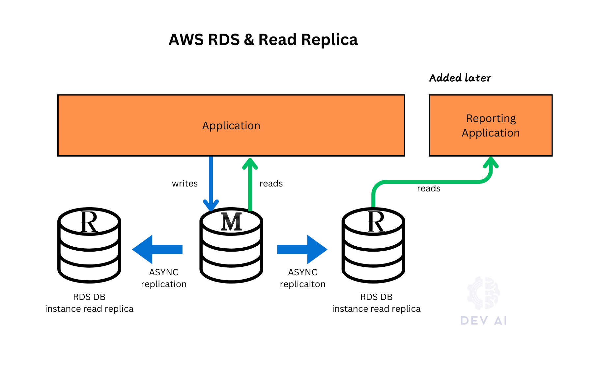

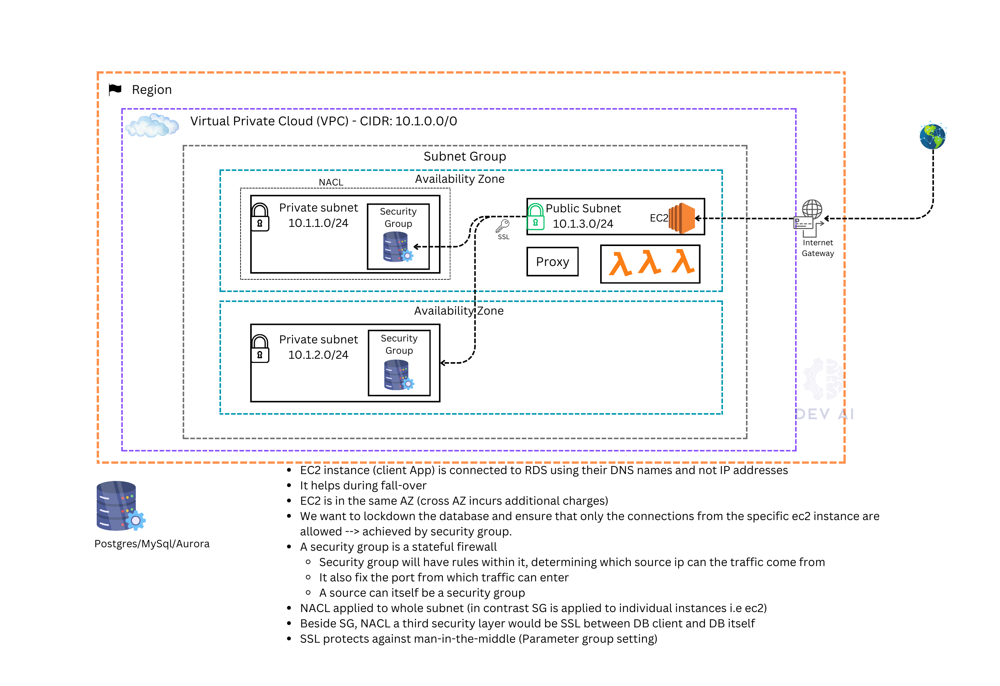
### 🛡️ Multi-AZ (High Availability & DR)
- **Synchronous replication** for HA.
- Automatic **failover** in case of:
    - AZ failure
    - Network issues
    - Storage or DB instance issues
- **No performance boost**, purely for **availability**.
- Setup:
    - Modify existing DB to Multi-AZ → standby created from snapshot.

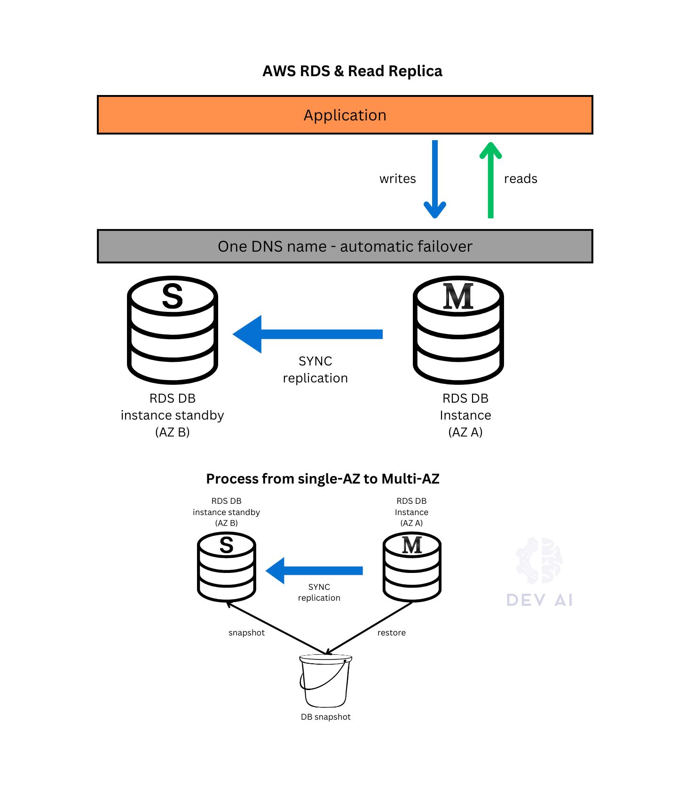

---

### 🔐 Security & Connectivity
- Encrypted **at-rest and in-transit (TLS)** using **KMS**.
- Should be deployed in **private subnet** (not public internet).
- Security via:
    - Security groups (stateful firewall)
    - Network ACL (optional)
    - IAM for authentication
    - **Secrets Manager** for secure password rotation

---

### 🔁 Backups & Snapshots
- **Automated backups**:
    - Daily full backup during backup window
    - Transaction logs every 5 mins
    - Retention: 1–30 days
- **Manual Snapshots**:
    - Long-term storage
    - Cheaper than running instance
    - Can be copied/shared across regions/accounts
- To **encrypt unencrypted DB**:
    - Take snapshot → copy with encryption → restore

---

### 🧰 RDS Resource Creation (Steps)
1. Create VPC
2. Create Subnet Group using VPC and Subnets
3. Create DB:
    - Choose engine, storage (e.g. gp3, autoscaling), instance type
    - Set up security group
4. Configure connectivity (EC2 connection, VPC options)

---

### 🔄 RDS Proxy
- Manages DB connections:
    - Reduces load, minimizes timeouts
    - Pools connections
- Fully managed, **multi-AZ**, **autoscaling**
- **Reduces failover time by up to 66%**
- Works with:
    - RDS (MySQL, PostgreSQL, etc.)
    - Aurora (MySQL & PostgreSQL)
- Integrates with IAM & Secrets Manager

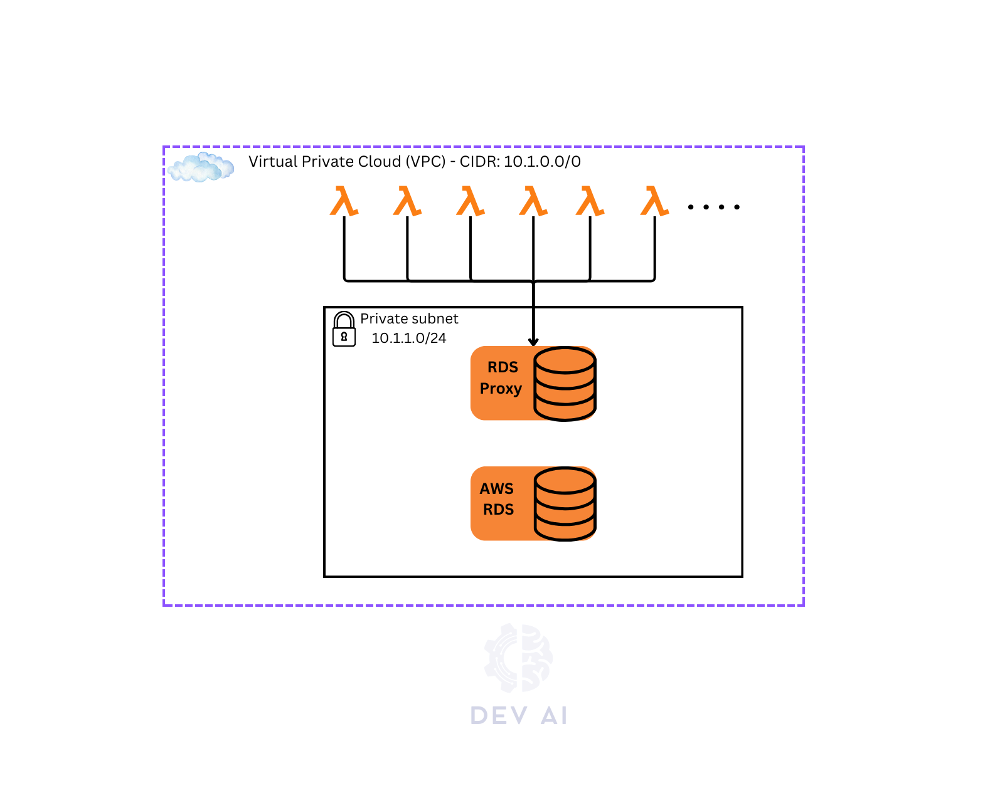

---

### 🧪 RDS vs RDS Custom
| Feature          | RDS                         | RDS Custom                         |
|------------------|------------------------------|-------------------------------------|
| OS-level access | ❌ No                         | ✅ Yes (SSH, root access)           |
| Use Cases       | General apps                 | Custom configurations, legacy apps |
| Supported Engines | All major engines incl. Aurora | Only Oracle & SQL Server           |

---
### RDS Demos
- Configuration


- Connection to the DB


- Additional features


# 🚀 Amazon Aurora

## 🔍 Overview
- **Proprietary, cloud-native** DB engine by AWS.
- **Compatible with MySQL & PostgreSQL**
- Offers **up to 5x performance** over MySQL and **3x over PostgreSQL**
- Comes with both **Provisioned** and **Serverless** options.

---

## ⚙️ Core Features

### 💡 Performance & Scalability
- **Auto-scaling storage**: 10GB–128TB
- **Sub-10s autoscaling** of compute (Serverless v2)
- Supports **up to 15 read replicas**
- Separate **cluster endpoint** for reads and writes
- **Aurora I/O-Optimized** and **Aurora Standard** storage types:
    - I/O-Optimized: better for intensive workloads
    - Standard: cost-effective

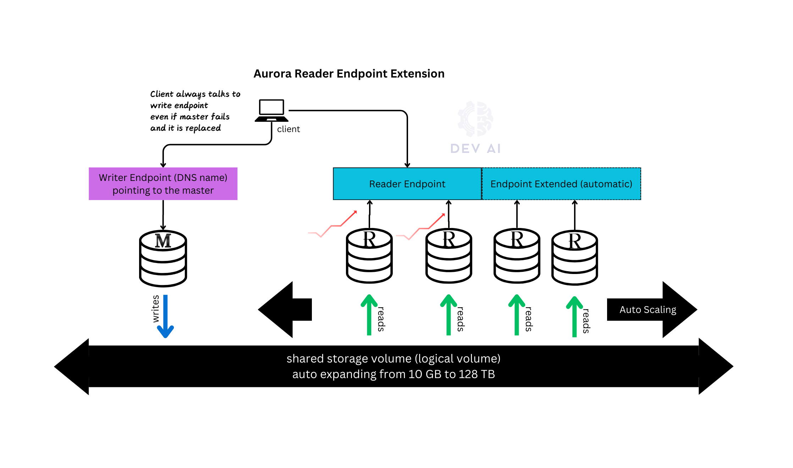
---

### 🔁 High Availability & Fault Tolerance
- Data replicated **6 times across 3 AZs**
- Only **4/6 copies** needed for writes, 3/6 for reads
- **Self-healing** and **peer-to-peer** replication
- Failover:
    - Replica priorities determine promotion
    - Failover time <30 seconds
- Write-only **one master instance**, all others are **read-only**

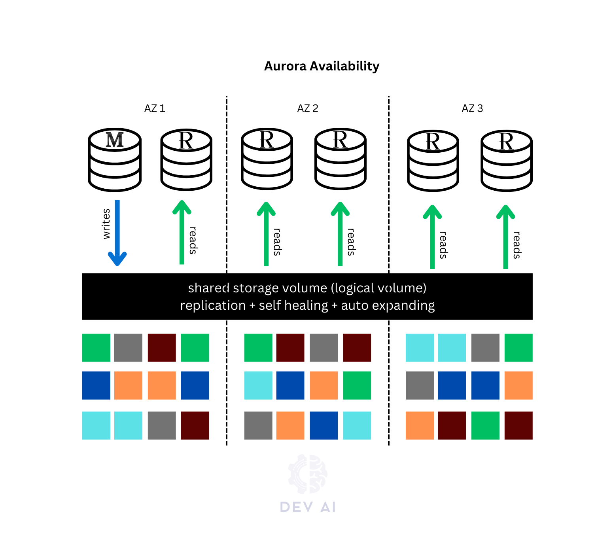


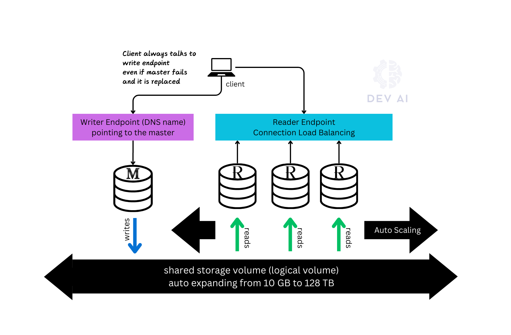

---

### 🔄 Aurora Cloning
- **Fast, cost-effective alternative** to snapshot/restore
- Uses **copy-on-write** model
- Ideal for **staging environments**, testing

---

### 🌎 Aurora Global Database
- **Global, cross-region** read replication
- Up to **5 secondary regions**
- Less than **1-second replication lag**
- Region failover <1 minute
- Up to **16 replicas** per region

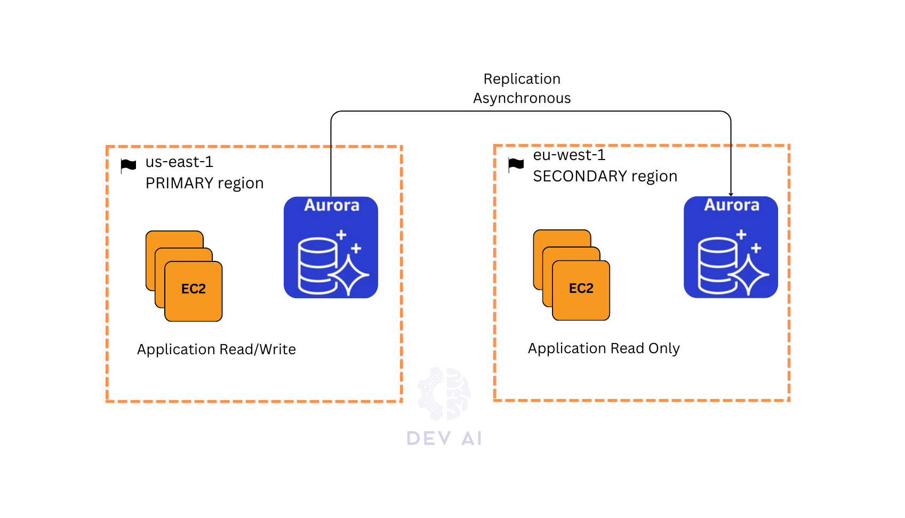
---

### ☁️ Aurora Serverless
- **Automatically scales** based on usage
- Ideal for:
    - Infrequent workloads
    - Spiky traffic
- **Pay-per-second**
- Available for both **MySQL & PostgreSQL**
- **Serverless clusters** can have:
    - Writer provisioned, readers serverless (or vice versa)


---

### 🔐 Aurora Security
- **KMS encryption**, at-rest and in-transit
- Integrated with **IAM**, **Secrets Manager**
- Only **VPC-accessible**, not internet-exposed

---

### 🔧 Aurora Advanced
- **Custom Endpoints**: define endpoints for specific replicas

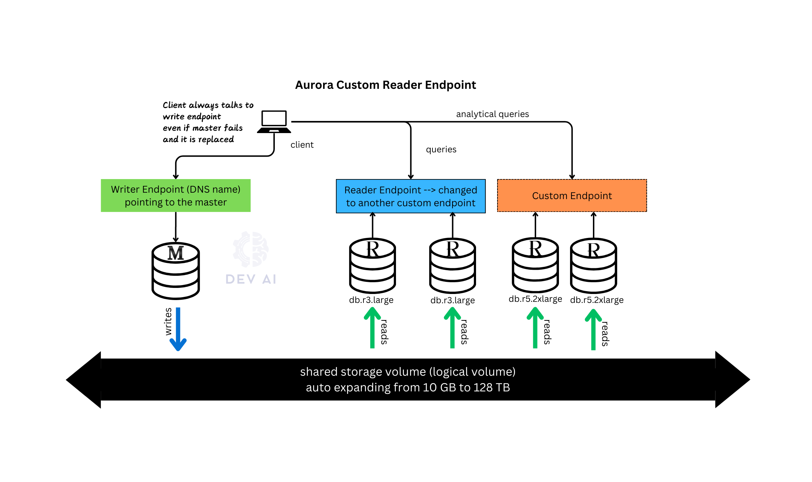

- **ML Integration**:
    - Use SageMaker, Comprehend
    - Real-time predictions in DB (fraud detection, recommendations)

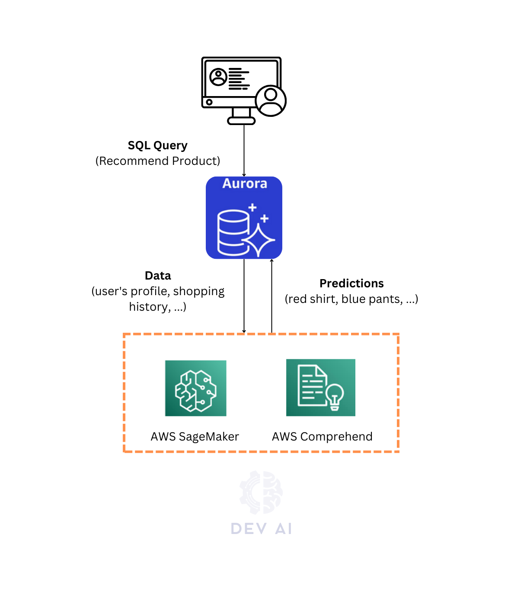
---

### 📋 Aurora Backups
- **Automated Backups**:
    - 1 to 35 days (mandatory)
- **Manual Snapshots**
- **Point-in-time restore** support

---

## 🛠️ Aurora Resource Creation
1. Choose **Aurora engine (MySQL/Postgres)**
2. Select:
    - Writer/Reader endpoints
    - Instance classes (Graviton, Intel, etc.)
    - Storage type (Standard / I/O-Optimized)
    - Enable Serverless / Global DB
3. Configure:
    - Failover priority
    - VPC + security groups
    - IAM roles and secrets
4. Connect via EC2 using private endpoint

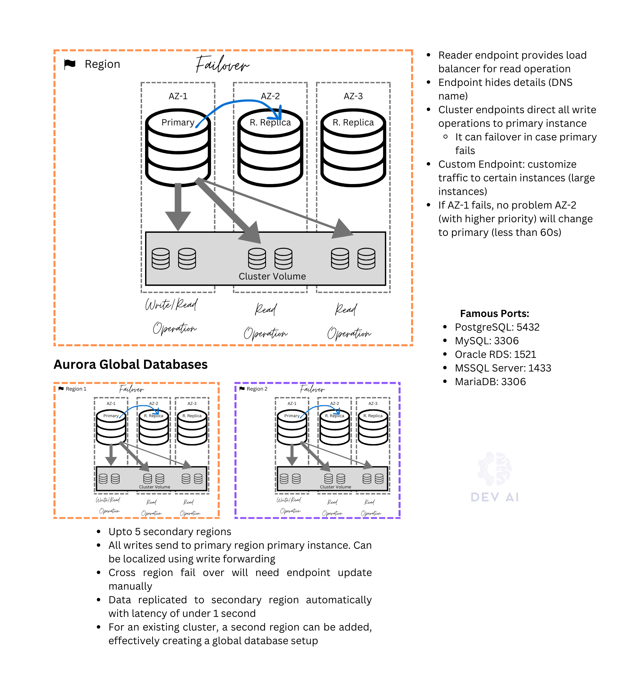

---

### 📈 Aurora vs RDS Comparison (Quick Glance)

| Feature                  | RDS                            | Aurora                                |
|--------------------------|---------------------------------|----------------------------------------|
| Engine Support           | MySQL, Postgres, Oracle, etc.  | Aurora MySQL & Aurora Postgres         |
| Performance              | Standard                       | 3x Postgres, 5x MySQL                  |
| Replicas                 | Up to 5                        | Up to 15                               |
| Failover Time            | 1–2 mins (Multi-AZ)            | <30 seconds                            |
| Storage Scaling          | Manual or autoscale            | Automatic 10GB–128TB                   |
| Global DB                | Cross-region replica           | Native global support (Aurora Global)  |
| Serverless Option        | ❌                             | ✅ Aurora Serverless                   |
| Pricing                  | Lower                          | ~20% higher but better efficiency      |
| Backup Retention         | 1–30 days                      | 1–35 days                              |

## Aurora DB Demo
- Aurora Setup Demo


- Aurora DB Interaction Demo

